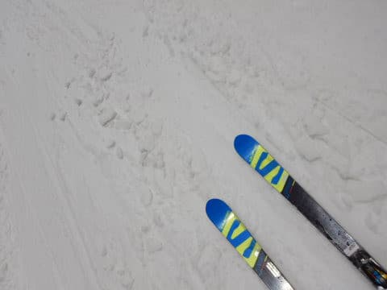

# 2021/5/1(日)の志賀高原スキー場は…朝は新雪3cm！昼間は気温が上がり，強風で午後ゴンドラストップ(涙)

📅 投稿日時: 2021-05-01 23:35:59

ということで．

本日，志賀高原滞在3日目ですが．

…本日．

朝は良かったけど．

午後は微妙…という感じの一日でした．

まず．

本日も，あさイチは通常営業からの参戦ですが．

うーむ．8:30の通常営業開始時に，すでに+5℃

ですか…(ちょい涙)

でも

なんと！

昨日の夜の雨は，夜半に雪になったようで…

ゲレンデ全面，2-3cmの新雪がっ！！！

早朝営業からやっていたので，通常営業

開始時には，バーンの真ん中の新雪は

もう薄くなっていたけど．

硬く締まったバーンの上に新雪が

うっすら乗っていて，気持ちいいよ！！

これは…

昨日より7億6000万倍くらい楽しいっ！！！

そして．

天気も曇り空なので…

日差しで雪が解けなくて，

これはいい！！

…そして．

昨日，雪が解けてコースの中にところどころ

穴が開いていましたが．

本日は，コース整備が完璧に行われ．

しっかり雪入れがなされたようで…

コース上の穴も，すべて完璧に

ふさがれてます！！

…素晴らしい．

ヤケビの整備スタッフ，ありがとう！！！

と，叫びたくなるような，

この時期としては文句ない，冷えた

フラットバーンを満喫！

5連休が始まったので，ゴンドラも

混むかな…と思ったけど．

最高の混雑がこれくらい．

…いや，本当に今日の最高の混雑はこれで，

この1回以外は，完全ゴンドラも飛び乗り！

いや…これはいい．

新雪が蹴散らされておらず，もっと締まっていた

らしい，早朝から滑りたかった…

…

と思っていたら．

なぜか午前10時ごろにぽつぽつ

雨が…(涙）

おかげで，いい感じの雪だったのに．

残念ながら，水を吸った重い雪に…(泣)

滑りもちょっと悪くなってきたけど，

でも，雨がぱらついたのは一瞬．

レインウェアに着替えるほどもなく，

雨は止んでくれましたよ…！

雨が止んだら，今度は日が射してきて…

いや．

晴れなくていいから，曇ってほしいんだけど…

晴れると雪が解けて，滑りが悪くなるんだけど！？？

と，思っていたところ．

天気は曇ったり晴れたりで，雨は止んだものの．

なぜか風が強くなり…

無茶苦茶ゴンドラが減速運転になったなぁ…

と思っていたら．

なんと．11:40ごろに，強風のため第2ゴンドラ

運休！！！！！(激涙)

(ゴンドラ運休の幕が風でめくれちゃってる…)

せっかく，朝は冷えて雪が降っていい感じ

だったのに．

そこからの雨，そして強風のゴンドラ

営業中止って…

私が一体何をした！？

なぜ，こんなひどい目に…？？←いや，だからいっぱい悪いことやってるから

焼額第2ゴンドラが営業中止になったので．

急遽第4ロマンスでの振替営業になりましたが…

風は強いものの，天気は晴れたり

時折雨がぱらついたり，曇ったり．

晴れると，表面の雪が解けて，

滑りの悪い雪になっていきます…（涙）

でも．

2ゴンが止まった瞬間，お客さんが一気に

帰ったらしく．

ただでさえガラガラなゲレンデは，5連休

初日というのに完全貸し切りのゴースト

タウンに！！

ちょっと滑りは悪くなって来たけど…

でも，誰も滑ってないゲレンデで．

いつも通り午後になってもフラット！！

うん．

ゴンドラが動かなくて残念だったけど．

でも，貸し切りで見渡す限り人がいない

バーンも，コースが全然荒れずに，

フラットなまま傾き放題傾けるので，

いいよね…

と．

今日も15:30のラストリフトまで滑り

続けたのでした…

今晩，雨が降ってますが．

明日の朝は，またちょっと雪になり．

あさイチは今日と同じ，うっすら新雪かも？？

ただ，また午後は雨に見舞われる可能性も…

運が良ければ，降り始めは営業終了後．

運が悪ければ，昼過ぎすぐに降り始めるんだけど．

もしかしたら，雪になるかも…？？

うーん．

明日の天気，かなり微妙…

## 💬 コメント一覧

### 💬 コメント by (m&t m)
**タイトル**: Unknown
**投稿日**: 2021-05-02 07:52:49

Sさん。

流石です！GW中一度は顔を出そうかと思っていましたが、諦めました。スキー道具片付け始めました・・・。

来シーズンはコロナが収まり、思い切り滑れると良いなぁ。月山まで楽しく拝見します。

### 💬 コメント by (ikkun)
**タイトル**: Unknown
**投稿日**: 2021-05-02 08:44:46

おはようございます❗ 今朝青空が見えて……がまんならず者……やけび？て云いたい所…お勧めの横手山に今参上ですm(__)m来シーズン分からないので「朝良かったですよ」隣の高級車の練馬の方でした❗場所は違いますが楽しみましょ🎵

### 💬 コメント by (かず)
**タイトル**: Unknown
**投稿日**: 2021-05-02 11:56:09

今日どうですか？風が強そうですね…行くなら3.4日しかないかな！今日の昼間移動で考えてます

### 💬 コメント by (ikkun)
**タイトル**: Unknown
**投稿日**: 2021-05-02 13:32:39

お疲れ様です  雪ちらつきましたね🎵  しかも……なかなかな混み具合(・・;) ボートが多く怖かったの数回？……久しぶりのスキーは……山頂パンにコーヒーも含め四時間と少し終了致しました❗ スキーを楽しむ心共にm(__)mなんて お先に失礼します

### 💬 コメント by (Skier_S)
**タイトル**: 今日は意外と雪！！
**投稿日**: 2021-05-02 23:17:20

＞ｍ＆ｔさま

GWは滑らないのですね…

まぁ，天気も悪い日が続き，Stay homeが正解かと．

来シーズンに期待しましょう！！

＞ikkunさま

横手山行ってきたのですね．楽しめましたでしょうか．

山頂のパン屋さんも行ってきたのですね…

また今度は焼額にお越しください！

＞かずさま

今日は午後はすごい吹雪でした…

明日は朝はいい雪と思いますが，8時過ぎにはもう緩んで

滑りの悪い雪になるかと…

4日も気温が上がって滑らない雪になりそうです（涙）

### 💬 コメント by (Skier_S)
**タイトル**: Unknown
**投稿日**: 2021-05-03 17:50:56

＞葛飾のSさま

ネタバレになるので、コメント私のみ見れる設定にしました…

すみません。

でも、ストーカーされてたとは。

明日も滑るのですか？ぜひ、お声がけいただければ。

