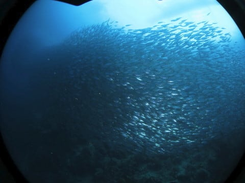
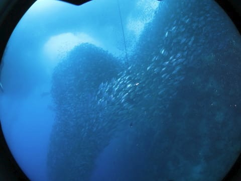

# 2019年8月，4度目のモアルボアル・小6の娘Cカード取得1周年！その21…2本目は，またまたイワシポイントでダイビング！

📅 投稿日時: 2020-09-01 01:46:20

🏷️ カテゴリ: [ダイビング日記](ce3a7a8d424d112fce83ee85c81a0e344.md)

えー．

昨日の記事は，

構想3時間，執筆2時間，

全文字数8000文字

という，超スペクタクル大作

でしたが．←せっかくの休日をそんなことで無駄に使ったのね…

手間暇かけたわりに，

難しすぎておそらく読者の興味を引かなかったこと請け合い

だった気がする今日この頃．

皆様いかがお過ごしでしょうか（時候の挨拶）

ということで．

昨日は久しぶりのスキーがらみのネタ（？）

だったわけですが．

今日はいつものダイビング旅行記です…

でも．この旅行記も，もう1年以上前の

出来事なので．

写真を見ながら一生懸命何があったかを

思い出して書いているという…

苦労の産物だったりします（笑）．

では，どうぞ～！

ーー

ってなことで．

シュノーケリングからそのままダイビングに

エントリー，イワシの群れ攻略に入るわけですが．

ダイバーとサイズを比べると，その群れの

巨大さがわかりますね！

この群れが，ダイナミックに動く！

…特に今回．

カイワリの群れがイワシの群れの

周りを泳いでいて…

このカイワリが一連になって，

イワシの群れに突っ込む！

ナンヨウカイワリが突っ込むと，

群れが狂ったように動きまわり

ます！

時折，このカイワリたちは

急降下して，イワシの群れから離れ，

ダイバーの間に割り込んでくると…

再びイワシの群れに突っ込む！

いや…

捕食シーンが入ると，イワシの群れも

さらに見応えたっぷり…！

そして，次は，またアジの群れを

見つけたので，アジ玉攻略！

かなり密度高く固まってますね…

イワシより固体が大きいので，見応え

たっぷり！

後半は，イワシじゃなくアジの群れを

中心に追いますが…

アジの群れも固まったり，ばらけたりを

繰り返しつつ…

ひとつの塊になったと思ったら．

また，渦を巻くように動いて…

違う場所で，グルグルと渦巻き

はじめます…

そして，また一つの大きな塊になって…

今度は，娘が行ける12mを超えた，

深い深度に潜っていきました…

だもんで．今度は浅い深度のイワシの

群れを攻略！

頭上を雲のように覆うイワシの群れに

近づいていくと…

全周360度，イワシに囲まれました！

娘も必死に写真を撮っているようですが…

これ…

やっぱりモアルボアルじゃないと

味わえない景色ですね…！！

と，思っていたら…

今度は，また下の方からアジの群れも

上がってきて…

手前のアジの群れが，

向こうのイワシの群れに向かって

伸びていきます…！

群れどうしは，上手くお互いが

ぶつからず，混ざらないよう，

互いの距離を保ちながら，

形がいろいろ変わっていきます…

いや，これ，面白いって！

絶対面白いって！

（長くなったので続く…）
