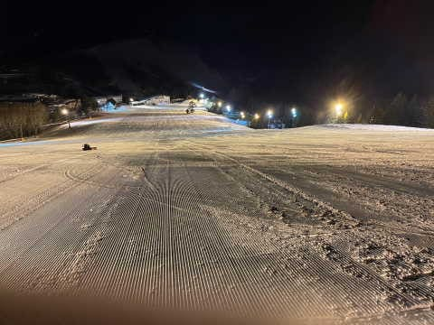

# 2月24日(金)の志賀高原スキー場，特派員情報！…そして，3月は気温が上がりそう(涙)

📅 投稿日時: 2023-02-25 00:12:29

🏷️ カテゴリ: [日記](cc4b5682fb7b8b144980957a978653fb0.md)

えー．

昨日日帰りで志賀に行き，今日1日

自宅で仕事して．

自宅滞在30時間ほどで明日から

志賀高原に舞い戻るSkier_Sです．

…ホントは今週末も，スキーに行くのは

かなり辛い状況なんだけど…

ってなことで．

スキーに行かなかった本日ですが．

飛び石連休の谷間ということで，

数多くの特派員から写真が送られて

来ました～！

まずはおこみん特派員．

いつも通り，奥志賀スタートですが…

うす曇りで日が射す，きれいな朝の

シマシマ写真を送ってくれましたが…

奥志賀ダウンヒルは結構固めのバーンで，

殺人コロコロがいっぱい出ていた

そうです…

そして，こちらは焼額の某特派員．

あさイチの気温は-6℃と，まぁまぁの

冷え込み．

あさイチはうっすら日も射し，冷え冷え

シマシマで…

こちらは奥志賀のダウンヒルコースと

違って，最高だったみたいです！！

…あとから話を総合すると，

奥志賀のダウンヒルコースだけなぜか

コロコロが多かったみたいで，

奥志賀の他のコースもそれ以外の

スキー場も，コロコロはそんなに

なかったみたいで，かなり良い

コンディションだったみたいです…！

で．

さすが連休の谷間．

平日にしては焼額ゴンドラも混んでいて…

奥志賀ゴンドラも結構列がついていた

ようですが．

どちらも混んでいたのは午前中だけで，

午後はそこまで混んでなかったみたいです．

気温は昼間に0℃近くまで上がったものの，

日差しがそれほどなかったので，

雪は緩まず．

全体的にパリッと締まったバーンで，

絶好のカービング日和だったみたいです…

午後はコースも人が少なかったよう

ですね…

で．

今日は一応平日なので．

一の瀬ファミリースキー場のナイターは

宿泊者割引で1500円で滑れるので．

ナイターに行ったツワモノ特派員も

いたみたいですが…

まぁ，ノロいペアリフトのナイターを

滑ろうという人が少ないのか，

ガラガラで楽しめたようです…

あぁ…うらやましい…

でも，明日から志賀高原に舞い戻るぞ！！

ってなことで．

この週末の土日ですが．

土日とも残念ながら晴れずに，

曇り～小雪の天気になりそうな天気図に

変わってきました…

あさイチの気温は土日とも-10℃を下回る

冷え冷えになりそうで．

どちらも終日曇りで，雪がぱらつく一日．

時折日も射す一瞬があるかもしれませんが，

土曜も日曜も，朝は冷え冷え雪が

5-10cmくらい積もってるかな？

…で．

週末が終わると…

んん？？？

気温がなんだか，すごい上がりそうな

気配なんですが…！？？？

そして．

23日発表の1か月予想を見てみると…

…3月，気温がかなり上がりそうな予想に

なってるんですが（涙）

特に2週目の，気温が高い確率が60％って…（泣）

うーん．

ただでさえ雪が少なかった今シーズン．

3月も気温が高いとなると…

ヤバい気配…

でも．

前も書いたけど．

気象庁の一か月予想はだいたい外れる

ので，心配しないでいいかな～…

むしろ，高温と予想されたぶん，

ホントは低温になるんじゃないかと期待！←気象庁の方，ゴメンナサイ

ってなことで．

あと3時間半後に出発です～！

## 💬 コメント一覧

### 💬 コメント by (a-island4138　ゆうさん)
**タイトル**: Unknown
**投稿日**: 2023-02-25 20:33:01

羨ましい!!　こちら島根の瑞穂ハイランドは、あと50cmとなりました😢　寒くならないかな～　天気予報、勉強になってます。

志賀高原を思いっきり楽しんでくださいね🎿

### 💬 コメント by (Skier_S)
**タイトル**: ＞ゆうさんさま
**投稿日**: 2023-02-25 21:01:48

瑞穂ハイランド，一時期は結構積もったみたいですが…

一気に解けたんですね（涙）

先週と比べると天国なので，志賀高原楽しんでます！！

