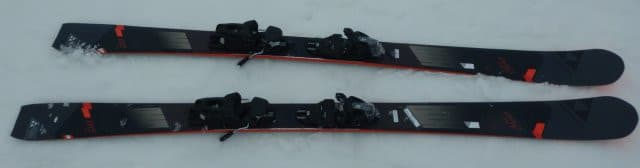

# スキー板，試乗レポート番外編その1…2019 FISCHER PRO MT 86 Ti

📅 投稿日時: 2021-07-28 02:13:03

ということで．

[土曜日の武尊山登山で，熊に遭遇した](e32342eec559fff6ca9e99d7e92fa4acf.md)わけで．

あれ以来気になって，Webでいろいろ調べて

みたわけですが…

やはり，4m程度の至近距離でいきなり

熊に出くわしたって人はそうそうない

みたいですね…

うーん．

登山道の角を曲がったら，目の前の

登山道の上に居たってパターン，

結構あるかと思ったんですけどね～…

3歩進んで手を伸ばせば叩けるな

という至近距離でのいきなりの接近

遭遇でかなり驚きましたが．

まぁ，人生で貴重な体験ができました…

（あくまでポジティブ）

ってなことで，本題へ．

…今回もスキー試乗レポートなんですが．

実は，エキップさんが試乗用にもってきて

くれた板は2022シーズンモデルだけじゃなく，

ちょっと古い在庫モデルのお勧めも持って来て

くれていたので，そちらも試乗レポートとして

載せておきます！

今回の試乗板は，エキップさんのおススメ．

ちょっと古いけど，今はもう手に入らない

2019シーズンモデルのフィッシャー，

Pro MTです．

○FISCHER PRO MT 86 Ti 175cm

オールマウンテン

これは…すでに2シーズン前のモデル．

来シーズンには，3シーズン落ちモデルと

なってしまう板ですが，かなり評判が

よかったらしく．

「在庫が残ってれば買い」

というおススメ板らしいので，乗って

みました…

見た感じセンターも86mmと結構太く．

お気楽系の優しいいただろうなぁ…

と思って滑り始めたところ．

をを！

さすが，評判が良かった板なだけはある！

メタルのしっかりした強さ，張りがあり．

スピードを出してもガッツリとらえる，

見た目と違ってかなり硬派なカービング板！

R=16.5という，いい感じのサイドカーブに

沿って，エッジでガッツリとらえて

きれいにカービングでエッジに沿って

回っていきます！

そして，いい感じの足ごたえの張りも

あるので．

たわませないでおけばロング気味に

滑って行けるし．

ぐっとたわみを溜めていけば，

しっかりトップとテールが雪面を捉え，

板がたわんでグリップして，

いい感じのミドルカービングが

できます！

このグリップ感，たわみ感，しっかりした

スピードへの耐性…

これは気持ちいい！

かなり本格的なカービング板で．

センター86mmの見た目と違い，

圧雪でガッツリエッジを効かせて

かなりのハイスピードで気持ちよく

雪面を切って滑って行ける板です！！

ものすごい傾ける板です！！

切り替えでも，たまった圧がポンと

返ってくる，気持ちいいばね感が

あるので，86mmという太さが

気にならず，自然に次のターンに

入って行けますし．

太さがあるので，雪面が多少荒れていても

新雪をファット板で滑るように，

柔らかく乗り越えていける感じ…

これ，気持ちいいよ！

整地を滑ると，

「え？これセミファット板？？」

と信じられないくらい，私の好きな

ロング系の板の乗り味で，

ガッツリグリップ系のカービングで

ガンガン傾いて行けるのに．

それにさらに，荒れた斜面や新雪の

踏破能力という，ファットのプラス

ポイントが着いてくるという…

これ，一粒で二度おいしい板ですね．

確かに，おススメなだけはある…

かなり本格的にスキーをやりこんで，

ガンガンスピードを出す人にも，

この板ならおススメできます．

この板，在庫残ってたらねらい目かも…！？？

## 💬 コメント一覧

### 💬 コメント by (northfox)
**タイトル**: Unknown
**投稿日**: 2021-07-28 12:35:22

私の友人も登山中に似た状況で熊に遭遇したそうです。

彼は驚いて思わず“アッ❗️❗️"って声を出してしまったそうで、そしたら熊も驚いて逃げていったそうです💦😅

### 💬 コメント by (ikkun)
**タイトル**: Unknown
**投稿日**: 2021-07-28 13:14:31

熱さが戻りつつあります  フィッシャーは比較的お高めですが残らないスキーですよね 私しも一時期狙いにあった時も( *´艸｀)でもやはりなかなか下がらない価格とだから人気なんですかね😢

### 💬 コメント by (Skier_S)
**タイトル**: 緊急事態宣言がまた出そう（涙）
**投稿日**: 2021-07-29 01:12:20

＞northfoxさま

意外と熊に会った人，多いですね…

会わなくていいなら会いたくないですが（笑）

向こうが逃げて行ってくれて無事だったようで良かったですね…

＞ikkunさま

フィッシャーはここ2-3年人気高いですよね…

去年はSCは売り切れたみたいですし．

