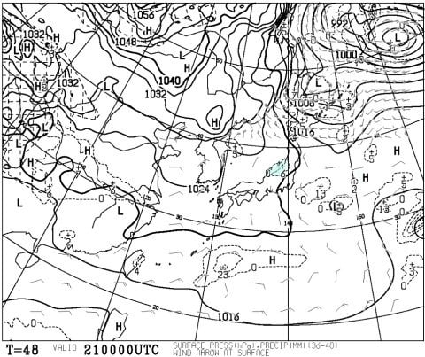
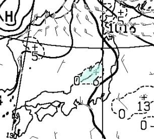
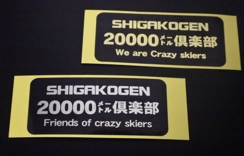

# Skilineは無くなっても，ゴールドステッカー配布は続くよ！…そして日曜の志賀高原は朝は雪が降るかも？

📅 投稿日時: 2018-01-19 23:16:24

ってなわけで．

今週末もいつも通り，志賀高原に行くわけですが．

明日，明後日の予想は．

基本的に水曜段階での天気予想のままですが．

ただ，21日，日曜の予想はちょっと変わってきました．

最新の21日の予想地上天気図を見てみると…

うむ？

日本海側にわずかに降水域が…

これを拡大すると．

うーむ．

微妙に志賀高原に降水域がかかっている気がする…

これって…

[予想を外した14日の日曜](e2e17ddaaff1c3133f3fc39a4bf8b50d7.md)のパターンに似てきたかも…

ってことで．

もしかすると，日曜朝はうっすら積雪があるかもしれません．

このままの天気図なら，多くても10cmくらいかな～．

そして，朝のうちは雪がチラチラ降ってるかも．

ただ，昼ごろには晴れると思います…

うん．晴れる．

晴れるはず！

…もしかしたら，晴れるのは夕方になったり

して…←先週外したのがトラウマになっている

ってことで．

話題は変わって．

昨日の記事に書いたように，

20000クラブのメンバーは，Skilineロスに

戸惑っているわけですが…

志賀高原のSkilineが終わってしまったということは．

20000mクラブのメンバーが悲しむってだけではなく．

志賀高原で一日滑走標高差20000mを公式に確認できる

手法が無くなってしまったということでもあり．

…これは．

もう2度と，20000mクラブのゴールドステッカーが

配布されることはないのか！？？

…と，心配になるところでしょうが．

いえ．

続きます．

Skilneが無くなっても，一日20000m滑ってしまう

終わった人素晴らしい人は，まだまだ

出てくるはずです！！

ということで．

怪しげな金のお札ゴールドステッカーの配布は

まだ継続しますよ～！

iSKIなどのスマホアプリ，

あるいは何らかのログ機能付きの時計や

スマートウォッチなどを示して，

一日滑走標高差20000mを滑ったと申告して

もらえれば．

今後も引き続き，

終わった人の証ゴールドステッカーを発行します！

今シーズン，20000mを突破した人がいたら．

金のお札を貼っている人に声をかけてみてください．

ステッカーの発行元，KonSuke大親分に

取り次いでくれるかと…

ってことで．

私はあと4時間後に志賀高原へ出発です～！

また，3時間ちょっとしか寝れない…（涙）

土日はいつも通り，焼額第1ゴンドラぐるぐるしてますので．

また今週も焼額でお会いしましょう～！

## 💬 コメント一覧

### 💬 コメント by (横須賀のウルトラセブン)
**タイトル**: Unknown
**投稿日**: 2018-01-20 06:45:50

スキーラインが無くなってしまい意気消沈されている20000ｍ倶楽部の皆さん～安心してください。皆の気持ちを再び志賀高原に引き寄せるため、徒然さんが目下極秘でそれに代わるアプリを開発中との情報を得ました。そのアプリは仮称「20000ｍグラフ」です！いつも皆をビックリさせる徒然さんですからきっと完成に成功するでしょう！かくいうセブンも今週末は八方で滑っております～すいません。（この情報は不確実です、セブンが夢を見たのかもしれないのであしからず～笑）

### 💬 コメント by (ながのんちゅー)
**タイトル**: Unknown
**投稿日**: 2018-01-20 17:17:30

先日、カエルのウェアのお方に銀のお札を頂きました。

あのお方が、KonSuke大親分様だったのですね！

Skilineの時から、ガンバっても9,000ｍチョイが最高です。

まずは10,000ｍを目指します！

### 💬 コメント by (静岡県のskier)
**タイトル**: すごいプログに感謝
**投稿日**: 2018-01-20 18:11:52

はじまして。毎年１回程度ですが、志賀に遊びに行く者です。えっちら５時間以上かけてそっちに行きます。（一番最初の時は、１０時間以上かかってました。高速道路長野道も無かったから）　雪無し静岡県なのに、このために寒冷地仕様の車です（４ＷＤじゃないですが）。来週２４日から２泊３日の予定です。今週来週は目まぐるしい天気模様、強風ならどこで滑ったら良いか・・などなど。まだまだ志賀初心者の小生にとって、こんな素晴らしいプログに会えたこと、一生の喜びです。ありがとうございます。それからがんばってください。

skilineというのは、初めて知りました。若ければきっと、小躍りして参加したんだと思います。ステッカーをしている方を見つけたら、（ゴンドラ内なら）声をかけたいと思います。

### 💬 コメント by (ほっぽ)
**タイトル**: 1/20志賀高原
**投稿日**: 2018-01-20 22:17:42

Ｓさん

今日は１ゴンでのご挨拶のみで失礼しました。

今日、初滑りのオッサンスキーヤーが同行していたものですから。

今日は標高差約13000m、一の瀬ペアで１６：４０まで滑ってもこの程度でした。

朝一のファミリークワッド待ちでkonSukeさん、maeさんにご挨拶し、ラスリフでもお二人の滑走シーンをお見かけし「これだよこれ」と安心しました。

静岡県のskierさん

はじめまして。私も静岡県ですが、年末からＧＷまで、ほぼ毎週末志賀高原に通っています。

今は高速が開通して早くなりましたね。

多分、自宅が私の方が近いのでしょうね、私はフル高速で４時間前後で志賀高原に着きます。

http://www2.tokai.or.jp/nana_hoppo/

### 💬 コメント by (Skier_S)
**タイトル**: 志賀も雪が減ってきました…
**投稿日**: 2018-01-20 22:55:38

>横須賀のウルトラセブンさま

いや…

残念ながらそんなアプリ作る実力はありませんので（汗）．

でも．

「20000mグラフ」

のネーミングはどこかで使いたい気分でいっぱいです(笑)

＞ながのんちゅーさま

その柄のウエアでお札を配っているのは…

間違いなくKonSuke大親分様です．

世界18位の滑りをご覧になられたのですね…

スピードを出さなくても，コース上で止まらなければ

簡単に10000mくらいなら行きますよ…と言ってみる(笑)．

無理せず10000ｍを狙ってください！

＞静岡県のスキーヤーさま

ようこそ，このBlogへ！

私はいまは4時間半で志賀に着くところに

住んでいますが，おととしまでは片道

5時間以上かかるところに住んでいました…

来週志賀高原ですか！

天気が悪かったら，やっぱりゴンドラがある

焼額＆奥志賀エリアがいいかと…

天気が良ければ，志賀高原をいろいろ渡り歩く

のがおススメでしょうか．

でも，24，25日は激冷えの吹雪で，

車が埋もれるほど雪が降りそうです．

新雪好きなら楽しめると思いますが…

寒いと思うので，ゴンドラがある

焼額がおススメですね～！！

また，シーズン1度といわず2度3度と

志賀に来てください！

静岡から志賀に毎週来る人も

何人かいますよ！

先週は，朝イチ焼額1ゴン常連さんのうち，

3人が静岡から来た人…という静岡率の

高い組み合わせでした(笑)

＞ほっぽさま

あ，お仲間さんとご一緒だったのですね．

私は今日も1ゴン張り付きでした…

お仲間さんと一緒に滑って，お昼も休んで13000mだったら，

すごい多いと思いますが…

私は昼を抜いても今日は14000mちょいでした（涙）

最近は焼額ゴンドラがかなりスピード遅いので…

しかし，やっぱり一の瀬の朝イチとラストに

いつもの鉄壁のメンバーがいると安心ですね(笑)

### 💬 コメント by (Skier_S)
**タイトル**: 志賀も雪が減ってきました…
**投稿日**: 2018-01-20 23:16:13

>横須賀のウルトラセブンさま

いや…

残念ながらそんなアプリ作る実力はありませんので（汗）．

でも．

「20000mグラフ」

のネーミングはどこかで使いたい気分でいっぱいです(笑)

＞ながのんちゅーさま

その柄のウエアでお札を配っているのは…

### 💬 コメント by (（静岡県のskier 改め）おぶせ)
**タイトル**: ますます、感謝です。
**投稿日**: 2018-01-20 23:53:31

Skier_S　さん

　暖かいコメントを頂き、また現地解説ありがとうございます。非常に助かります。今回、焼額での宿泊となりますので、ちょっと安心しました。

　それから、過去プログ等を見させていただきましたが、月山にも行かれるのですね。すごい！小生、実はスキーデビューが５月の月山で、数回滑りましたが、現在は相当ご無沙汰していましたので、非常に懐かしく、プログ楽しく拝見させていただきました。

ほっぽ　さん

　早々にコメントを頂きありがとうございます。ＨＰ見させていただきました。静岡から４時間とは、かっとびですね。小生は、諏訪ＳＡで休憩、志賀山道入り口でチェーン装着（旧式ハシゴ・・特に今年はスタッドレス５年目なので必須）、マイペースです。こちらも身延経由ですが、バックミラーにレガシー、パジェロが見えたら、見通し効くところで、左ウインカー、左寄り、スピードダウンで、さっさと抜いてもらっています。張り合っても負けますので。（笑）

　今回は、女房と行きますので、帰りに小布施で栗おこわをハシゴで食べ比べとなります。これも楽しみです。

　みなさんとこうして会話でき、今回の志賀旅行が小生自身の中でルンルンになっちゃってます。

　ありがとうございます。

### 💬 コメント by (Skier_S)
**タイトル**: おぶせさま
**投稿日**: 2018-01-22 02:42:46

24日，25日の朝は，積雪でスキー場の営業開始が

遅れそうなほど積もりそうですし…

冷凍人間になるかと思うほど寒いと思うので，

しっかり防寒対策をしていってください！

月山へはシーズン2回ほど行きます~！

片道500km，日帰りで行くことも多いです（笑）

静岡から月山は厳しいですよね．

では，志賀高原を楽しんできてください！

