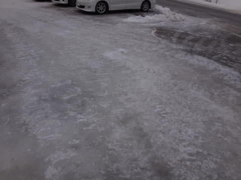
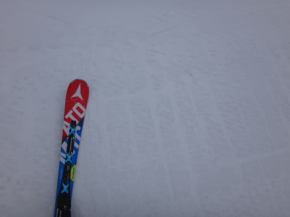
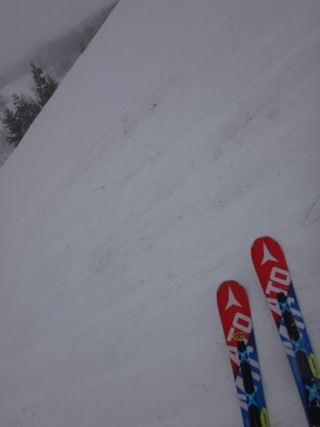
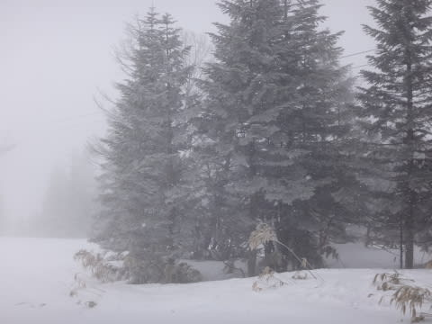
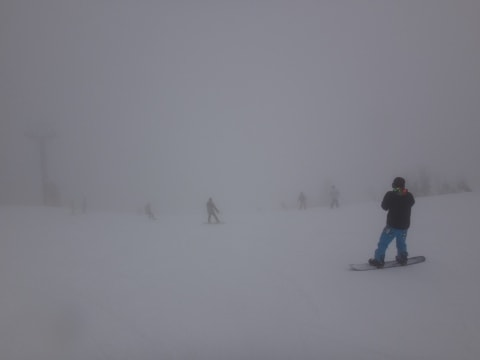
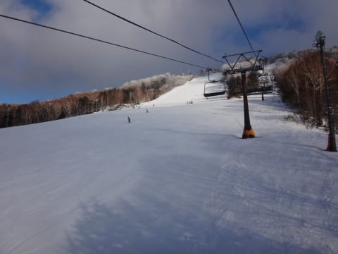
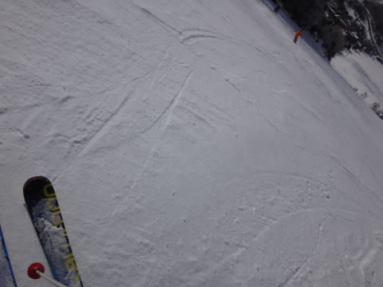

# 2月21日，日曜日の志賀高原速報…志賀高原は全面アイスバーン祭り（涙）．

📅 投稿日時: 2016-02-22 02:12:38

🏷️ カテゴリ: [2016スキー滑走日記](c70c67ed5248e9432b899dcd5747048bb.md)

えー．

本日も，夕方までしっかり滑り．

帰宅が遅かったので，速報モードです…

で．

…本日朝も．

外しました．

ええ．外しました．

外しましたとも．

天気予想．

土曜日の夜に降り始めた雨が，夜中に雪になり．

10～20cmの積雪になるはずだったのに．

…なぜか，今朝の積雪はほとんど0（激烈涙）．

なぜ？どうして？？

…だもんで．

駐車場には，昨晩の雨でとけた雪がそのまま固まってます…

もう，ツルツルです．

転ばないように歩くのが一苦労のレベルです（泣）．

…ということは．

当然ゲレンデも…

そうです．

志賀高原全体，アイスバーンです．

もう，全山あげてのアイスバーン祭りです（涙）．

あー．

アイスバーン祭りだけじゃなく．

さらに出血大サービスで，ブッシュもついてきます（泣）．

昨日の雨で，オリンピックコースなどは

ちょっと悲しい状況に…（涙）．

で．

天気は．

午前中は雪が降ったり…

ガスったり…

…午後は少し日も射しましたが．

でも，今日は気温が低く，

午後になっても，全山アイスバーン祭り状態は変わらず…（泣）．

というわけで．

オールマウンテンアイスバーンフェスティバルな

今日一日だったのでした…（残念）．

どうしたことだ．

何があったというのだ．

とても，2月のゲレンデ状況とは思えない…（涙）．

とりあえず，明日の詳細ゲレンデレポートで，

全山アイスバーン祭りの状況を，さらに詳しくお伝えします…

さぁ．

明日も，皆さま覚悟のほどを！

＃最近，悲しいレポートが続く…（涙）．

## 💬 コメント一覧

### 💬 コメント by (いか)
**タイトル**: Unknown
**投稿日**: 2016-02-22 12:31:15

こちらはアイスバーン、ブッシュ、上部風運休のコンボが決まりましたorz

下部は、朝こそアイスバーンでしたが、昼頃にはザブザブでした…

来週に期待です！

### 💬 コメント by (Skier_S)
**タイトル**: いかさま
**投稿日**: 2016-02-23 01:33:07

アイスバーン，ブッシュ，運休コンボですか…

こちらは，夕方まで全く緩む気配を見せない，

全山アイスバーン祭り開催中でした（涙）．

来週までに，どっさり1mくらい，パウダーが

積もってくれないかなぁ…

