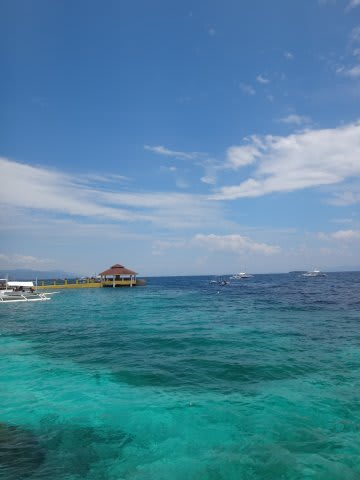

# あうう…記事を書く時間がない

📅 投稿日時: 2016-08-24 04:38:11

🏷️ カテゴリ: [日記](cc4b5682fb7b8b144980957a978653fb0.md)

えー．

本日もこんな時間に帰宅しているSkier_Sです．

うーむ．

この時間に帰宅しても，空が明るくならない季節に

なってきましたね…

こーゆーことで，そろそろ夏も終わりに近づいて

いるのを感じますねっ！！←普通の人は感じないから，それ

ってことで．

明日もいつも通り朝に会社に行かなくてはならないので．

もう寝ます…

おやすみなさい…

## 💬 コメント一覧

### 💬 コメント by (yama)
**タイトル**: 休日の過ごし方
**投稿日**: 2016-08-24 13:42:09

仕事お疲れ様です。前に書き込みしたインラインスケートができる公園ですが、小山公園ニュースポーツ広場と言います。ヘルメット必要ですが無料の貸出もあるそうです。混み具合についてはわかりません。お金をかけずに子供と過ごす方法はいくつかあります。今週末27日には高田橋で花火大会です。河原まで下りると大変混みます。イエティまで我慢ですね。

### 💬 コメント by (Skier_S)
**タイトル**: yamaさま
**投稿日**: 2016-08-25 02:06:54

公園情報，ありがとうございます…

今週末もどうやら遊びに出る時間はなさそうで，

一体行けるのはいつの日になることやら…

11月には一山超えると思うので，

スキーシーズンにはちょっと楽になることを

期待しつつ…

オフ会できずすいません（涙）

