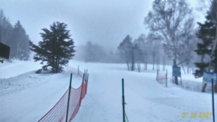

# 2021/1/24(日)の志賀高原スキー場，特派員情報

📅 投稿日時: 2021-01-25 09:13:47

🏷️ カテゴリ: [日記](cc4b5682fb7b8b144980957a978653fb0.md)

そろそろなんだかいろいろクリティカルな

状況になりつつある今日この頃．

昨日は，夕食を食べた後すぐに死んだように

寝てました…

だもんで，また朝更新にて，昨日の日曜の

志賀高原特派員情報です！

えー．

まず，焼額山頂は，朝は-4℃程度と．

意外と冷え込んだみたいですね…！

天気は朝から曇り空．

…でも，朝イチはしっかり圧雪の

シマシマが楽しめたようです！

雨にはならずに済んだようですが．

昼間は0℃を超えるくらいまで気温が

上がり，リフト乗車中に汚れたしずくが

ワイヤーから垂れてくる感じだった

ようで…

そして．

意外なことに，朝10時過ぎにはゴンドラに

列が！

でも，列がついたのは午前中の一瞬．

列がついても，そんなに待つほどでは

無かったようです…

ってな感じで．

雨の危機だったこの週末．

日曜も日は射さなかったものの，

雨が降ることは無く．

曇り空でもってくれて…

午後には眼下に雲海も見えて．

そんなに悪くない一日だったようです…

いやー．

雨にならず，この週末も無事乗り切れた

ようですね…

このあと，27日午前中まで，

気温が高い期間が続きますが．

25，26日は晴天になりそうで．

27日朝の降り始めがちょいと危険な感じ…

でも．27日夜からまた冷え込みが

戻りそう…！

…と，冷え込みは戻ってきそうですが．

一体，いつになったら私は志賀高原に

戻れるのか…（涙）

PS.日曜にコメントくださった方すみません．

コメント回答はまた今晩！

## 💬 コメント一覧

### 💬 コメント by (ほっぽ)
**タイトル**: 1/24　志賀高原
**投稿日**: 2021-01-25 12:51:43

Ｓさん

年１回のロンバケも終わり、今日から社会復帰しています。

昨日は志賀高原で正解でした。

結局、高速道路も夕方には冬タイヤ規制も解除され、順調でした。

昨日の滑走記録はblogにアップしておきました。

日程調整が上手くできるか分かりませんが、

只今エキップさんに問い合わせ中です。

http://hoppo.officialblog.jp/

### 💬 コメント by (レインボー73)
**タイトル**: Unknown
**投稿日**: 2021-01-25 16:16:52

月曜日の志賀高原情報

好天に恵まれ清々しい一日でした。朝の蓮池はマイナス5℃くらいだったかなあ。やや柔らかめながら滑りやすい絶好のコンディション。

本日も、パノラマ、カラマツはファースト頂きました。速攻で１ゴンへ。ＧＳ、オリンピックのなんと快適なこと！

奥志賀第６は、ボードの人が技を繰り出せるオブジェが、ほぼ完成かと。ボードのかた、ぜひ志賀へ！

エキスパートが悶絶バーン。圧雪の境の段差はあるものの、私でさえ気にならないレベル。第３からエキスパートに飛び込んだら、下には誰もいない。ここぞと大回りを楽しんでいたら、スピード好きの隊員にシュワッと抜かれました。私は91km/h、隊員は当然100オーバーです。70前後のお爺はもう命が惜しくないのか、だめですよね。

それと大回りで、コースの最端まで大きく回るのは危険ですので、もし端までいくのなら、くれぐれも安全を確認したうえでしたいものです。スキー学校の多勢のトレインはなおさらです。

ヤケビにもどると、気温が上がって白樺は緩みすぎ。でも他はあいも変わらず快適。めっちゃ気持ち良すぎなのに、毎日滑っていると雑用がたまるので、レインボー早退。

### 💬 コメント by (レインボー73)
**タイトル**: Unknown
**投稿日**: 2021-01-25 22:18:26

ブーツ

長年、後傾が全く治らす進化の止まった私に、一年前『ブーツだよ』と声をかけてくれたのが、通りすがりの今の師匠です。

それから一年。師匠のおかげで人脈もひろがり、今では技術も低いレベルながらも着々と進行し、やめようと諦めかけていたスキーが第一の趣味にまでなりました。スキーは楽しいはずのものです。でも、私は進歩の歩みがアンダンテ（歩く速さ）。そう、全くの進化なしだったのです。

量販店で作ってもらった高価なブーツが、なんと、どうやっても後傾にしかならないブーツだったのです。62歳デビューの無知な私にはわかるはずもありません。

長岡のエキップさんでブーツを作って頂いて翌日のことです。

同居三人組（レインボー隊）の一人が私の滑りを見て、『あれはレインボーではない』と言ったとか。

それほど見違えるほど変わりました。といっても低いレベルての話ですが。

ブーツも長らくそのままで使うと緩んできます。今年になって、エキップさんと師匠が再調整してくれました。結果は夢の世界てす。

長年進歩がないなと感じでおられる人は、まず靴の見直しです。私が頼んだ量販店はだめです。新潟に近い人はエキップさんをお勧めします。まず裏切らない社長です。

ブーツの角度一つでこんなにも違うのか。

ブーツのフィット感一つで…こんなにも違うのか。

今、私は滑ってみて、いままでと違う世界がみえるようになりました。まずはブーツ、そして、人脈だと思います。

### 💬 コメント by (Skier_S)
**タイトル**: なんて時間にコメント更新しているんだ…
**投稿日**: 2021-01-26 04:33:17

＞ほっぽさま

長期休み遠征，お疲れ様でした…

で，今シーズン中にブーツアップデートですか！？？

エキップさんのブーツ，履くと滑りが変わりますよ…！

＞レインボー73さま

今日もレポートありがとうございました！

しかし，ブーツの影響は大きいだろう…と思っていましたが．

今回のエキップさんのブーツを履くようになってから

「予想していたよりブーツの影響は大きかった」

というのを痛感しました…

周りのエキップブーツを履いた人たちが，みんな滑りが変わったのが

面白いですよね．

やっぱり，ブーツと板はいいものがいいですよね…

### 💬 コメント by (ほっぽ)
**タイトル**: 名言
**投稿日**: 2021-01-26 23:56:55

Ｓさん

「ブーツと板はいいものがいい」名言だと思います。

ついでに「妻も新しい方がいい」とか書くと、

多方面から刺されそうな気がしてますが。(^^;

今夜はイエティナイターで下手になった自分にガッカリして帰宅しました。

というかこれが実力。

http://hoppo.officialblog.jp/

### 💬 コメント by (Skier_S)
**タイトル**: ＞ほっぽさま
**投稿日**: 2021-01-27 03:41:25

「妻も…」は危険発言ですね(笑)

志賀高原の勘違いバーンで滑ってると，自分がすごく上手くなった気が

しますよね…

それで，志賀高原以外で滑ってがっくりするという．

志賀高原常連あるあるです…

