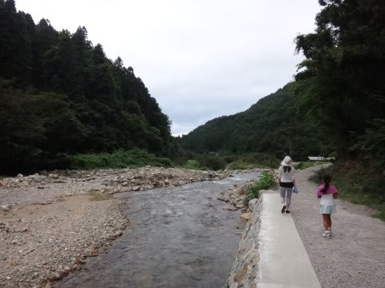

# 夏の志賀高原へ行ってみた…志賀高原は，お祭り前夜祭！

📅 投稿日時: 2015-08-29 02:05:36

🏷️ カテゴリ: [登山・旅行](c1d637a11a25b457ac978d197adbdafc5.md)

ということで．

動物好きの娘には超好評だった，野猿公苑営業で，

営業終了の17時まで過ごして．

また，15分ほど歩いて，駐車場へ戻ります…

その後は，いつもの慣れた志賀高原の道を

登っていきますが．

うーむ．

周りに全く雪がない志賀高原の登り道，新鮮だ…

ってことで．

やってきたのは．

私が一人で泊まるときの定宿，

アストリアさん．

…いつも，泊まりなれた宿なのに．

雪に囲まれた姿しか知らないので．

「え？入口の前，こんなだったの？」

「この宿の回りって，こんな風になってたんだ…」

と，驚くことしばし．

こんなオサレなテーブルやら，ガーデンチェアやらが

前に置かれているのか…！

そして，夕食＆お風呂を済ませると…

この日，宿に着いてから初めて知ったんですが．

なんと今日は，志賀高原のお祭り，「大蛇祭」の前夜祭らしく．

旧蓮池ロープウェー駅舎前で，イベントをやってるようで．

さっそく，見に行ってみました～！

明日が本祭で，ミス志賀高原コンテストがおこなわれる

らしいですね～．

現ミス志賀高原，次期ミス志賀高原候補者，そしておこみんが，

ステージ前で踊ってました…

こんなお祭りやってるなんて，知らなかった…

ラッキー！

で，前夜祭の締めとして．

花火が打ちあがるのですが．

なぜか．

なぜか，花火打ち上げ直前から…

雨が降り出してきたんですが（激涙）．

花火大会の直前まで天気がもって．

花火開始5分前から雨って，そらないでしょ…

誰か，強烈に日ごろの行いが悪い人がいたに違いないっ！！

間違いない．←あなたの日ごろの行いが悪い，ってことに間違いないのでは？

しかし，その雨の中，花火が打ちあがりましたが…

をを！

すぐ目の前からの打ち上げで，真上で花火が開く！

これは，結構すごい．

ここまで打ち上げ場所に近づける花火も，そうそうないのでは…

…しかし．

残念だったのは．

小雨が降る天気のおかげで．

花火の1/3ほどは，雲の中に隠れて良く見えなかったこと…（泣）．

せっかくの花火大会が，勿体ない…

とりあえず．

雨に濡れながらの花火見物になっちゃったけど．

朝の善光寺から夜の花火まで，

この日はイベント盛りだくさんの一日だったなぁ…

と，満足して眠りについたSkier_S一家だったのでした．

## 💬 コメント一覧

### 💬 コメント by (読者)
**タイトル**: 志賀高原エクストリームトライアングル
**投稿日**: 2015-08-30 11:02:17

こんにちわ

いつもブログ楽しく拝見させていただいています。

この時期、志賀高原エクストリームトライアングルと

いう大会が開催されているようです。

http://www.nature-scene.net/shiga_ex/

冬並みにかなりの標高差を体験できる大会のようです。

ぜひ来年参加されてみてはいかがでしょうか。

### 💬 コメント by (Skier_S)
**タイトル**: Re:志賀高原エクストリームトライアングル
**投稿日**: 2015-08-30 13:20:37

いや…

これ、普通の人間には無理ですからっ！

リフト使わないで、自分の足であれだけの標高差

稼ぐの無理ですからっ！

