# 2021/3/28(日)の志賀高原スキー場は…朝から強風ゴンドラ運休，12時前から雨(涙)．一旦止むけど，14時からまた雨の，悲しい一日

📅 投稿日時: 2021-03-29 00:33:29

🏷️ カテゴリ: [2021スキー滑走日記](c2b0fc073d6357d3b786f6ca655147f7d.md)

ということで．

強風・高温・雨の3重苦の悪天候が予想

された本日も滑ってきたわけですが…

本日．

雨の降り始めの時間で，

皆さんの日ごろの行いはどうだったのか

があからさまにされるはずの一日．

果たしてどうだったのか？？

とりあえず，本日のレポート，行ってみましょう！！

えー．

まず．

「強風で，朝は2ゴンはヤバい」

と予想した本日朝ですが…

…

2ゴンどころか．朝イチから

・焼額1ゴン，2ゴン揃って死亡

・奥志賀第3，第4ペア＆ゴンドラ討ち死に

・寺小屋全面運休

・東館ゴンドラ動かず

という．

朝から，予想より広範囲のリフト・ゴンドラが

運休になるスタートとなりました…

焼額も，最初は4ロマのみ営業，

という情報だったのが．

なんとか8時前に，

「2高も動きそう」ということで．

本日は2高スタート！

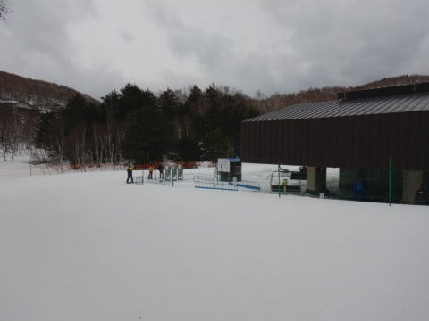

1ゴン，2ゴン運休と分かった時点で

焼額スタートを諦めた人が多かったのか．

2高スタートの人はかなり少なかった

ですね…

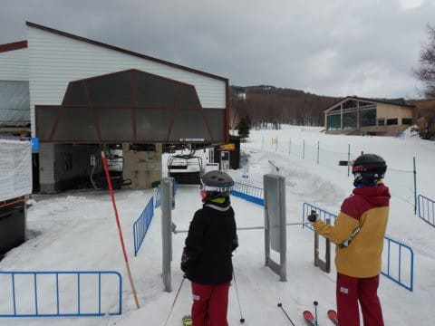

朝は雨も降っておらず，風が強いのは

山頂付近だけで，ゲレンデはあおられる

ほどの強風ってわけでもなく．

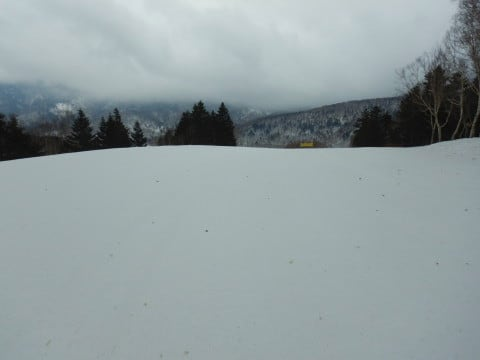

うむ？

気温は朝からプラス気温だったので，

朝からザブザブ雪を覚悟したけど．

朝イチゲレンデは押し固められたかき氷

って感じで．

意外と締まっていてエッジも嚙む，

かなり楽しい感じのバーン状況なんですが！？？

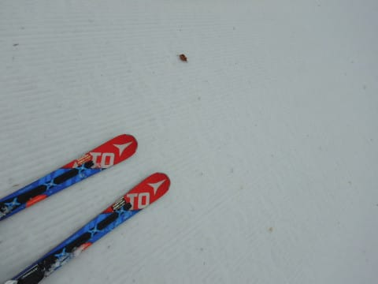

これでゲレンデもガラガラだし…

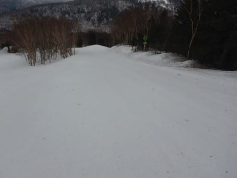

思いのほか楽しいっ！！！！

朝イチシマシマバーン，

予想以上に楽しめるよ！！！

営業開始から30分くらいは，

リフトも飛び乗りで．

「貸し切りか？」

と思えるくらいのいい感じの，

重めながらシマシマでエッジが嚙む

バーンを，思う存分かっ飛ばせました！

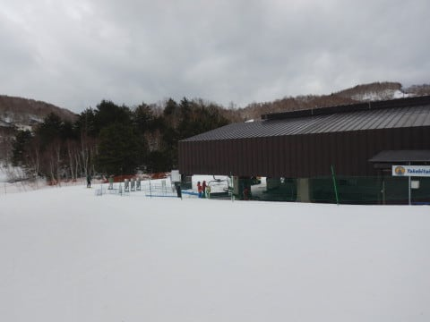

…が．

うーむ．

9時を過ぎると，一の瀬方面から流れてくる

人が増えて来て…

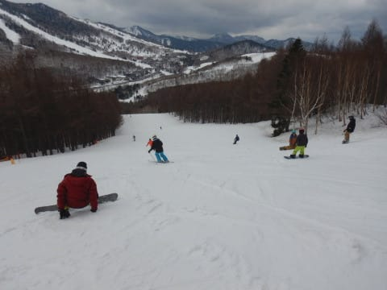

雪も緩んで，多くの人で荒らされてきて

しまい…

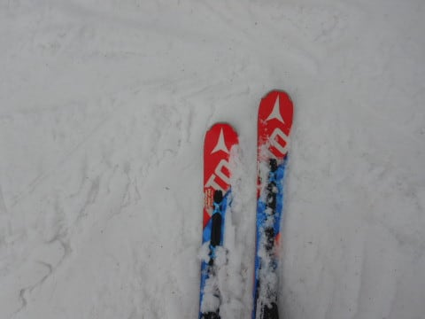

9:30には，かなりの人口密度に

なっちゃったんですが…(涙)

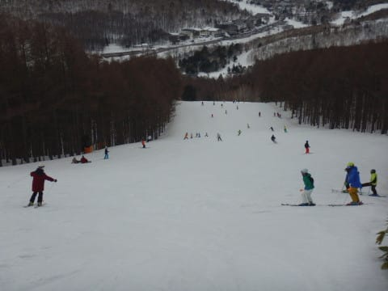

そして．

リフト待ちが…

うぎゃーーーー！！

何じゃこりゃ！！！

すごいリフト待ちに…(泣）

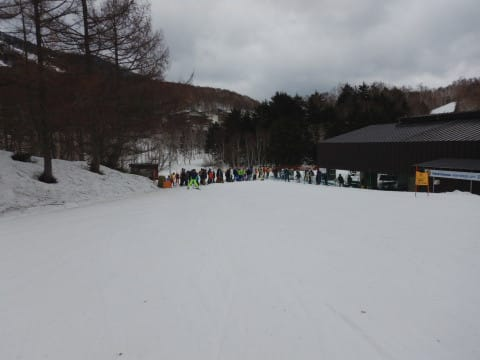

こりゃたまらん．

速攻一の瀬方面へ逃げよう…

と，焼額を脱出！

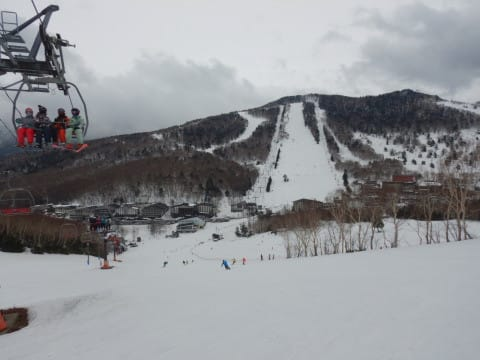

…でも．

一の瀬ファミリーもすごいリフト待ち

なんですが！？？？

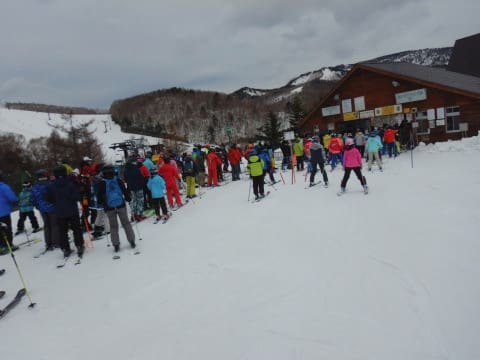

そして…

一の瀬のゲレンデの人口密度も，

すごいですね…(涙）

焼額，奥志賀，東館のゴンドラが動かず．

寺小屋も止まっているので．

人が集中してるのか…

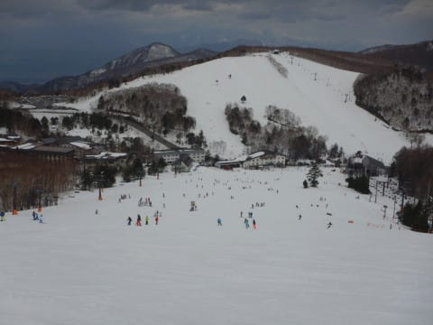

おかげで．

普段は混まないタンネの森まで

人が多いです！

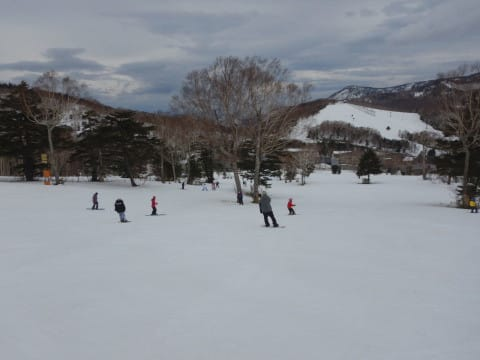

修学旅行とかの団体で埋まったのは

見たことがあっても．

一般スキーヤーでこんな人口密度が

高くて，リフト待ちがあるタンネの森．

あんまり見たこと無い気がする…

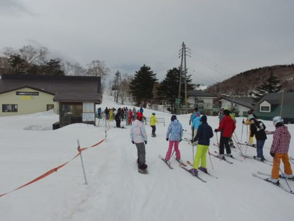

だもんで．

そのまま高天ヶ原に移動！

うん…高天ヶ原のリフトは，列は

ゲートの中に収まっていて．

そんなに待ち時間ないですね…！

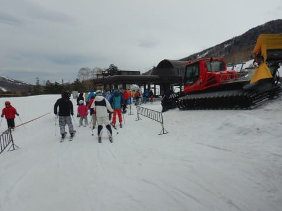

…と，思ったら．

ええええええ！！？

なんだか，午前10時過ぎなのに，

メインコースが凸凹なんですが…！？？

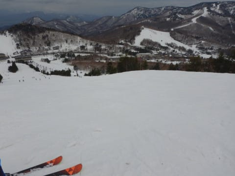

これって，昨晩から圧雪してませんよね…？？

まさか，高天ヶ原のメインバーン，

日曜朝に圧雪を掛けないとは！！！

これは，リフトが混まないわけだ…

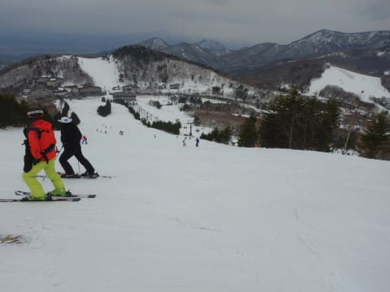

西舘方面へ行こうかとも思ったけど．

結構雪が解けて穴が開いているとの

ことだったので．

とりあえず高天ヶ原をしばし滑っていると…

…来ちゃったよ．

11時半ごろから，雨が…(涙）

最初はポツポツだったけど．

12時前にはパラパラとそこそこの

降りになっていき．

ゲレンデは水を吸って重い雪に…(泣）

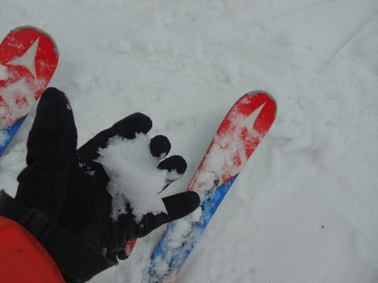

たしか，どこかの誰かは早くても

降り始めは13時と言っていた気が？？？

…これはきっと．

誰か，想像を絶する日ごろの行いの悪さ

の人がいるに違いないっ！←そこは素直に予想が外れたと言おうよ

…でも．

雨は12時半ごろに一旦止んでくれたけど．

焼額に戻ってくると，この雨のおかげで

ゲレンデの人はほとんどが淘汰されたらしく…

もう，ガラガラです．

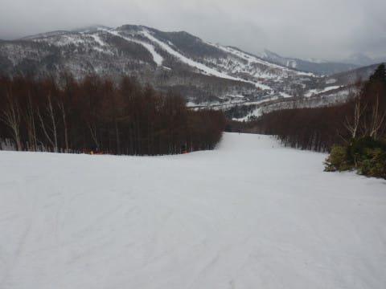

風は強めで，人がいないので

ゲレンデの上にいっぱいいろんなものが

積もってたり．

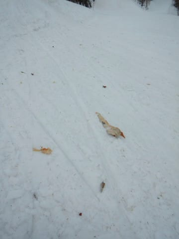

コース脇の雪も汚れが出てきたり

していたけど．

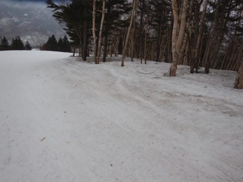

雨で濡れたゲレンデは，板が結構

滑ってくれるので，昨日の張り付き雪より

かなりマシかも…！！

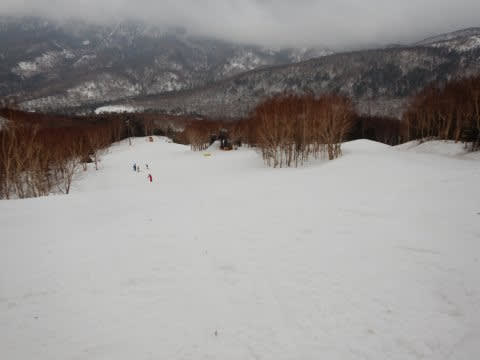

…と，滑っていたら．

一旦止んだ雨が，午後2時半過ぎに

また降り始めてきました…（涙）

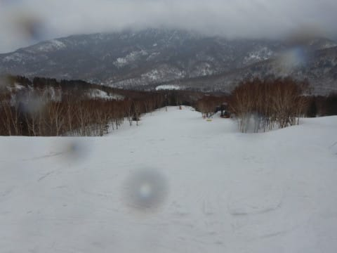

ポツポツ，時折パラパラ降る程度で，

ザーザーぶりにはならないものの．

レインウェアがびしょ濡れになる

雨が，時折止みながらも降り続き．

ゲレンデはかなりずっしりとした

重い雪になり，荒れていったのでした…(泣）

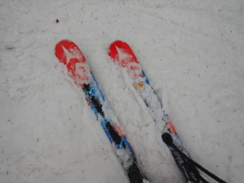

でも．

しばらく滑れなかったフラストレーションを

晴らすべく．

雨の中，今日も営業終了時間まで滑り続けて

しまった，Skier_Sだったのでした…←いや…しばらく滑っていようがいまいが，どっちにしろ最後まで滑ってたはず

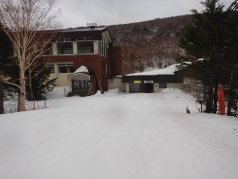

ということで．

日ごろの行いが悪い人がいれば

降り始めは13時ごろ，

日ごろの行いが良い人が多ければ

リフトストップまで降らずにもつ…

という予想の本日．

結局は途中一旦止んだものの，

予想をはるかに超えた早さの，

11時半から降り始める

という結果だったので．

今日ゲレンデにいた人のうち誰かが．

予想を超える日ごろの行いの悪さ

だったということが明らかになった

本日だったのでした…

さぁ．

日ごろの行いが悪かった人は誰だ！！

怒らないから，ここで素直に白状

しなさい！！←いや，それはあなたでしょ

PS.明日月曜は早朝まで雨が残るものの，朝は曇り空．

　昼ごろには晴れていくかも？

　気温は高いよ．

　火曜は晴れ，気温が高い4月中旬みたいな

　重い雪の，春スキーの一日になりそうです

## 💬 コメント一覧

### 💬 コメント by (ikkun)
**タイトル**: Unknown
**投稿日**: 2021-03-29 04:34:07

ちょいと早いおはようございます❗やはり？我がゲレンデも山頂リフトは朝から運休(泣)しただけでした(泣)二本でしぐちゃぐちゃでした

しかも昼には下の一本だけとなりました しかしそんな中でご家族でいらした常連客様に笑顔をお菓子を頂き感謝でした  ちなみに戸隠に行った仲間は技術的にも斜面的にもお客様の多さにもびっくりと言っておりました とりあえずseason終了の我がゲレンデでした

てかさすがですね

### 💬 コメント by (rudi0223)
**タイトル**: Unknown
**投稿日**: 2021-03-29 08:53:57

初めましてS様！いつも楽しくブログを拝見しています♪大阪在住の還暦スキーヤー⛷Tです。ホームゲレンデは木島平ですが、この土日志賀高原に行ってました。Sさんの天候情報のおかげでノーマルタイヤで宿のあるジャイアントの下の駐車場まで行くことが出来ました。帰りの雨の高速も楽に走れました。土曜日は西館、高天原、一ノ瀬から寺子屋まで遠征したのでSさんに遭遇していたかもしれません？日曜日は横手山で午前中、タナベスポーツ主催の試乗会に参加、何台か乗りましたがブリザードのFIREBIRD HRC166が私の好みでした。軽めの板ですが昔のスキーみたいに反発力があってトーションも剛性感あり、センター76でスライドすることも出来て年寄りの足には優しい板でした。あとフォルクルのDEACON 74ブラックも操作性が良くて乗りやすかったです。最近、家族が誰も一緒に行ってくれなくて毎回一人スキー旅(涙)、Sさんのように関東や名古屋の人が羨ましいですわ。Sさんのブログ応援しています。また楽しいレポート配信してください。

### 💬 コメント by (レインボー73)
**タイトル**: Unknown
**投稿日**: 2021-03-29 16:12:10

月曜日の志賀高原情報

初めて毛布をはだけて寝てました。春です。

朝の上林７℃　蓮池５℃。明け方まで雨が降ってたらしく、路面が濡れている。太陽がヤケビじゃない、やけに、まぶしい。

2ゴン上６℃。ザクザク。今日からシラカバの雪をパノラマ用にするため、シラカバ完全閉鎖。パノラマからカラマツへ。柔らかいけど、踏んでないコースを選んで快適そのもの。マッサージ機よりずっとまし。でも、すぐ荒れそう。

ＧＳざらめたけど快適。３本すべったけど、だんだん荒れてくるしシニアの団体様も出現したので、一の瀬へ。

ダイヤモンドは走る雪で快適ひと滑りでした。

寺子屋は、本日のベスト。快適勘違いパーンでしたよ。上から見て、右フィロソフィー　中リップス　左エターナルコースを楽しんだあと、林道からブナへ。

昨日ベストだったブナは、七曲がりがズクズクで疲れる。

西たては勿論柔らかいけど滑る。でも、穴が大きくなっている。

そんなんで昼は今日も銀嶺。

昼食後、タンネの俺様コースを教わりました。私なんかに教えたら、いっぱい滑り倒しそうなのに！ありがとう。

そしてポールが片付いたパーフェクタが、やっぱりいい。３本回してヤケビヘ。

このサウスが本日のワースト。たのしくなかった。

### 💬 コメント by (アリス)
**タイトル**: 春はあけぼの
**投稿日**: 2021-03-29 17:56:17

Skier_S様

夢ではなく、リアル滑走とご自身での現地レポートおめでとうございます。

『待ってました』です。楽しく拝見させていただきました。

すっかり平日の滑走に味を占めて休日はじっと我慢です。

レインボー様、寺子屋のコース名ちゃんと覚えたちゃったみたいです・・・舌を噛むようなコース名(私はいまだに右、中、左です）

### 💬 コメント by (Skier_S)
**タイトル**: 雪が降ってほしい…
**投稿日**: 2021-03-30 02:41:37

＞ikkunさま

日曜，あの状況でレッスンされてたんですね…

シーズン終了，お疲れ様でした！

＞rudi0223さま

コメントありがとうございます～！！！

志賀にお越しだったんですね．どこかでお会いしているかも…(笑)．

わざわざ大阪から，お疲れ様です．

大阪から大変ですが，ぜひちょくちょく志賀高原へお越しください…

まだまだGWまで滑れますよ！

私もGWまで滑ってます．

＞レインボー73さま

今日は志賀もあったかかったみたいですね．

タンネの俺様コースがちょっと気になります…

西舘から下，ヤケビ1ゴンもあと残るは2日．

シーズンも終わっていきますね…

＞アリスさま

やっとリアル滑走レポートできました…

しかし，最近はゴンドラ乗車定員制限で混むので，

私も平日に滑りたい…

