# 6月21日の月山の詳細レポート…雪はあるので滑れます…が．

📅 投稿日時: 2014-06-24 01:09:18

🏷️ カテゴリ: [2014スキー滑走日記](c992167609b6415052179ee69ea1ea7d8.md)

ってことで．

昨日，一昨日と．

速報モードが2日間続いた月山ですが．

本日は，写真たっぷりにて詳細レポートをば…

…で．

土曜日は．

朝から月山に向かったわけですが．

車の中から見える大斜面は，まだ雪がいっぱいあって．

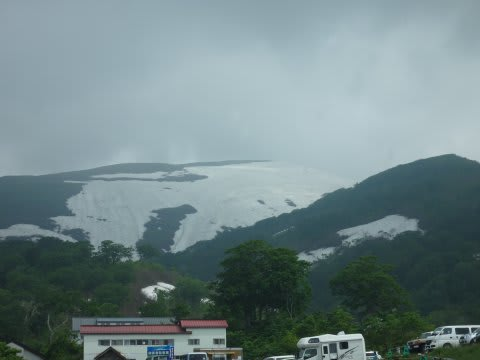

…うーむ．

これでリフト運休なのはもったいない…

とりあえず．

わざわざK奈川県からここまで来たんだし．

駐車場の500円も払ったし．

…ちょっと様子を見に行って来ましょうかね…

と．

こういう看板の横を通り抜け．

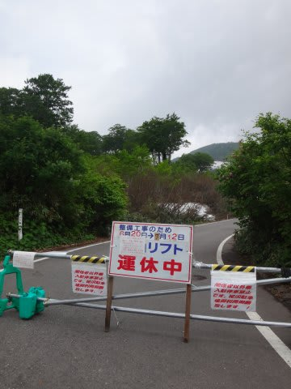

駐車場からとぼとぼ10分近く歩いて…

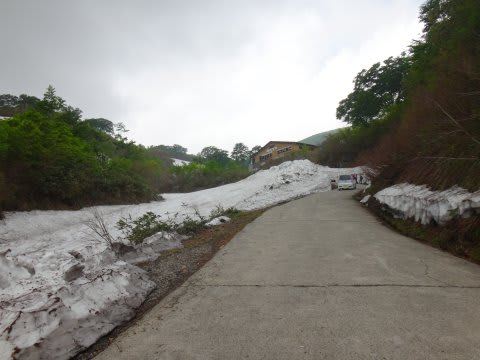

やってきましたリフト乗り場．

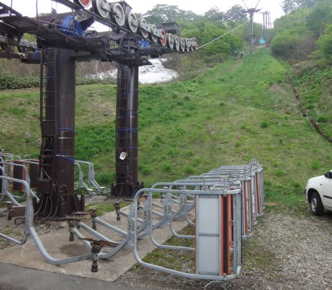

うーむ．

そして，亀裂があった3号支柱を工事している，

パワーショベルも見えますね…

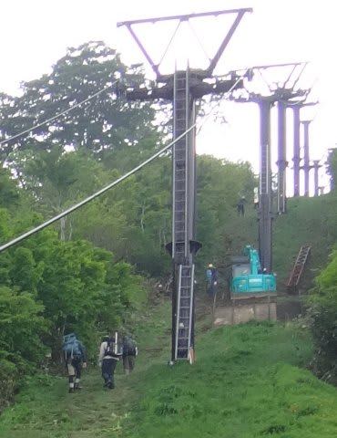

いや～，

その横に，歩いて登ってる人がいますね～．

リフト1本分，歩いて登る気かな～．

すごいな～．

自分はそこまでできないなぁ…

とりあえず，リフト乗り場近辺を散策して．

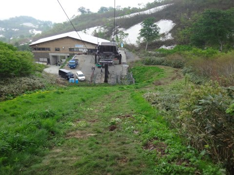

3号柱の工事の様子でも観察して．

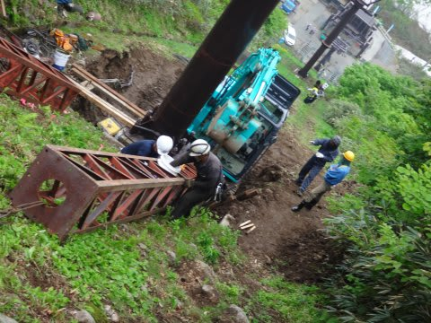

高山植物でも愛でてましょうか…

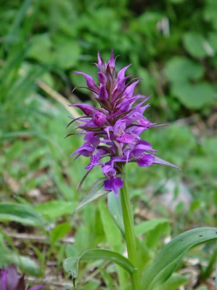

と．

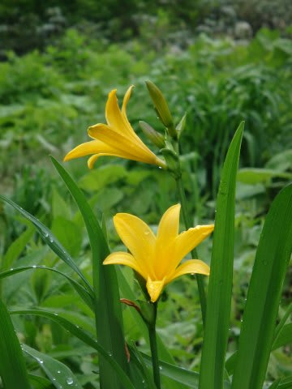

ニッコウキスゲなんかを見ていると．

なんと！

そのあと，時空を超越したらしく．

おや？

おやっ！？？

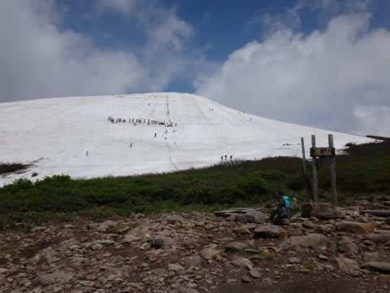

なんだ，ここは？？

リフト山頂じゃないかっ！？

どうしたことだっ！！！！！！

自分に，時空を超越する能力があったとはっ！！！

…しかし．

時空を超越するのに要した時間，約40分．

さらに．時空を超越するには，かなり体力を消耗するようで．

リフト山頂で休憩すること15分…

山頂を見ると…

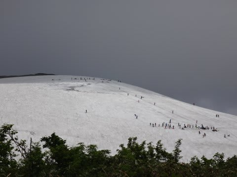

…

…リフトが動いてないのに，

こんなに人がいるとは…っ！

信じられん．

山頂からトラバースライン方面を，

パノラマ撮影してみると．

…雪はまだたっぷりありますね～

雪が多かった去年並みですかね．

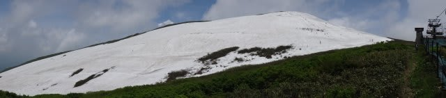

で．

ひと休みのあと．

また，リフト降り場からこういうところを登って…

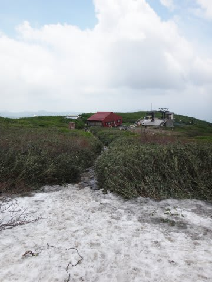

やっと雪があるところに着いたら，そこからTバーまで，

さらにこのくらいの距離をひと登り…

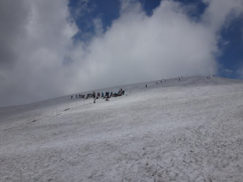

ってことで．

時空超越によるかなりの高速移動をしたつもりですが．

駐車場からTバー乗り場まで，1時間半かかりました…

で．Tバーに乗車．

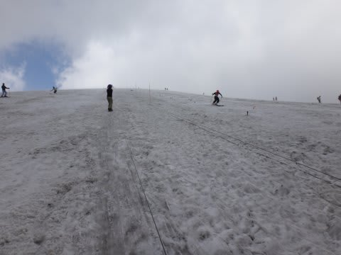

Tバー脇には，すごく浅いですがコブらしきものも．

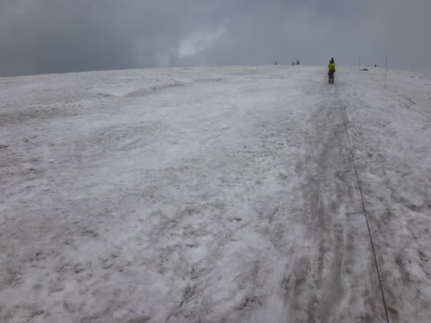

Tバー横のコースは，ある程度踏まれてますが，

でも，ちょっと荒れ気味かな～

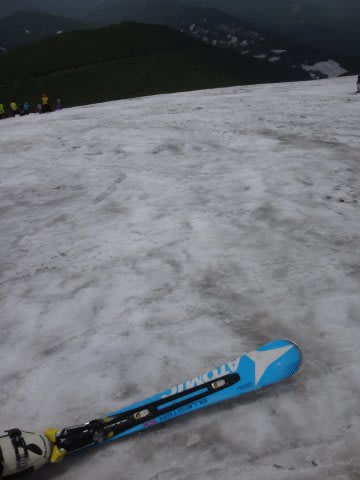

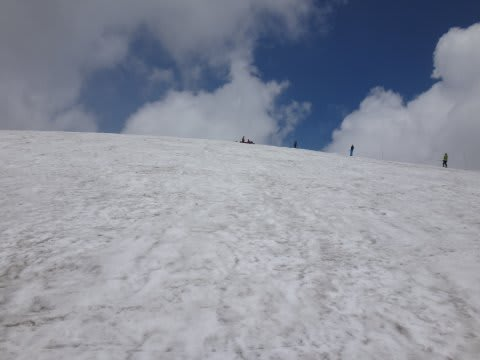

…でも．

何よりかにより．

30秒で滑っちゃうTバーに，

待ちが10分以上あるのがつらい…

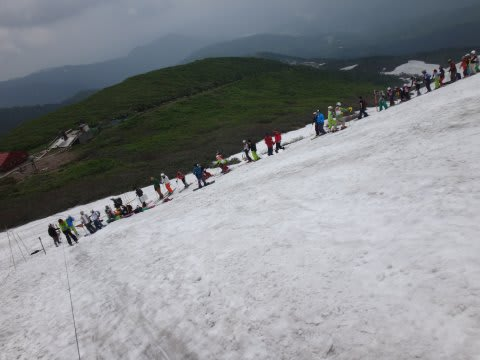

Tバーから下山するコースも，まだたっぷり雪があって．

沢コースもまだ問題なく滑れそうです．

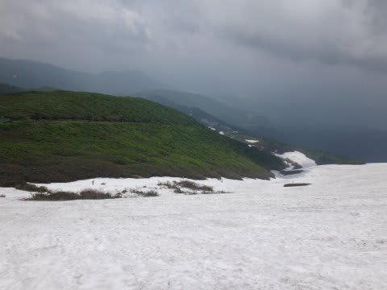

が…

Tバーから下は，ほとんど人が滑ってないので．

かなり荒れ荒れの，完全ナチュラルバーンで．

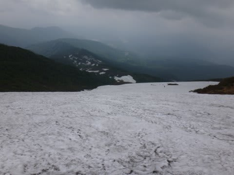

…あんまり楽しくない（涙）．

大斜面までやってきましたが…

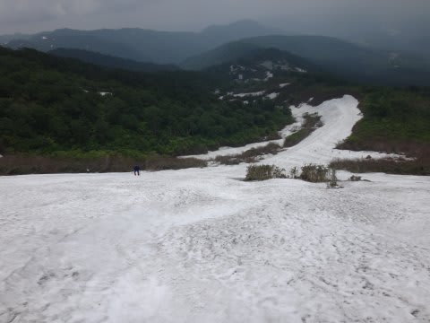

うむ．

人が滑ってないから，コブが消えかけてるぞ．

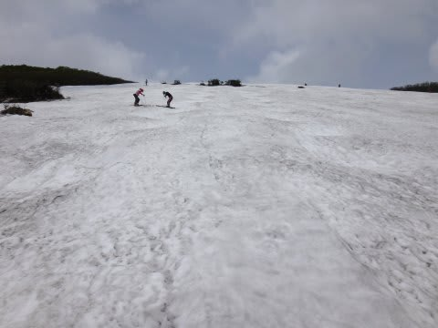

っていうか，ほとんどコブがないぞ．

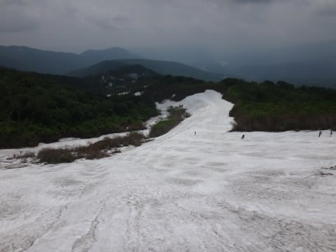

コブというより，ナチュラルバーンにわずか凹凸がある

感じ…

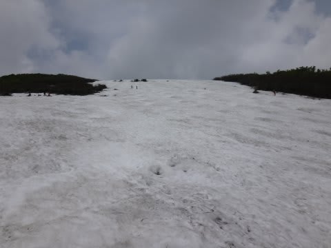

まぁ，3日間誰も滑ってないみたいで．

雨も降ったから，こんな感じかな～

でも．

まぁ．

こんな感じで，大斜面．

まだ雪はたっぷりありますよ～．

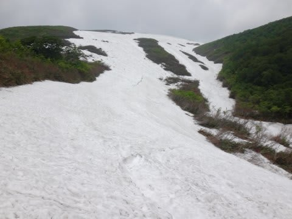

リフト乗り場近辺まで，まったく雪の跡切れも

藪漕ぎもなく滑れます…

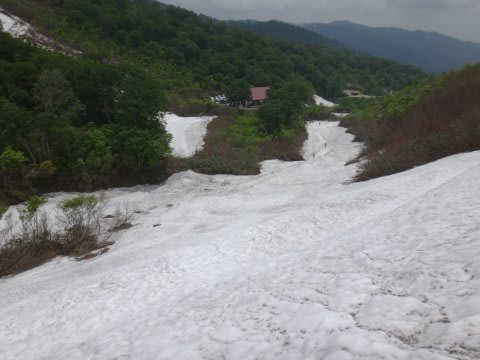

もう，6月下旬と考えれば，十分かな～．

って感じで．

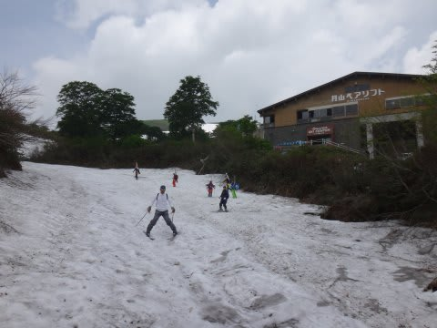

雪はまだたっぷりあるので．

リフトが動いていないのが，たいへん残念な感じの

月山．

…私は，義務である

「スキーシーズンおしまいの儀式」を

雪の上で執り行ってきたので．

これにて，シーズン終了です…
