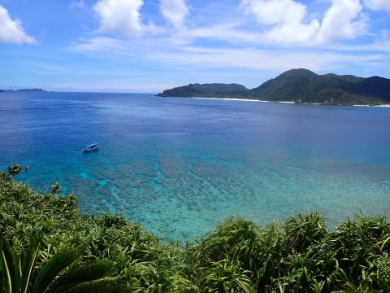
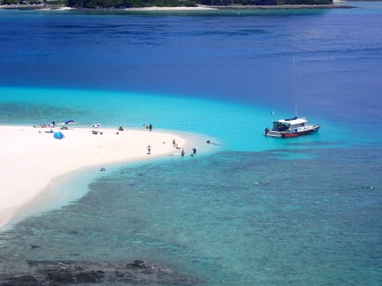

# 2023年8月，座間味で親子3世代ダイビング！その17…ダイビングラストデーのお昼休みは，ガヒ島の高台に登ってみた

📅 投稿日時: 2023-10-06 05:07:30

🏷️ カテゴリ: [ダイビング日記](ce3a7a8d424d112fce83ee85c81a0e344.md)

10月初めまで30度を越えるような

日が続いたと思ったら．

ようやく秋らしく冷え始めたけど…

今度は極端に冷え始め，一気に富士山も

冠雪したかと思ったら…

なんと．

志賀高原の焼額山でも，雪が降っている

みたいです！！

（[焼額山スキー場Facebook](https://www.facebook.com/yakebitaiyama/videos/1016419572932962)より）

イエティのオープン日はまだ出てないけど．

今の造雪状態で13日にオープンはない

だろうから…

20日オープンと考えれば．

あと2週間！！！

だんだんシーズンが目前に迫ってる感が

出てきましたよ～！！

って感じの話題のあとで．

季節感を逆行する本題へ．

今日も[前回の続き](e318d7d929a95ff4f65d5e35fcbc44e9a.md)，座間味のダイビング

レポートです～！！

ーー

ということで．

今日も2本目終了後にお昼休みと

なるのですが…

お昼休みの場所は，いつものガヒ島です！

そして．お昼ご飯もいつもの星砂さんの

お弁当．

いやー．

こんな景色を眺めながらのお昼ご飯は，

日常生活のすべてを忘れられる，

最高の癒しタイム…

で．

しばらくは，こんなきれいな景色を見て

のんびり過ごすわけですが．

お昼休み，かなり時間があるので．

やはりきれいなビーチに上陸したくなるの

ですよね…

いつも通り，目の前のビーチまで泳いで，

上陸するわけですが…

今日はいつものように，ビーチで

のんびりするだけじゃなく．

向こう側に見える，あの岩山に

登ってみようとチャレンジ！

近づいてみると…

とりつき部分は，ちょっと崖っぽく

なってますが．

その上に登ると，踏み跡があって

てっぺんまで登れる道ができてます．

…意外とここ，登る人が多いんだな…

向こうに見えるあそこがてっぺんですね．

ってなことで．

Garminさんによると標高40mほどの，

高台に登っていくと…

見事に座間味まで見渡せます！！

いや．

高台からの景色，結構いいな…

そして，みんながいるビーチの反対側にも，

だれもいない砂浜があるのが見えたり…

ビーチからは眺めることのできない，

きれいなサンゴ礁の海の景色がほぼ360度

広がります！

そして，ビーチに泊まっている

ティンガーラ号も見渡せて…

うん．

今後，お昼にガヒ島に来たら，

ビーチで過ごすだけじゃなくて，

時々ここに登ってもいいかも…

しばらく景色を堪能したら，下山します．

って言っても，山って程じゃないですが…

3分もかからずに下山．

ビーチに下りてきます…

いやー．

しかし．

ホントにこのビーチ，きれいだな…

ってな感じで．

高台に登って降りてきたら，ちょうど

昼休みも終わりくらいの時間．

ボートに戻ったら…

タンクを付け替えて．

今日のラストの3本目へ向かって，

移動開始！

（[続く](eff0d9a0e36af73fe2f4b077add8fcc40.md)）

## 💬 コメント一覧

### 💬 コメント by (mae)
**タイトル**: Unknown
**投稿日**: 2023-10-06 09:44:17

写真だけでも十分に美しさが伝わってきますね。

来年、素潜りだけでも行きたくなりました。

### 💬 コメント by (Skier_S)
**タイトル**: ＞maeさま
**投稿日**: 2023-10-07 20:46:23

座間味もインバウンドがかなり増えました…

そのおかげか，宿は一部取りにくくなっているようですが，

ぜひ座間味にまた行ってみてください！

