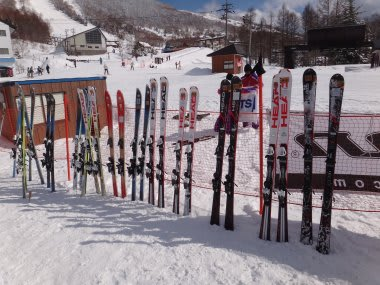
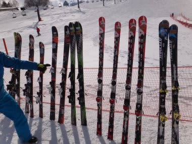
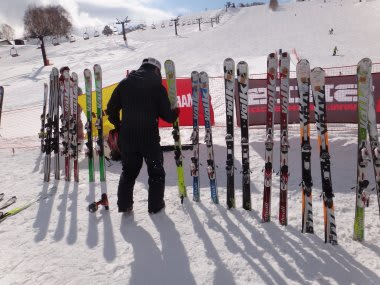
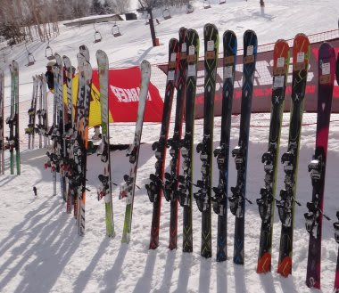

# 2013シーズンのスキー板の傾向は？？

📅 投稿日時: 2012-04-27 01:41:25

🏷️ カテゴリ: [スキー雑談](c1f9d2cb7478308da16419928ea3945e9.md)

で．

長々と試乗レポートをいろいろ書いてきましたが．

やはり，来シーズンのスキー板の傾向としては，ロッカースキーが

基礎・競技用のトップモデルに採用されてきた，というところが大きいでしょうかね～．

(大体トップロッカーで，フルロッカーってのはないですけど）

で．

もうひとつの大きな傾向は．

板の操作方法が大きく変わっちゃってるよ…

ってところですかねー．

「板のトップを押さえる」

という運動はまったく不要になりました．

＃一部の板は，トップを押さえたほうがいいものが残ってますが…

昔ながらのスキーをやっている人は

「ここまで後ろに乗っちゃっていいの？？？？」って感じで．

ポジションがかかとよりになりました．

まぁ，これはトップを押さえなくてもすでにたわんだ形になっている，

ロッカースキーに適したポジションなのかと．

ということで．

これからは．

カービングスキーの出始めのころと同じように．

「ロッカースキーを履いているか否か」

で，スキーの指導法を変えなくてはいけないようになるのかな？

…とか思ってしまったりするわけで．

それくらいのことを感じさせちゃうくらい，

来シーズンモデルのロッカースキーは，

スキー技術を大きく変えそうだなぁ…

って．

そんな感じを受けました．

だって，ホントに．

性能が発揮できるポジションが．

これまでの板と明らかに違うものが多かったんだもん…

＃テールを押さえる極端度では，

＃HartC9.2＞Salomon X-kart＞Dynastar Course demo

＃って感じかな…Hartはロッカーじゃないけど（汗)．

とりあえず．

来シーズンの板は．

トップを押さえなくても曲がる板が多いよっ！

