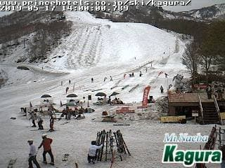
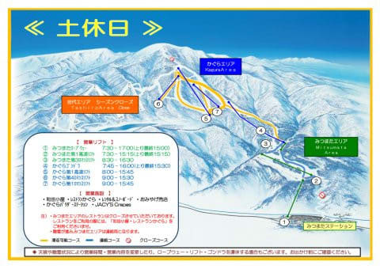
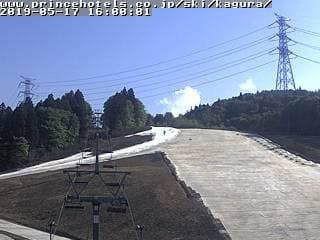
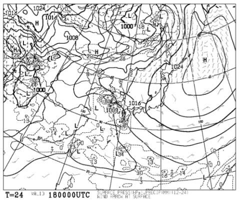
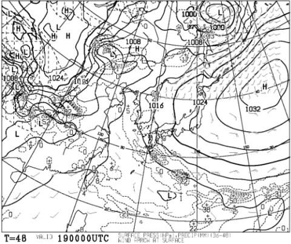

# 今週末は1泊2日でかぐらで滑ってます～！

📅 投稿日時: 2019-05-18 00:05:23

ということで．

今週も，ひどい雨が降ることは

無かったので．

この一週間，かぐらスキー場の雪が

壊滅的に減ることは無く．

ライブカメラを見ると，メインバーンは

まだ全面雪に覆われてますし…

（[かぐらスキー場HPライブカメラ](https://www.princehotels.co.jp/ski/kagura/livecamera/?__utma=1.590953270.1526916109.1558027463.1558089521.219&__utmb=1.1.10.1558089795&__utmc=1&__utmx=-&__utmz=1.1535996538.42.2.utmcsr=anotherski.skr.jp|utmccn=(referral)|utmcmd=referral|utmcct=/skireport/early-ski2018.html&__utmv=-&__utmk=152778169#main_g)より）

昨日の記事に書いたように，

まだパノラマ・ジャイアント・テクニカルも

滑れるようで．

（[かぐらスキー場HP営業マップ](http://www2.princehotels.co.jp/ski/kagura/files/pdf/201900518_kagura_map.pdf)より）

みつまたも廊下ながら，まだ雪が

残ってますし．

（[かぐらスキー場HPライブカメラ](https://www.princehotels.co.jp/ski/kagura/livecamera/?__utma=1.590953270.1526916109.1558027463.1558089521.219&__utmb=1.1.10.1558089795&__utmc=1&__utmx=-&__utmz=1.1535996538.42.2.utmcsr=anotherski.skr.jp|utmccn=(referral)|utmcmd=referral|utmcct=/skireport/early-ski2018.html&__utmv=-&__utmk=152778169#main_g)より）

春の残雪にかなり恵まれていた，

2シーズン前と同じくらいのレベルに雪が

残ってますね～！

そして．

土曜日の天気図を見ても．

日曜の天気図を見ても．

本州はおおむね高気圧に覆われていて，

土日とも晴れそうですし…

ってな感じで．

この土日．

状況が良さそうなので．

1泊2日でかぐらを滑ってます～！
