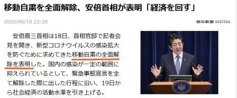
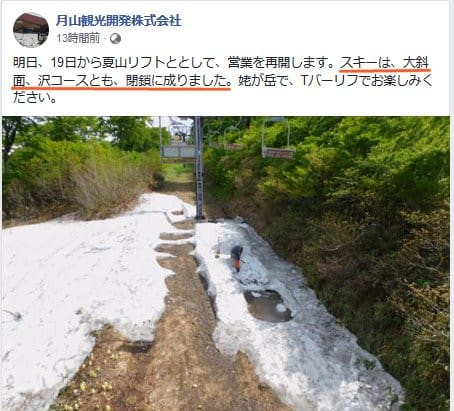
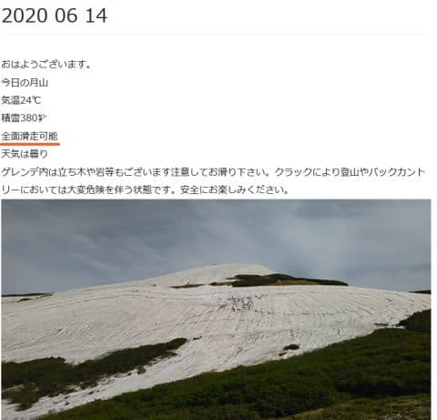
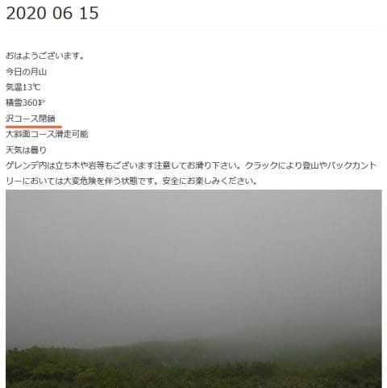
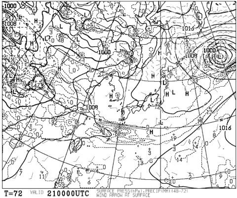

# ようやく移動自粛全面解禁．今週末は月山に行くぞっ！！！…って，なに？？大斜面終わっちゃったの！？？（涙）

📅 投稿日時: 2020-06-19 01:22:28

えー．

ついに．

待ちに待った，

長距離の移動自粛の全面解除

が宣言されました…っ！！！

（[朝日新聞ニュース](https://www.asahi.com/articles/ASN6L74D5N6LUTFK017.html?iref=comtop_latestnews_05)より）

耐えがたきを耐え，

忍び難きを忍んだ，この2か月半．

待った…

待ったよ，この日を…っ！！

まだ，シーズンは終わっていない．

ふはははははは．

今週末こそ，待ちに待った雪山に復活だ…っ！！

月山に行くぞっ！！

…って．

え？

えええええ！！？？

（[月山観光開発FB](https://www.facebook.com/gassankannkou/posts/2978970928877748)より）

大斜面，沢コースとも閉鎖っ！？？

大斜面，終わったのっ！？？？？

う，

うぎゃーーーーー！！！

なんてことだーーーーーーーーっ！！

14日の先週日曜までは，大斜面はもちろん，

沢コースも滑れる全面滑走可能だったのに…

（[月山観光開発ホームページ](https://gassankanko.jp/honjitu/2020-06-14/)より）

今週月曜15日に，沢コースがクローズとなり．

（[月山観光開発ホームページ](https://gassankanko.jp/honjitu/2020-06-15/)より）

そして，明日から大斜面もクローズとは…っ！！

惜しい．

惜しすぎる…

あと2日持ってくれれば…っ！！

あぁ．大斜面よ．

なぜおぬしは，

移動全面解除の直前に死に絶えるのだ…っ！！（激烈涙）

大斜面の…大斜面のバカっ！！意気地なしっ！！

…残念だ…

残念すぎる…

とりあえず．

天気図を見ると…

20日の土曜は，明け方まで雨が残り，朝のうちは

ガスが出そうだけど，昼前から晴れそうで．

21日の日曜は，終日晴れてくれそう．

ってな感じで，天気は悪くなさそうなので．

とりあえず，この週末は．

シーズン終了の儀式を執り行いに，

月山まで行ってきます…

## 💬 コメント一覧

### 💬 コメント by (naoちゃんねる)
**タイトル**: Unknown
**投稿日**: 2020-06-19 17:07:29

ようやく解除され、大手を振ってスキーに行けますねっ(祝)

私は地元なので、スキーの日数は多かったですが、何だかスッキリしないシーズンの終わりでした…

でも、昨日のSさんの記事で、今シーズンは私にとっても娘にとっても濃いーシーズンだった事を思い出しました！

大斜面終わってしまったのは残念ですが、楽しんで来てくださーい！ レポート楽しみにしてます♪

### 💬 コメント by (yumi)
**タイトル**: Unknown
**投稿日**: 2020-06-19 18:46:35

Ｓさぁ～ん⛷️💨💨💨

🎉🎉🎉🎊🎊🎊🎇🎇🎇🎏🎎🎃🎄🎖️🎀🎁

やっと✨やっと🎵行けるのね☺️

良かった ですね☺️

うちの主人も✨

良かったねぇ～💖

って 言ってましたぁ～🎵

くれぐれも お怪我の無いよう✨楽しんで来て下さいね🎵💖✨👍😁

### 💬 コメント by (親父スキーヤー)
**タイトル**: Unknown
**投稿日**: 2020-06-19 19:11:58

おめでとうございます㊗️㊗️

大斜面は残念ですが、Tバーは問題ないかと…

先週、中5日おいて月山行きましたが、暑さで雪解け例年になく早く感じました…とは言え、雪の上に立てるだけ良しです！！思いっきり滑って来て下さい！！

自身、東北から八方に通う変態ですが、今年は散々なシーズンでした

そんな中、徒然さんのブログ楽しませて頂きました！

月山レポート楽しみにしてます！

これからも頑張って下さい！！来年は良いシーズンになります様に！！

### 💬 コメント by (Skier_S)
**タイトル**: 睡眠時間1時間で出発（涙）
**投稿日**: 2020-06-20 00:30:14

＞naoちゃんねるさま

もう，やっと県境を越えられます…（感動）

naoちゃんの2級合格，いい思い出になりましたよね！

次は1級ですか（笑）．

月山楽しんできます～！！

＞yumiさま

やっと行けます…

もう，長い自粛期間でした…

これほどK奈川県民だったことを恨めしく思ったことはありません（笑）．

あと1時間半後に出発ですが，怪我なく事故の無いよう

行ってきます…

＞オヤジスキーヤーさま

やっと解禁です！

思いっきり滑ってきます！

…とはいえ，Tバーだけなのが残念ですが…

しかし，東北から八方って，かなりのマニア度ですね…！！！

ぜひ，志賀にもいらしてください…

来シーズンこそいいシーズンでありますように！！

