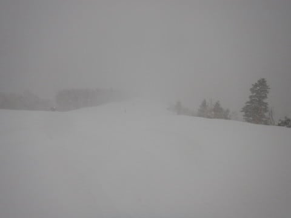
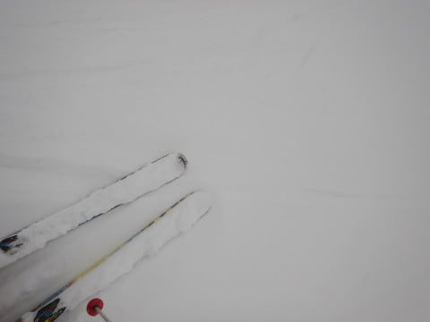
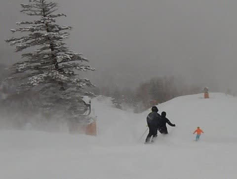
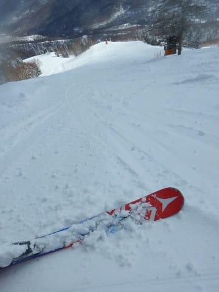
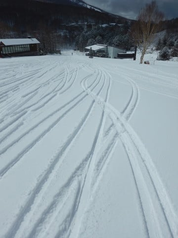
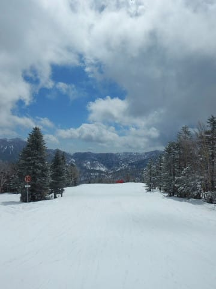
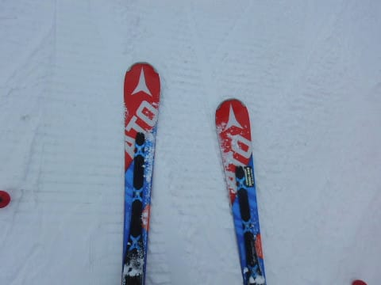
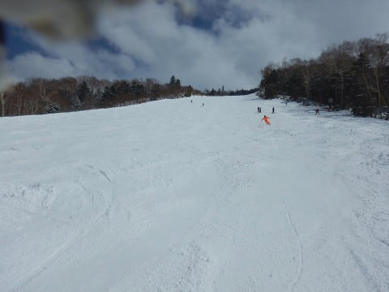

# 4月8日(日)の志賀高原速報モード…久々の冷え冷え！朝は積雪10cmちょい，午後は所々カリカリ＆もさもさになったけど，久々の冬の雪！

📅 投稿日時: 2018-04-09 01:40:22

🏷️ カテゴリ: [2018スキー滑走日記](c11b88dc181f34079ab41db74a3587646.md)

ということで．

今日もラストリフトまで滑り．

帰宅は深夜…

だもんで．

今日の志賀高原，いつもの速報モードにて！

まず．

朝は早朝から参戦しますが…

なんだか，朝はマイナス8度とすごい

冷え込み！！！

そして，雪が結構降ってるんですが？？

明け方3時くらいから雪が降り始めた

みたいで…

朝イチは，10cm程度積もってます！

それも，結構冷え冷えの軽い新雪！！

早朝は，降雪で視界が悪かったけど．

真冬の雪質のブーツパフを蹴散らしながら，

久しぶりの柔らかい雪で滑れたよ！！

あぁ…そうだよ…

雪って，こんなに柔らかかったんだよ！！

通常営業開始のころから，

時折日も射し始め．

早朝営業をやっていないコースでは，

通常営業開始時に，朝イチフレッシュパウダー状態！

天気は雲が多く，基本的に曇り．

ときどき日が射す程度の天気で，

昼間の気温もしっかりマイナスをキープ！

ただ，雪は…

基本的に柔らかいいい雪が上に乗ってくれているのですが．

ところどころ，下地が掘りかえされて固いコロコロが

出ていたり，凍った下地が出てきているところも…

とはいえ．

3月に入ってから，毎週末春の重い雪に

なっていた今シーズン．

久しぶりに冷え冷えの新雪が積もり，

2月以来の雪らしい雪を滑ることができ．

さらに，昼間の気温も冷えて，

最後まで全く雪が緩むことなく．

時折日が射す中，4月にしてはいい

コンディションで滑れたのでした…

あぁ…

こんなコンディションが，

あと1か月ぶっ続けでGWまで毎日続けば．

GWのゲレンデは安泰なんだけどなぁ…←ありえないから，それは無いから

ってなわけで．

明日詳細モードやります～！

## 💬 コメント一覧

### 💬 コメント by (m&t)
**タイトル**: ありがとうございました
**投稿日**: 2018-04-09 11:53:08

昨日は１ゴン駐車場で帰り際に声をかけさせていただき、ご迷惑ではなかったでしょうか?

ステッカーを4枚もいただきありがとうございました。

11月のアサマから何度も声をお掛けする機会はあったのですか、昨日が今シーズン最後のスキーだったため、思いきって声をかけさせていただきました。

スキーをしている時の鬼気迫る様子と違い、素顔のSさんはとても優しい方で、安心しました。

来シーズンはもっと志賀に通い、集団暴走（？）に参加させていただきたいと思います。

今後もどうぞよろしくお願いいたします。

### 💬 コメント by (はっち)
**タイトル**: 朝一は最高！
**投稿日**: 2018-04-09 21:43:21

午後からどんどん人が減っていき、午後はマイゲレンデ状態。　早朝から最後まで滑っていたのは、我々ぐらいかもｗ

### 💬 コメント by (ほっぽ)
**タイトル**: 昨日はお会いできました
**投稿日**: 2018-04-09 23:44:14

＞Ｓさん

昨日は友人と一緒だったのでご挨拶だけで失礼しました。

そして、まさかのカレーバイキングでの再会、あそこでお会いしたのは初めてでした。

今週は土曜日日帰りの予定です。

私も昨日の滑走レポートをアップしておきました。

### 💬 コメント by (Skier_S)
**タイトル**: 昨日はコメントできずすみません…
**投稿日**: 2018-04-11 01:48:31

＞m&tさま

ステッカーは一人2枚お配りしているので，

今回2人でいらしたので4枚渡させてもらいました～！

そうですか…11月から私のことを発見してらしたのですね．

結構志賀に来ていらっしゃるなら，

私と出くわすチャンスはかなりあったかと．

…でも…

そうなんですか…

私はゲレンデで滑ってる時は，鬼気迫ってますか（笑）

お気楽レジャースキーヤーなんですけどね

＞はっちさま

日曜はお疲れ様でした～！

夕方の焼額はガラガラでしたね…

早朝から最後まで行く人は，

普通そんなにいないと思いますが．

20000mな方々と滑ると，それが標準と思ってしまうところが

いろいろずれてます…

＞ほっぽさま

日曜は珍しいところでもお会いしましたよね…

今週は土曜日帰りですか．

日帰りはつらそうですね…

という私も，今週末は日曜日帰り予定です（笑）

