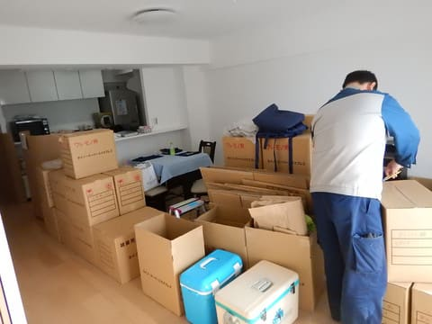

# 新居生活開始…まだまだ細かな片づけは続く

📅 投稿日時: 2018-11-06 02:33:05

ってな感じで．

引っ越し作業，今日も続きました．

本日は朝から引っ越し業者さんによる

開梱作業が進められて．

本日をもって，業者さんの作業は終わりました…

私は作業途中で出社したので，

全てを見ていませんが．

先ほど帰宅したら，ほとんどの段ボールが片付いてました．

（こんな日でも，いつも通りの深夜帰宅（涙））

ってなわけで．

電話もインターネットも本日開通作業が終わったので．

必死にネットワークを復活させて．

無事，いつものPC環境が戻りました…

…ただ．

まだ荷物が開いていないものやら．

想定した収納スペースに入らず，

仮に突っ込んであるものやら．

収納用の棚とか小物入れが無くて，

乱雑に仮に収められているものが

多くて．

収納小物やらプラケースやら，

買わなきゃいけないものがいっぱいありそうで．

本格的に片付けるのには，

まだまだかかりそうです…

あぁ．

全然引っ越しが終わらない…

でも．

この週末は滑りに行かずに我慢したので．

今週末，土曜にはYetiに行かなきゃいけないし．←義務なの？？それは義務なのか？？

そして，次の日曜は．

気のせいでなければ，昼過ぎの飛行機に乗って．

また一週間ほど遠くに出張へ出かける気がするのだが…

うむ．

いつ，完璧に片づけが終わるのだろうか．
