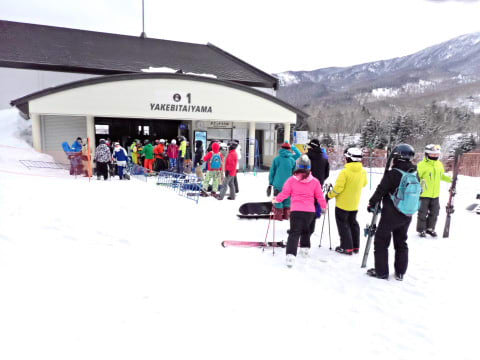

# 2024/2/25(日)の志賀高原焼額山スキー場，速報レポート！…予想外して朝から雪，強風で昼前にゴンドラ運休．吹雪でバーンはガチガチの残念な一日(涙)

📅 投稿日時: 2024-02-26 00:50:47

🏷️ カテゴリ: [2024スキー滑走日記](c453f687e8a0f05679e95831d0a02cd0c.md)

えー．

今日は．

こんな日もあるさ

と自分を慰めるしかない，かなり残念な

感じの一日でした…(涙)

いや．

あさイチはそこまで天気も悪くなかったし．

営業開始前の第1ゴンドラの待ちの列も

そこまで長くなく．

今日も昨日と同じ，穏やかで結構

いい一日になるんじゃないか，

という予感でスタートしたんですが…

ただ．

今日の予想は晴れのち曇り，

夕方から雪かも？

という予想だったはずが．

朝から曇り空であったことに，

ちょっと懸念を感じていたけど…

とりあえず，あさイチのバーンは，

昨晩からの積雪0だったため．

わずかながらも積雪があった昨日の

土曜とは違って，ちょいと硬めでは

あったものの．

まぁ，締まったいい感じのシマシマかな，

と思ったら…

唐松コースとかはすぐにコロコロが

出始めて．

さらに，さすが3連休ということもあり，

コース上の人も多めで…

そのうえ気温が低かったので．

大勢の人で圧雪された表面の雪が

すぐにはがされて，下地の硬い雪が

コースのそこかしこに出てきちゃい

ました…(涙)

そして．

午前11時ごろには，かなり本格的に

雪が降りはじめ…

というか．

風もものすごく強くなり，本格的な

吹雪になってきちゃったんですけど？？（涙）

そのおかげで…

11時ごろには第2ゴンドラ，第1ゴンドラ

そろって討ち死に（泣）

このあと，運転再開せずに終日

運休となりました（涙）

ゴンドラが2本とも運休になったせいで．

第3高速が10分近い待ち時間に

なりましたが…

第3高速リフトも強風のため，

ペアリフト並みの低速運転が

続き…

午後1時前に，このリフトも討ち死に（泣）

午後1時を過ぎると．

残るは第4ロマンスリフトと第2高速

リフトの2本だけになりました…（泣）

山の神＆ダイヤモンドリフトも

強風で運休になったので，一ノ瀬から

人が流れてこなかった分，

第2高速リフトはそこまで混みません

でしたが…

ただ，焼額を滑っているほとんどの人が

このゲレンデに集まったため．

コース上は，日曜午後と思えないくらい

人が多かったです（泣）

さらに，バーンはコロコロとアイス

バーンと凸凹のトリプルパンチで．

あまり楽しくない，ちょいと残念な

感じ（涙）

さすがの私も，吹雪＆ゴンドラ運休＆

バーン状況悪化の3重苦の今日は，

リフト営業終了まで滑らずに早上がり

しようかと思うレベルでしたが…

午後2時半を過ぎると，滑る人が

かなり減ってきたのもあり．

気づいたら，16時15分の営業終了

まで滑ってました…

ってなことで．

予想をいい意味で裏切って楽しめた

土曜とは打って変わって．

予想を悪い方向に裏切られて，

この私でも，

リフト営業終了を待たずに帰ろうか？？

と思うレベルだった本日だったわけですが．

誰だ？？？

日ごろの行いが悪かった人は？？？

今日，焼額を滑っていた人で，

日ごろの行いが悪かった人は素直に

申し出てください！！←いい意味で裏切られたのは

自分の行いなのに，悪い方は人のせいにするのね…

ちなみに．

志賀高原は25日深夜の今，雪が降ってる

ようですが…

26日から28日の朝にかけて．

毎日10cmずつくらい積もってくれそう…！！

…でも．

せいぜい1日10cm，合わせて30㎝程度．

ドサドサ積もるほどじゃないです（泣）

クローズになったオリンピックコースが

開けられるほどじゃないですね（涙）

でも，アイスバーンが隠れてくれれば，

次の週末のコンディションは少しは

良くなりそう…！

とりあえず．

次の週末まｆｒには，状況が改善することを

期待…！

## 💬 コメント一覧

### 💬 コメント by (真美子)
**タイトル**: Unknown
**投稿日**: 2024-02-26 06:58:20

今日は、お会いできて、私には幸運な午前中でした。

しかも一緒に滑っていただき、感謝感謝です。

風が強くゴンドラも止まり、リフトも2本しかなくて、ゲレンデに人が多くなってしまい、私は早々に引き上げてしまいましたが、4時15分まで滑っていたのですね。さすがです。

### 💬 コメント by (副院長)
**タイトル**: Unknown
**投稿日**: 2024-02-26 07:52:24

日曜日は、南風が、残念でしたね。ゴンドラ止まって、プリンスで、まったりして、志賀で、風が吹かない、丸池、サンバレーで、タラタラしておりました。

来週コンディションの回復お願いします。

### 💬 コメント by (スシネコ)
**タイトル**: Unknown
**投稿日**: 2024-02-26 12:53:51

いやー、14:30過ぎからは一気に空いて、数人しかいないカラマツは楽しかったですよねー。終了に向けて２高は盛り上がってましたよねー。テンション上がりっぱなしでしたよねー！　ฅ(๑•̀ω•́๑)ฅ

### 💬 コメント by (レインボー76)
**タイトル**: Unknown
**投稿日**: 2024-02-26 15:01:38

月曜日の志賀高原情報

朝の上林-1℃　蓮池-5℃。曇っている。新雪10cmが圧雪されて久々の快楽バーン。

昨日の地肌で終わったはずの白樺が、開いてる。しかもいい感じ。唐松もいい。

今週で終わるはずの三高はまだまだやれるのに！やっぱり勘違いバーンでおかわり連発。

GSだけが期待はずれ。遅く行ったせいで荒れてたし、人も過密でした。昼前には微かに晴れ間も出てきて未練が残ったけれど、終了。

副院長さんからもお声掛けいただきました。

午後の湯田中は小雨。明日はずっと雪予報だけど、18mの強風予報なので、ゴンドラ止まりそう。私は心置きなく休場予定です。

### 💬 コメント by (大阪のK)
**タイトル**: Unknown
**投稿日**: 2024-02-26 16:13:11

昨日はダイヤモンドクワッドが止まっており、一ノ瀬から焼額山に行けず風の穏やかな西舘を回しておりました。

13時にはフーディークワッドが止まるとの連絡を受け、慌てて高天原に移動。

宿のあるタンネで絞めて閉店しました。

小中学生とは言え、女性同伴ではバスタイムを設けなくてはならず、大阪に帰ったのが23時50分でした。

新雪が積もり始めた西舘、良かったですよ。

### 💬 コメント by (おぼう)
**タイトル**: 見掛けましたよっ
**投稿日**: 2024-02-26 19:23:45

前にすこしコメントしたことのある者です

この３連休で焼額に行ったので、Ｓさんはいらっしゃるかな？どの方かな？と

探してたところ、第1ゴンドラ乗り場や、第３高速で

「もしかして？」思える方を見掛けました。

で、駐車場でも車種と色と合う車のところで帰り支度をされてたので確信しました。

「やっぱりあってた～」と。

次に見掛けましたらお声がけしていいですか(笑)

３連休、ガリガリが隠れてるところもあって、コースによっては楽しめたので良かったです。

### 💬 コメント by (misaring)
**タイトル**: Unknown
**投稿日**: 2024-02-26 22:53:36

私が行かなかったばっかりに、コンディションが悪く申し訳ありません！！

これから毎日30㎝ずつ新雪（粉雪）が積もるよう雪乞いしておきます🤲☃️（ - 🙏 - ）☃️🤲

### 💬 コメント by (地元民)
**タイトル**: Unknown
**投稿日**: 2024-02-26 23:40:29

里も１日雪で、夕方からすごい降り。

大雪注意報がでていて、明日までに40㌢だそうです。里もかなりの降り。

週末も寒波が来るらしけ、しばらく低温傾向みたいです。いや〜、自然ってきちんとバランス取るんすね〜。

### 💬 コメント by (Skier_S)
**タイトル**: 眠い…
**投稿日**: 2024-02-27 03:11:16

＞真美子さま

無事お会いできましたね…喜んでもらえて良かったです．

これからもケガをしないよう，転ばないようお気をつけてスキーを続けてください！

＞副院長さま

日曜はかなり残念なコンディションでしたね…

今日も雪が降ってるみたいですし，今週末は少しはコンディション回復するかも？

ただ，白樺 ＆唐松はクローズですね（涙）

＞スシネコさま

私はテンションだだ下がりでしたが…

＞レインボー76さま

明日は雪がちょっと積もってコンディションは回復しそうですね~！

風が強くなければ，いい雪を楽しめる一日かも．

＞大阪のKさま

え？西舘よかったんですか？

焼額はかなり残念な感じでしたが…

早上がりせず，日曜はあのコンディションでしっかり遅くまで滑ったんですね（笑）

＞おぼうさま

おっと．見つかってましたか…（笑）．

今度見かけたときはぜひ声をかけてください！

＞misaringさま

コンディションが悪かったのはmisaringさんが来なかったからだったのか…！！

では，来週は絶対来てください（笑）．

＞地元民さま

え？？40cmですか！？？

そんなに積もるのかなぁ…

志賀は明日までに10cm，よくて20cmと思ってますが…

でも，いっぱい積もってほしいです…

