# 2022年10月，谷川岳→茂倉岳に登ってみた…その2

📅 投稿日時: 2023-08-23 00:26:49

🏷️ カテゴリ: [登山・旅行](c1d637a11a25b457ac978d197adbdafc5.md)

ってなことで．

書類上は7連休とか8連休でも，

大体は家で泣きながら仕事をしていて，

実際にそれだけリアルに休むことは

ここ数年間なかったわけですが…

今回，久しぶりに5日間にわたって慶良間で

過ごして，リアルにのんびりしてたので…

久しぶりにリアルにこれだけ休むと，

仕事に戻っても，すぐにはペースが戻らない

感じ（涙）．

あーーーー

仕事したくない～っ！！！！

と叫びたい気分を抑えながら仕事してます．

ということで，本題へ．

[昨日の記事](e51ccfb2c75ccc4b03b245dd5f83add0c.md)の続き，谷川岳の山歩きレポートです！

ーーー

とりあえず，朝日が差す中，

朝6時に谷川岳ベースプラザをスタート

したわけですが…

まず，スタートしてからしばらくは

舗装路を歩きます．

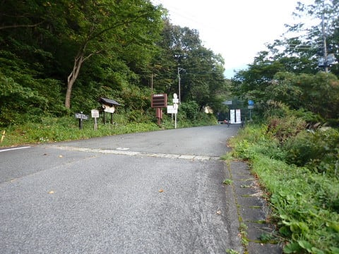

5分ほど歩いたところで，

舗装路から分かれる登山口があります．

ここから，日本3大急登といわれる

西黒尾根がスタートするわけですが…

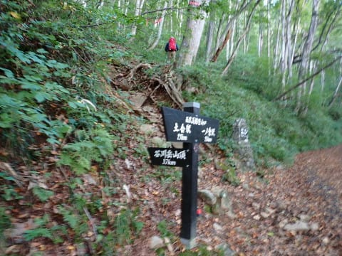

まぁ，確かに．

とりつきから早くも急登ですな…

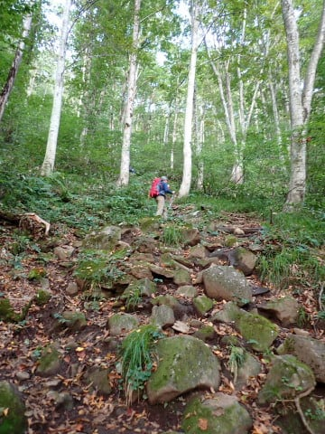

最初はゴロゴロした岩の上を歩いていき…

しばらくすると，斜度は急ながらも，

木立の中の歩きやすい道になっていきます．

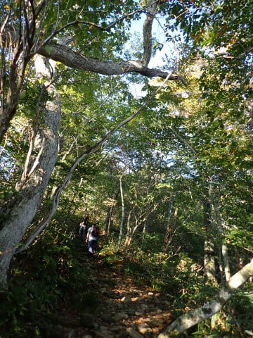

もう少し手足を使うほどの急登かと

思ったけど．

最初のうちは急坂ながらも，

そこまでの急登じゃないですね…

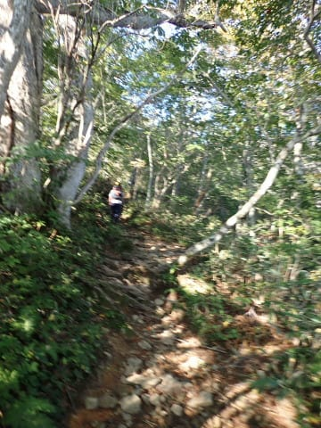

そして．

スタートから1時間も歩くと…

回りの木もなくなり，スコーンと見晴らしの

いいところに出ました！！

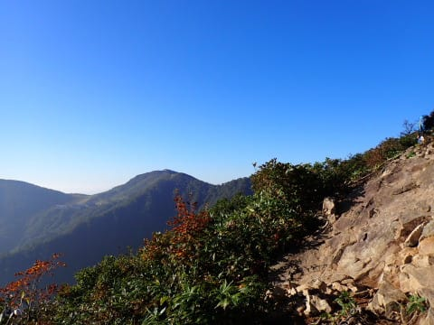

いや～！

今日は天気もいいし，

絶好の山歩き日和だなっ！！！

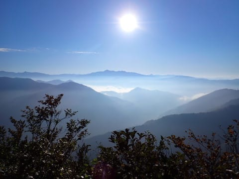

ただ…

このあたりから，また斜度がきつくなっていき．

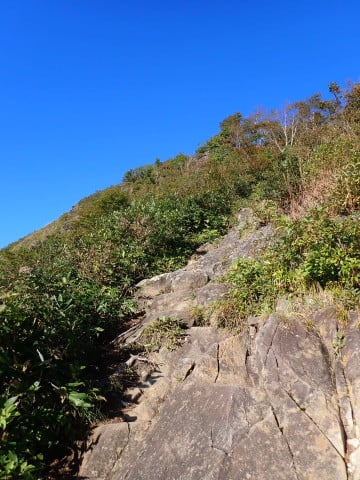

鎖場もところどころで出てきます…

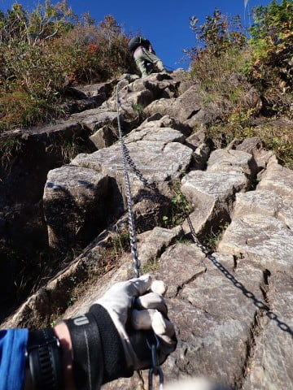

いくつかの鎖場を越えますが．

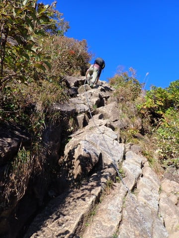

うん．

かなりの高度感がある山登りですね！！

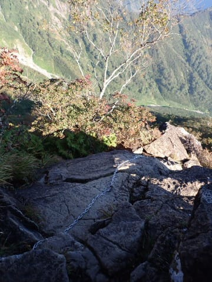

ただ…

登っていけばいくほど景色はよくなっていき．

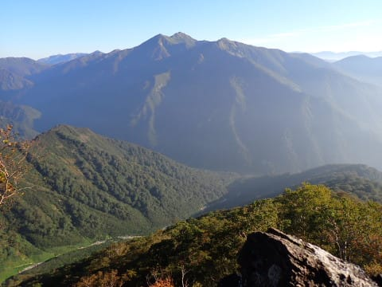

これは，今まで登った山の中でも

かなり絶景の山ですね！！

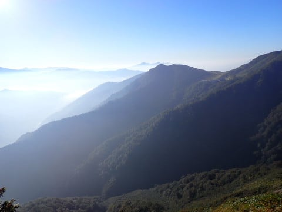

…でも．

さすが日本3大急登…

斜度はかなり急で，手足を使って

登らなくてはならないところが続き

ますし．

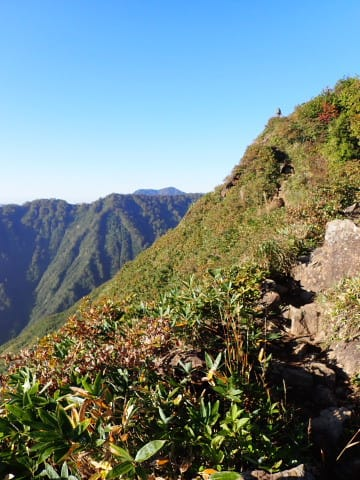

写真ではわかりにくいけど…

かなり斜度感があるところをひたすら

登っていく感じで．

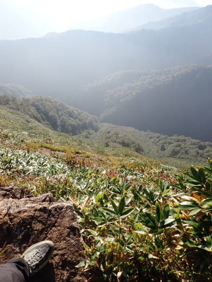

1時間以上，かなりの急斜面を登り続け

ましたが．

…まだ山頂はあんなに先なのか…（涙）

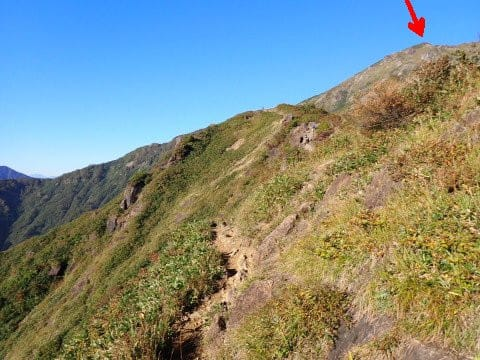

（[続く](e71c1adff190d2f3ab7c56385825dc343.md)）
