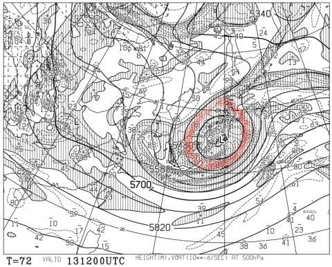
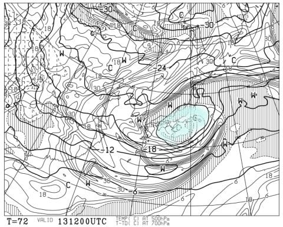

# 本日の志賀高原スキー場は，やっぱり冷え冷え！…そしてこの週末は土曜冷え冷えのいい天気，日曜はそれほど暖まらない曇り空

📅 投稿日時: 2020-04-11 02:16:00

🏷️ カテゴリ: [日記](cc4b5682fb7b8b144980957a978653fb0.md)

えー．

わが給料を払ってくれる，某組織．←だから，勤務先とか会社って言おうよ…これだと反社会的組織みたいなんだけど

先週あたりから，

テレワーク

という名のもと，無理やり家で仕事を

することになったわけですが．

…結局家にても，

朝から夜までヘッドセット付けっぱなしで，

ぶっ続け何件もWeb会議が続く

という，あんまりいつもと変わらない感じの

日々を送っている，Skier_Sです．

ってなことで．

本日の志賀高原ですが．

雪降りで始まった朝．

あさイチはうっすら積雪があったようで…

そして，朝の山頂の気温は

　朝イチは-7~8℃と激寒！

という予想がまたピッタリ当たって，

-7℃と，4月としてはかなりの

冷え冷えっ！！

で．

ゲレンデは，かなり固めの下地の上に，

軽い新雪が10cm近く乗った，

この時期としてはいいコンディション！

コースによっては，カリカリと

新雪がまだらになって，ちょっと

手ごわいところがあったようですが，

焼額のパノラマコースなんかは，ほぼ全面

新雪が下地のカリカリを隠して

くれてたようで，滑り良かったみたいです…

　朝は数cmの積雪がありそうで，

　硬い下地の上にうっすら柔らかい

　圧雪が乗った，この時期としては

　最高級のバーンコンディション．

という予想も，大体当てたようですね～！

気温は昼間も-5℃程度までしか

上がらなかったようで．

　昼間も-5℃程度までしか上がらない，

　真冬の冷え冷え！寒いよ！

という予想も，見事にピッタリじゃないですか！！

で．

天気は午前中に一瞬日が射した

タイミングもあったようですが．

基本的には雪が降ったりやんだりで，

時折ガスが下りてきたりした一日

だったようです…

あと，風が強かったようで．

奥志賀はゴンドラは止まらなかったものの，

第2，第3ペアが運休になってましたね…

ってなことで．

リフトが運休するほどの強風だったのは

予想できませんでしたが．

　積もるほどではないけど，昼間も

　時折雪がぱらつく天気で，

　昼間も雪が緩まない，4月と思えない

　一日．

という，まさにこの通りの天気

だったようです…！！

ふはははははは．

すばらしいぞ，我が天気予想！！！←自画自賛

…そして．

私がスキーに行けないのを気遣って，

いっぱい写真を送ってくれた，志賀高原近辺

在住の特派員の皆様，ありがとうございます…！

…これ，ホントに．

私がスキー場に行かなくてもスキーレポートが

出来ちゃうなぁ…

来シーズンから，

「平日のSkier_Sの記事は水曜の天気予想だけでいいから，

　平日も特派員の報告を毎日上げろ！」

とか言われそう…

ってなことで．

4月も中旬に入ろうとしているのに，

1，2月の状況からは想像できなかった

冷え冷えいいコンディションの4月となり，

まだまだ雪がもちそうな感じになって

いるわけですが．

この週末の志賀高原の天気を見てみると…

まず，11日土曜の850hpa図は，

赤い0℃線は志賀高原より南にあり．

朝は-5℃程度まで冷えそうで，

昼間も0℃前後までしか上がらなさそう！

この時期としては，冷え冷えな

感じです…

そして．

11日土曜の地上天気図は，

一見高気圧に覆われて晴れそうに

見えますが…

赤く印したところに発生している，

プチ低気圧．

こいつのせいで，多分午後は

曇が多くなってくるんじゃないかな～．

で．

12日の日曜午後9時の850hpa図を見てみると．

赤い0℃線が，残念ながら志賀より

北に上がってますね…（涙）

昼間はちょいと気温が上がるかもしれませんが，

これでも平年のこの時期に比べると，

冷えてる方ですね…

で．

日曜夜9時の地上天気図を見ると．

うーむ．ギリギリ降水域が志賀に

かかりかけてるので．

夜になると，何か降ってきそうです…

まぁ，降っても夕方からで，

リフト営業中に降ることは

なさそうだし．

まぁ，降り始めは雪かな．

そして．

問題なのは，13日の月曜．

13日の地上天気図を見ると…

なんだ！！？？

この台風並みの低気圧はっ！？？？

専門的になるので，あまり詳細に

説明しませんが．

500hpa高度図に，赤く印すような

強烈なカットオフローが出てて…

それに伴い，500hpa気温図でも，

水色で示した温度が低い領域，

寒冷渦が見えてます…

これは，低気圧が発達しそうな感じ…

で．

寒冷渦だから，寒くなって冷え冷えに

なるのでは？？

と思うでしょうが．

…基本的に，寒冷渦で低気圧が

強烈に発達して，この低気圧に

強く風が吹き込むので…

低気圧前面の東側では，かなり強烈な

南風になり，赤矢印で示したように，

暖かい空気を強烈に引き込んでるのが，

850hpa気温図で読み取れます…

だもんで．

この南風のおかげで．

赤い0℃線は北に押しやられ，

さらに水色の+3℃線が志賀高原より

北まで北上しちゃってます…（涙）

ってなことで．

13日の月曜の志賀高原．

かなり激烈な南風が吹き込み，

荒れます（泣）．

それでも，2月のころに襲われた，+10℃の

強烈南風に比べればまだずっとマシですが…

とはいえ，13日は，+2-3℃の強い南風が吹き続け…

そして，降ります．

液体が…（涙）

ただ，南風ではザーザーぶりにならない志賀．

そこまでひどい降りではなく．

ポツポツとした降り，時折パラパラパラ…と

降る程度で済むんじゃないかと楽観してます…

ってなことで．

まとめると．

11日土曜：朝は-5℃程度と冷え冷え！

　朝はごくうっすら，数mm程度の積雪が

　あるものの，下地はざらざらした感じの

　硬めのバーン．

　かなりのハイスピードバーンかな．

　天気は午前中は晴れ！

　気温は0℃程度までしか上がらないけど，

　日当たりのよいバーンは午前中から

　緩みそう．日当たりの悪い斜面は

　結構長持ちするかな…

　午後になると日が陰り始め，

　一旦緩んだバーンは再び硬くなり，

　手ごわくなるかな…

　でも，この時期としては冷え冷え，それほど

　ひどく雪が緩まない，いい一日になりそう．

12日日曜：朝はマイナス2-3℃の曇り空．

　もしかしたら，朝のうちだけちょっと

　雪がぱらつくか？

　バーンはかなり固めに締まったバーン．

　昼間は気温がプラス2-3℃まで上がりそうだけど，

　終日曇り空で，日差しが無いため，雪はそれほど

　ひどく緩まなさそう．

　でも，昼ごろにはちょっとだけ雪が緩んで，

　朝の硬めバーンより滑りいいかも？

　午後に向かって南風が強くなっていく．

　リフト営業終了後の夕方から雪がぱらつき

　始めるかな…？　

13日月曜：朝から荒れ気味．強風で雨がぱらつく朝．

　あさイチの気温は0℃を上回る．

　麓では+2～3℃．

　台風並みに発達した低気圧で，ゴンドラは運休か…

　雨はザーザーぶりではないけど，

　雨粒が強風でたたきつける一日．

　基本的に，終日ぽつぽつと降り，

　時折パラパラと強く降る．

　雪はどっしりと水を含んだ重い雪になっていく…

という感じでしょうか．

13日がちょっと残念な感じですが，

13日の低気圧が通過した後，また冷えるので，

14日の志賀高原は，午前中パラパラと雪が降り，

この時期としては寒めの一日になりそうです…！

このままいい感じで冷え冷えが続いて，

コロナ騒ぎが終わる5月や6月まで

いっぱい雪が残るといいな！

…いや．

7月…もっともっと，8月くらいまで

冷え冷えで，雪が残ってくれると

いいな…！！←だから，そんな異常気象になったら，農作物とかすごい影響が出るから！！
