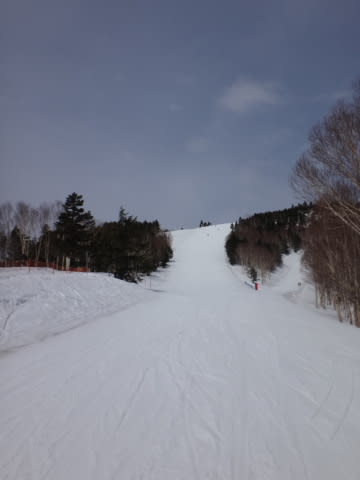

# 4月28日の志賀高原のゲレンデ状況は…さすが平日！がらがら！

📅 投稿日時: 2014-04-28 20:56:12

🏷️ カテゴリ: [2014スキー滑走日記](c992167609b6415052179ee69ea1ea7d8.md)

さてさて．

GW前半ももう3日目．

本日の志賀高原ですが…

やっぱり平日だけあって．

ガラガラでしたよ～！

とりあえず，本日も．

日が昇ったばかりの朝6時に，早朝営業に繰り出したわけで．

朝イチの山頂の気温はプラス4度と．

そこそこ気温は上がったものの…

んでも．ゲレンデはいい感じの硬いバーン！

ガッツリ硬いけどしっかりエッジが利き．

すげースピードが出るという，

スピード派にはよだれじゅるじゅるの快適大回りバーンだっ！

＃硬いのがだめな人には苦行かも…

見よ～っ！

このガラガラのきれいなシマシマ具合をっ！

もう，今日は平日ってこともあり．

昨日までより人が少なく．

もう，ほとんど人が滑ってないんですが．

…これは，ゴーストタウンですかっ！？

そして．

この日の天気は．

終日．

時折日が射すこともあるけど…

おおむね薄く雲がかかった空模様．

まー，この時期．

ピカピカ晴天よりも，曇ったほうが気温が上がらないので，

いい感じかなっ！

早朝2時間が終了し，通常営業開始の8時を過ぎても…

うははははは．

まだまだ，シマシマだっ！

雪は表面がちょうど良くやわらかくなった程度で，

まだまだいけるよっ！

午前10時半ごろになると．

ちょっと雪はクリーミーになってきたけど…

でも．

まだ人が少ないので，

ゲレンデはぜんぜんフラットだよ！

…ホントに人がいないよっ！

昼ごろになっても，天気はうすぐもりなので．

強い日差しで雪がどろどろになっちゃうこともなく…

うむ．

4月下旬の午後2時で，まだ大回り板を履いて

滑ってられるって，どういうことだ？？

これが，午後2時半のゲレンデなんだけど…

人がいないからゲレンデが荒れなくて，

まだまだ大回り可能なんだけどっ？？

特に，白樺コースなんて．

人がいないので「午前中か？」ってほど，

朝からのフラットを保ってるんですけど…？？

ってことで．

リフトストップになってもこんな感じで．

大回り板を履いて，ひたすら大回りを堪能できた1日で．

うーむ．

トップシーズンでも，リフトストップまで大回り板で

滑れる日なんて，そうそうないのに．

まさか，GWになってから．

一日中，大回りし続けられる日があるなんて…

さらに．

ちょっと心配だった天気も，薄日が射すような

天気が夕方まで続いてくれて．←月曜は降らないという予想を

当てたということを，さりげなく自慢

このGW，これまで3日間は結構恵まれた日々が続いたなっ！

＃雨が心配な明日も，なんとか夕方までは降らずにもってくれそうな気配…

## 💬 コメント一覧

### 💬 コメント by (rousan)
**タイトル**: 板と滑走速度
**投稿日**: 2014-04-28 21:13:17

まず、乗り場に置いてあった小回り用のアトミックで滑走中を確認。あとは大回りをするグリーン板の人を探しました。

天気予報も大いに参考にさせていただいています。

普段はほぼ野沢で滑りますが、春になると志賀にやってきます。

### 💬 コメント by (いか)
**タイトル**: Unknown
**投稿日**: 2014-04-29 01:47:54

お仕事終えて帰ってきたらこんな時間…(笑)

大回り板で一日できるっていいですね！

普段、疲れるので履ける状況でもお昼には小回り板に履き替えてしまいますね(-＿-)

### 💬 コメント by (Skier_S)
**タイトル**: 早朝スキ一中
**投稿日**: 2014-04-29 06:35:56

いや～

今日も、天気予想を裏切って

晴天！

最高です！

>rousanさま

普段は野沢なんですね…

昨日はコンディションよく、

一日中緑の板でした。

今日も焼額滑ってますので～！

>いかさま 

人がスキーしている間、お仕事お疲れ様です(笑)

私は小回りの方が疲れるので、なるべく

大回りが行けるうちは大回りで

滑ります…

ＧＷは滑らないのですか？

