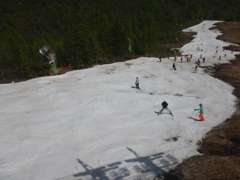
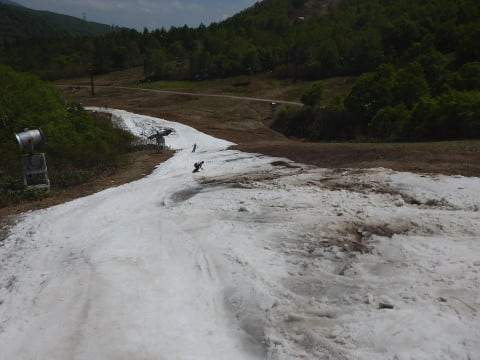

# 5月27日（日）のかぐらスキー場ファイナル，速報モード！…いや，すごいよ．すごかったよ…

📅 投稿日時: 2018-05-28 00:16:47

ということで．

今日は，予告通り行ってきましたよ！

ファイナルかぐらへ…

今日のかぐらは．

一言でいうと．

…すごかったです．

いや～，すごかった．

とりあえず．

今日も日曜深夜恒例，速報モードにて…

えー．

ピカピカ晴天，かなり暑かった本日．

7:30の朝イチロープウェーにのり，

みつまたリフト→ゴンドラと乗り継いで．

やってきました，かぐらゲレンデ！

なんと．

すごいことに，まだクワッドリフトが

営業してますっ！

…でも．

幅，狭くなりましたね（涙）

そして，クワッドリフト乗り場への道も．

なんだか，10月のYetiを思い出させる，

硫安ガンガンの完全紐ゲレンデです…（泣）

でも．

朝はまだ良かったのだ．

朝は，まだ雪が白くて，穴も開いてないだけ

良かったんだけど．

午前10時を過ぎてくると…

うむ？

なんだか，いろんなところに穴が…

そして．

11時を過ぎてくると．

なんだ～！！！

これは！！

そして．

昼になると…

…これは．

どこを滑ればいいんだろう…（泣）．

クワッドリフト乗り場前に

続く道も，すごいことに…

もう，午後になると．

滑って降りるというより．

何とかリフト乗り場にたどり着くため，

ちょっとでも石が出てなさそうなところを

選びながら移動する…

という感じに（激涙）

これは…

…楽しくない（泣）

ということで．

さすがの私も，今日午後1時半ごろに

切り上げ，かぐらゲレンデを後にしました…（涙）

いやーーー．

しかし．

今日まで，意地でクワッドを営業したのはすごい．

意地でもコースを繋げるぞ…

という根性で，いろんなところから雪を運んで，

なんとかコース（らしきもの）を維持しようとした

努力はすごい！

（必死に穴埋め作業をするスタッフ）

ってことで．

なんとか最終日までぎりぎりクワッドを営業した

かぐら．

ギリギリセーフ…というより．

かなりアウトっぽいものを，意地で

セーフにし続けた感じのファイナルデーでしたが．

とりあえず，今日まで営業を続けたスタッフには

敬意を表するしかありません…

また明日，詳細レポートやります～！

## 💬 コメント一覧

### 💬 コメント by (Q太郎)
**タイトル**: Unknown
**投稿日**: 2018-05-28 01:13:23

ほんとすごいですね・・・。土の間に雪があるっていう感じ・・・・。

地元の住んでると、１、２月のトップシーズンでさ、充分に降雪があって、その後も低温が続いてて、しかも、晴れてる日でないとスキーに行かないので、圧倒されるゲレンデ状態でございます。

### 💬 コメント by (もりや)
**タイトル**: 今シーズン終了します
**投稿日**: 2018-05-28 05:05:53

スゴイゲレンデの中、一緒に滑って頂きありがとうございました。さすがに私達もあのゲレンデをラストまで滑ろうとは考えられなかった。息子も時間と共に悪化して行くゲレンデを目の当たりにし、もう今シーズン終了なんだな〜と寂しさを感じながらラスリフを待たずに今シーズン終了しました。

S様、今シーズンお世話になりました。お先に失礼致します。

### 💬 コメント by (Skier_S)
**タイトル**: かぐら終了！
**投稿日**: 2018-05-29 06:42:59

＞Q太郎さま

確かに，ゲレンデのそばに住んでいて．

いつでも行けるや，ってなったらそんな感じ

なんでしょうね…

ゲレンデまでものすごい時間と交通費をかけて行くと，

もう雨が降ろうが槍が降ろうがミサイルが降ろうが，

コースが紐ゲレンデだろうが何だろうが

滑っちゃいますが（笑）

＞もりやさま

いやー．すごいゲレンデでしたね．

日曜はご一緒していただき，ありがとうございました．

というか，今シーズン，ずっとありがとうございました！

いろいろ楽しかったです．

来シーズン，また成長しているお子さんお二人に

お会いできるのを楽しみにしています～！

