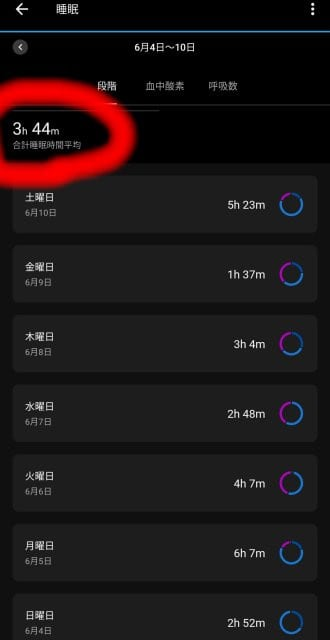
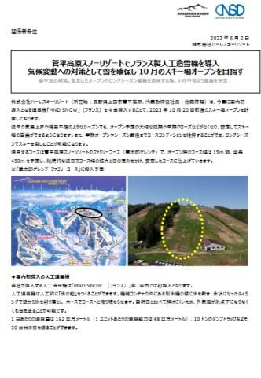
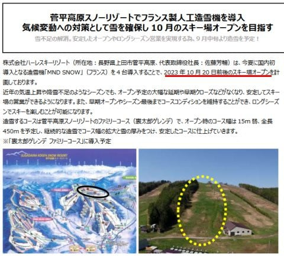
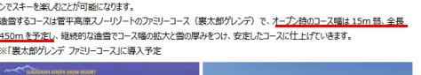
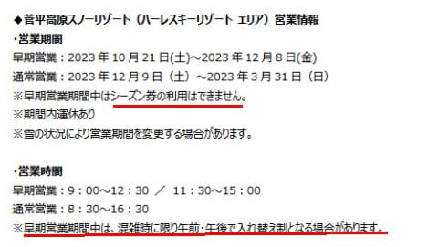

# 最近のスキー仲間で話題，来シーズンから菅平のアイスクラッシュ導入！

📅 投稿日時: 2023-06-11 04:15:35

ってなことで．

今週はかなりクリティカルな状況で，

よくこれでBlog書いてたな…という感じ

だったんですが…←Blog書かく時間があるなら寝ようよ…

いや．

今週がどのくらいやばかったかというと．

1週間の平均睡眠時間が3時間44分…

これ，週末を入れての平均睡眠時間です…

いや．水曜の睡眠時間３時間切りのころから

やばいな，と思ってたけど．

木曜は朝の会議スタートが遅かったので

何とかぎりぎり3時間寝られたけど…

金曜はほぼ徹夜．何とか朝1時間だけ

仮眠をとれた感じ…

…日曜朝は睡眠3時間切りで

深夜1時に起きて，月山日帰りスキーに

行ってるのが，あかんよな(笑)．

ってなことで．

水，木，金と3時間睡眠2日連続の後

ほぼ完徹という死にそうな3日間を乗り越えて．

今日は13時間以上寝ました…

いや．

金曜夜の日付が変わったころに何とか仕事をやっつけ，

Blogを書き終えた後．

6時半ごろにいったん起きたけど．

その後，また7時過ぎに倒れてしまい．

…起きたら午後3時でした…

死んだように寝た…

ってなことで．

何とか1週間の睡眠不足を解消できたのですが．

もし，月山がまだリフトを滑れたら，

今週末はまた月山に行きたかった…

と思っているのが私のやばいところ…

私の身体的には，今週末は月山のリフトが

滑れなくなってよかったのかも？？

ってなことで，本題へ．

最近，世界中の注目を浴びている話題といえば…

これですね！！

菅平に人工造雪機（アイスクラッシュ）導入という

ニュースです！←これが話題になってる世界は限りなく狭いのでは？

（[日本スキー場開発(株)ホームページ](https://www.nippon-ski.jp/uploads/2023-06-02_hare_winter_open_early.pdf)より，以下同）

なんと．

菅平に人工造雪機を入れて，10月20日前後の

スキー場オープンを狙うようです…！！

コースはファミリーコースなので，

高速クワッドで滑れる効率の良いコースで

滑れるようです…！！

…長さ450mはイエティの半分くらいですが…

標高差はイエティより倍近くあるし，

結構な斜度のある斜面．

ここが幅15mあればいいけど…

イエティのオープンみたいに幅5mだと，

ちょっと斜度がありすぎて怖いかも？

斜度もあるので，一瞬でコブ斜面に

なっちゃいそう…

あと，幅15mに高速クワッドで人を

送り込むと，コースの人口密度が高くなり

すごいことになりそうですが…

そこも考慮されているのか，ひどく混雑

しないように，午前，午後の入れ替え制も

検討しているみたいですね…

あ，あと，12月8日まではシーズン券は使えない

ようです…！！

ってなことで．

Yetiに殴り込みをかけるような，菅平の

人工造雪機導入．

関東圏では，苗場，鹿沢，丸沼と，次々

アイスクラッシュの運用をやめていくスキー場が

相次ぐところ，久しぶりに明るいうれしい

ニュースです…！！

これで，Yetiは日本一早くオープンするスキー場の

名誉を守るため，菅平より1週間早くオープン

するかな～…

あるいは，菅平より1日でも早ければOKと，

菅平の10月20日(土)オープンに対し，

例年通りの金曜日オープン，一日早い10月19日(金)

でOKと，同じ週のオープンを狙うのか…？

気になるところ…

おそらく，菅平はボーダーよりスキーヤーが

多そうな気がするので．

スキーヤーは菅平のほうがいいかな～．

でも，11月の軽井沢の混雑を考えると…

すごい混みそう…

とりあえず，久しぶりのスキー界の

明るいニュースだな！！

## 💬 コメント一覧

### 💬 コメント by (ozuriski)
**タイトル**: 頑張れ日本スキー場開発！
**投稿日**: 2023-06-11 17:26:19

報道発表資料では、冒頭に「10/20前後」、早期営業期間に10/21(土)～とあり、どっちなんだい？ですが、初めてのICSでピンポイントには決めきれず、「10/21目標だけど前後するかも」ということでしょうか。

雪づくりが順調にいって10/20(金)オープンの可能性があるのなら、イエティは最速タイでよしとするのかどうか…。

菅平なら降雪機の増強の方が投資の費用対効果は良さそうですが、イエティや軽プリ、横手山の混雑をみて「いける」とふんだのでしょう。これらの早期オープンゲレンデの混雑がどう変化するかも気になります。

日本スキー場開発㈱傘下関連では、八方の新ゴンドラはもう一つの索道会社が嫌がっているのか白紙撤回の噂が絶えませんが、岩岳の新ゴンドラ・新ベースセンター建設やホテル誘致といい、この菅平のICS導入といい、これからも積極的な設備投資をしていってほしいところです。

### 💬 コメント by (Skier_S)
**タイトル**: ＞ozuriskiさま
**投稿日**: 2023-06-12 02:35:32

ozuriskiさんもネタにしていたので，つい私も話題に便乗してしまいました(笑)

おそらく10月21日予定で雪を作り始めて，早くオープンできそうならオープンを前倒しにするんじゃないか…

と踏んでます．

イエティは日本最速にどれだけこだわるのか？来シーズンは，ライバルの様子を見て

木曜日オープンとかもありうるのかも…

ウイングヒルズの来シーズンICS中止などの寂しいニュースが続く中，

日本スキー場開発さんには頑張って元気になる投資を続けてほしいものです…

### 💬 コメント by (炎の北海道民)
**タイトル**: Unknown
**投稿日**: 2023-06-12 12:49:12

スキーってランニングなどに比べるとものすごく環境負荷が高いスポーツですよね。現地に行くまでに消費する燃料、大規模な森林伐採、ナイターの電気代、そしてこの人工造雪機、んー。でもスキーは楽しいんだよなぁ。

### 💬 コメント by (Skier_S)
**タイトル**: ＞炎の北海道民さま
**投稿日**: 2023-06-13 01:43:04

そうですね…

スキーやゴルフは環境負荷高そうですよね…

ヨーロッパみたいに，森林限界を超えたところが自然にスキー場になってるなら

環境負荷が低いんでしょうが…

でも，楽しいのは間違いないです（笑）．

