# 3月15日の志賀高原，詳細モード…至福の一日…わが幸せ，ここにありっ！！！

📅 投稿日時: 2015-03-17 01:57:47

というわけで．

昨日速報した，日曜の志賀高原のゲレンデ状況．

本日は，詳細モードにて…

えー．

日曜の朝も，予想通りの晴天でスタート！

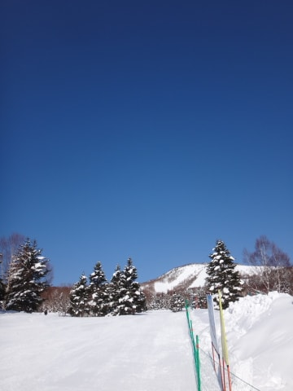

これは…雲一つない快晴ですな．

ゴンドラで山頂へ上がると…

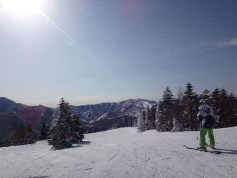

うむ．

晴天だけど，いい感じで冷えてますな．

山頂の気温は，マイナス5度．

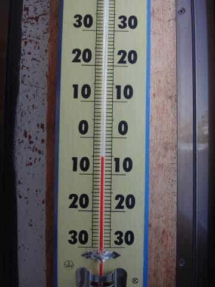

まぁ，この時期の晴天の朝としては，

冷えていていい感じの気温ですね．

…あ，そうそう．

焼額はゴンドラ普通に運転してましたが．

奥志賀はゴンドラは，朝は強風で運休でした…

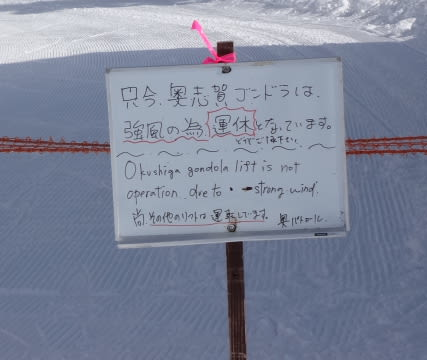

＃昼過ぎくらいに営業開始してました

で．

雪の状況は．

昨日の夜は冷え冷えだったので，

雪質がいいままキープされており．

今朝は冷え冷えの雪がきれいに圧雪された，

超最高のシマシマバーンっ！！！！

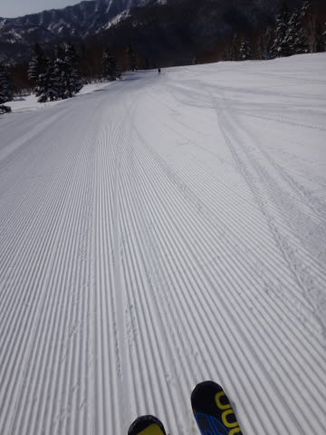

ふはははは！

もう，気持ちよく適度にエッジが食い込み，

どこまでもスピードを上げていける，

超快感の，これ以上求めるものはない

最高圧雪っ！！

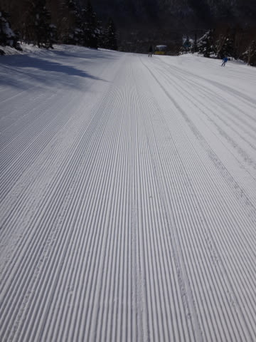

これだっ！

これだよっ！

人生，このために生きてきたんだよっ！

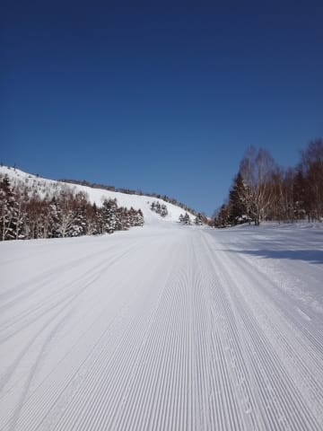

うはーっ！！！

し，シアワセっ！

シアワセすぎるっ！

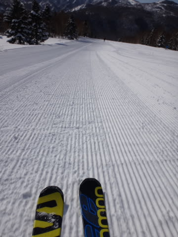

もう，人生，この快楽シマシマバーンがあれば，もうあとは何もいらない！

あとは，いいスキー板といいスキーブーツがあれば，それでいい！

他にも，ウェアとストックも！

あ，いいゴーグルもいるな…

…あと，グローブやらアンダーウェアもいるし…

他にもスキーに来るための4WDの車と，

スキーに来れる収入と…

…

とりあえず．

ピカピカ晴天の中．

チョー気持ちいい，快楽大回りバーンを

ガシガシ自由落下！

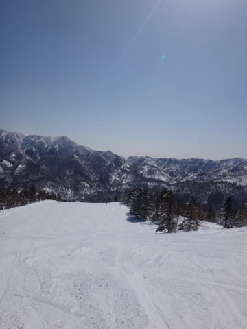

あぁ…

ホントにシアワセ…

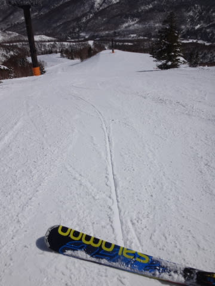

と，シアワセを味わっていると．

あらららら？？

えええ？

なんだ，このゴンドラ待ちはっ！！！

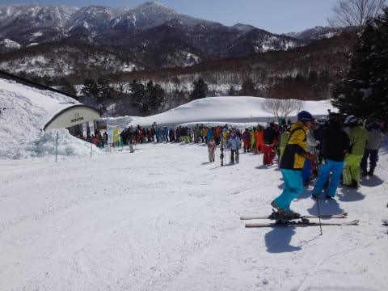

10時ごろに5分待ち，10時半には10分待ちまで，ゴンドラ

待ちが伸びちゃいました…（涙）．

うーん．

この待ち時間だったら，次はゴンドラやめて

どこかに逃げようか？

…とも，思ったけれど．

10時半の10分待ちでゴンドラに乗った次の回には…

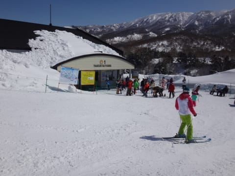

もう，ゴンドラ待ちが1分ちょいにまで短くなっちゃってました．

ふーむ．

ゴンドラ駅舎の外にまで長い列がついていたのは，

10時から11時前までの1時間弱という短い時間で，ラッキー！

でも．午前中はちょっとゲレンデの人口密度が上がり…

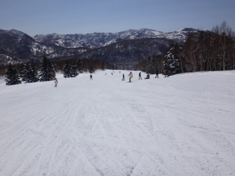

うーむ．

快楽の大回りは，ちょっと厳しいかな…（涙）．

と，悲しんでいたのですが．

昼ごろには．

あれれ？

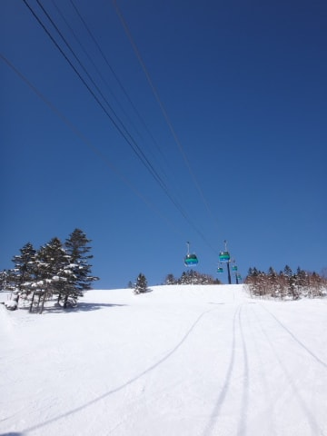

あらら？

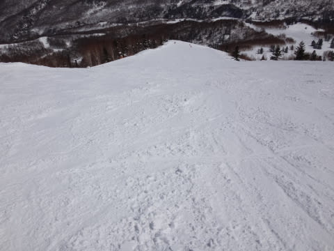

ゲレンデに，人がいなくなっちゃいましたね～．

こんなピカピカ晴天で．

こんなに雪がいいのに…

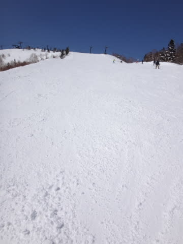

ゲレンデの人がいなくなっちゃいましたよ～（喜）

で，晴天の昼というのに．

雪質は比較的いいじゃないですか！

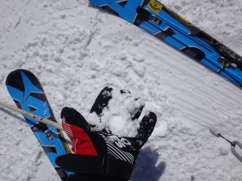

人も少なく，いい感じなんですけどっ！

そして．

さらに．

午前中に貸し切りでクローズしていた白樺コース．

昼過ぎにオープンになり…

オープン直後にコースに飛び込むと．

え？なにこれ？

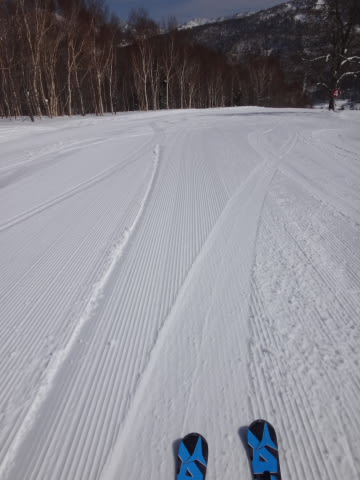

シマシマなんですけど？？

いいんですか？

昼過ぎに，こんなシマシマ滑れて，いいんですか！？？

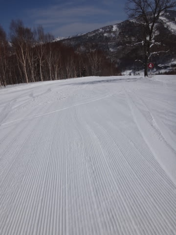

これは，最高だ～っ！

…と，数本，たいへんおいしくいただきました．

いやー．恵まれてるね～．

でも．

さすが午後には，強烈な日差しのため．

ちょいと雪は重く固まり始めてきました…

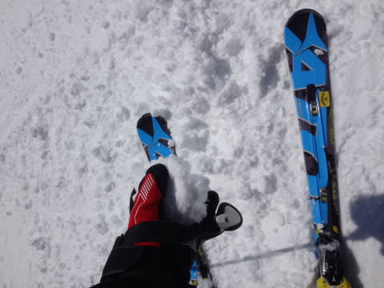

うーむ．

でも，昼間も気温自体はプラス2℃程度と．

快晴のこの時期としては，まだ低めの気温．

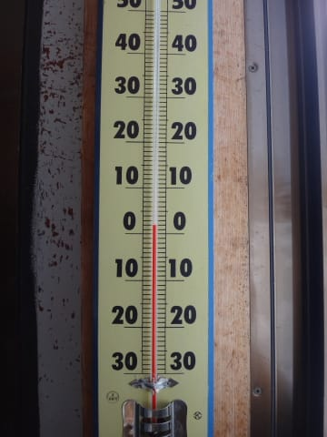

そのせいか，雪は重くなっても，水っぽい雪にはならず，

せいぜいダマダマに固まる程度で．

コースはフラットなまま．

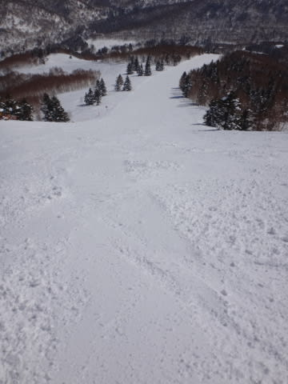

うーむ．

この時期の午後に．

多少雪が重いとはいえ．

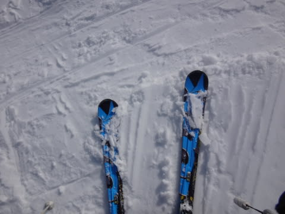

人が少ない，こんなフラットバーンを滑れてよいのだろうか？？

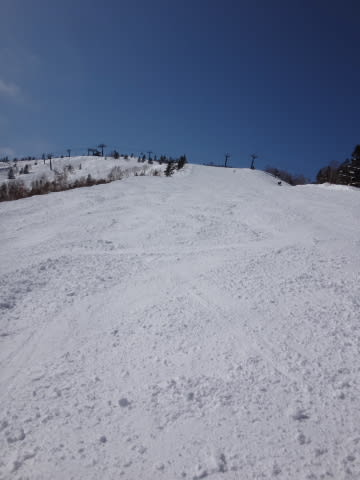

ああ…

シアワセ．

シアワセだよ…っ！！

って感じで．

夕方になってくると，重くなった雪が硬くなってきたものの…

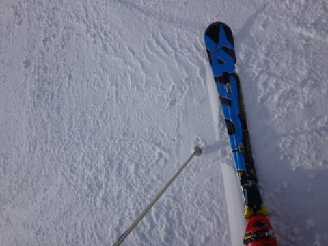

まだ，雪煙が上がるような状況で．

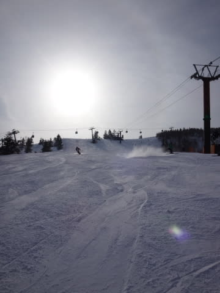

午後は雲が多くなるかも…という予想は

いい方向に外れ，最後まで晴天で．

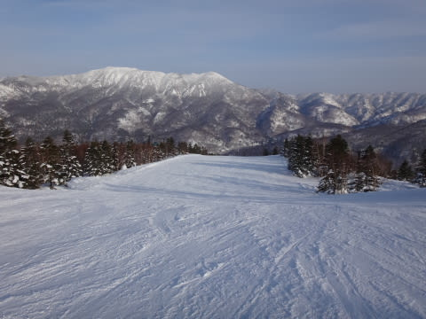

リフトストップまで，きれいなフラットバーンを

味わいつくしたのでした…

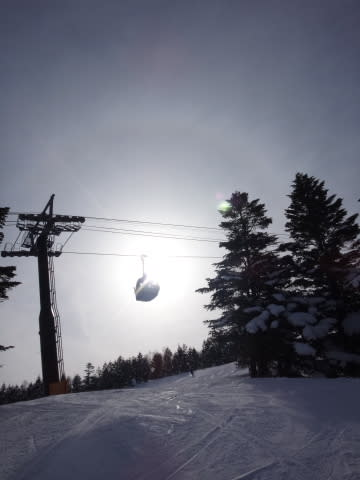

いやーーーーー．

ホントによかった．

この週末は，良かった．

来週も再来週も，そのあともずーーーーっと，

こんな週末が続くといいなぁ…！←7月や8月までこんな週末が続いたら，

それはすでに氷河期では？？

## 💬 コメント一覧

### 💬 コメント by (はなげ親分)
**タイトル**: 最高の１日!!
**投稿日**: 2015-03-17 10:22:38

先々週、先週とエコー、かぐらと浮気してしまい散々な目に見舞われてしまいました。

反省しつつ戻って来ると

さすが志賀高原！

S様のおかげで、見事な天気に恵まれました。

ありがとうございました(パンパン!!)

あまりの快適さに、ピザ痛も吹き飛んでしまいリフトストップまで滑ってしまいました(^^)v

さて来週からは勿論、

早朝スキーですよね………？

### 💬 コメント by (マルハバ)
**タイトル**: 年に一度の志賀高原で
**投稿日**: 2015-03-17 18:26:52

2日間こんな好天に恵まれるなんて

きっと何方かの日ごろの行いの良さのお陰かと・・（笑）

午前中で早々に引き上げてしまいましたが

ゴンドラでまたご一緒できて本当に良かったです。

来年もお会いできましたら宜しくお願い致します！

### 💬 コメント by (Skier_S)
**タイトル**: いやー．最高でした！
**投稿日**: 2015-03-17 23:49:01

＞はなげ親分さま

あ，志賀にいらしてたんですね…

最高のコンディションで，楽しめたようですね～．

やっぱり志賀高原でしょ！って感じです（笑）．

でも，私もリフトストップまで滑ってましたが…

お会いしませんでしたね．

来週から早朝スキー営業開始ですが…

うーん．

早朝からナイターまで滑ったら，死んじゃいます（笑）．

＞マルハバさま

いやいやいや．

やっぱり，この週末の天気の良さは，

きっと，私の日ごろの…（＾＾；

でも，日曜は午前中で切り上げちゃったんですね．

私はリフトストップまで滑って，へろへろでした（笑）．

また，来シーズンもお会いできたらよろしくお願いします！

### 💬 コメント by (えぐ)
**タイトル**: いつもありがとうございます
**投稿日**: 2015-03-17 23:55:12

先週の土日は予想を見て、今シーズン4回目の志賀高原満喫しました。最っ高の土日でした。

何度か、1ゴンやダイヤモンドナイターでSさんお見かけしましたが、小心者なので声を掛けられず。

子供（小学4年）と一緒に、Sさん見つけ遊びしてました。。。

今シーズン最後だと思うので、最後にお礼をと思いコメントさせて頂ました。

今後も宜しくお願いします！

### 💬 コメント by (Skier_S)
**タイトル**: えぐさま
**投稿日**: 2015-03-18 00:34:01

コメントありがとうございます～！

いやー．最高の土日でしたよね！

…しかし．

ヤケビだけじゃなく，ダイヤナイターまで

いらっしゃいましたか…

どれが私だか，よくお分かりになりましたね～！

やはり，板を目印に探されたのでしょうか？

＃ちなみにダイヤナイターでは，リフト沿いのシュプールを

＃見れば，私が滑っているかどうかわかるらしい…（笑）．

志賀はGWまで滑れますので，今シーズン最後と言わず，

また志賀に滑りに来てください！

その時は，ぜひ声をかけてくださいね～！！

### 💬 コメント by (Goku)
**タイトル**: Unknown
**投稿日**: 2015-03-18 18:53:07

＞＃ちなみにダイヤナイターでは，リフト沿いのシュプールを

＃見れば，私が滑っているかどうかわかるらしい…（笑）．

そりゃー切れっ切れの２本線が食い込んでますからね～

### 💬 コメント by (Skier_S)
**タイトル**: Gokuさま
**投稿日**: 2015-03-18 23:33:45

あまり他の人が滑らず，跡がつかない

リフト沿いを滑るので…

目立つ跡がついちゃいます（笑）．

ダイヤナイターも，残すところあと2週間．

そして，ヤケビも第1ゴンドラはあと3週間．

うーん．

だんだん，シーズン終了が近づいてます…（悲）．

