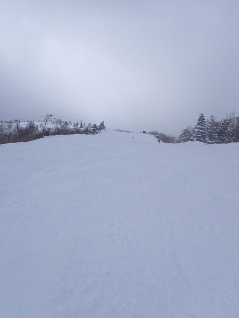

# 2025/1/13(月・祝)の志賀高原焼額山スキー場，詳細レポート！…朝は激烈雪降りからの晴れ，午後はボコボコだったけど3連休としてはガラガラ！

📅 投稿日時: 2025-01-15 01:57:22

えー．

14日深夜現在，志賀高原のライブカメラ

を見ると，雪が降り始めているよう

ですが…

これ，15日の水曜日，1日中降り続けます！！

16日の朝まで降り続け，そこそこ

積もりそうな感じ…

16日は一旦天気は回復するけど，また

17日の金曜日に雪が降って，

その後，18，19日の週末がちょうど

晴れそう

という，いいパターンになりそう…！

ただ…

うーん．やっぱり19日あたりから

しばらくの間，気温が上がりそう…(涙)

でも，昨日も書いたけど，

20日あたりは高温＆何かが降りそうでは

あるものの，志賀高原の標高ならまだ

液体が降ってくる危険性はなさそう…

ただ，19日以降，しばらく気温が

高い日が続きそうです(泣)

とりあえず，今週末は土日とも晴れて，

日曜は気温がちょっと上がるけど，

志賀ならそこまで雪は緩まないはず…！

（標高が低いところは雪は緩みそう）

ってなことで，本題へ．

3連休最終日，13日の月曜の志賀高原

詳細レポートです！！

まず．

今日も朝8:30の焼額第1ゴンドラの

営業開始を狙っていきますが…

ゴンドラ乗り場に着いた時，

ちょうどゲートオープンしていて，

列の長さが写真に撮れなかった（泣）

でも，ゲートオープン開始1分後の8:31

もうゲート内に全員が入っている

レベルなので，3連休としては

人が少なかったかな…

でも．

人がすくなかったのは，

朝から悪天候で，かなりの雪降りだったから

というのが大きな理由でしょうね…

朝早くはそれほどの降りじゃなかったけど，

ゴンドラ営業開始の8時半ごろには

かなり強い降りになってました…（泣）

山頂の気温は-9℃と，気温自体は

予想と1度誤差だったけど…

朝は晴れているかも？？

という予想は見事に外してしまったのが

かなり悔しい…

金曜の天気図では，西風のはずだったのに…

とりあえず．

かなり激しい降りだったので，

本格的に降り始めたのは朝からだった

とはいえ，コース上は圧雪の上に新雪が

5～10cmほど乗ってますよ～！！！

朝イチはしっかり締り気味のバーンの

上に乗っかった軽い新雪を蹴散らす

感じで，結構楽しく滑れましたよ～！！

そして．

かなり気温が寒く，そして前が見にくい

レベルで雪が降り続ける本日．

さすがにゲレンデに出てくる人も少なく．

3連休最終日だから今日は滑らずに帰ろうか…

という人も結構いたようで．

ゴンドラやリフトもガラガラ！

そして，コース上も結構人が少ない…！

だもんで，朝のうちは新雪もそれほど

積もったいなかったのもあり，

かなり気持ちよく滑れましたよ～！！

でも．

視界が悪くなるほどの激しい降り

だったので，コース上の雪はだんだん

深くなっていきます…

とはいえ，最初の2時間くらいは

まだバーンが荒れておらず．

「コース上も新雪だ～！！」

とか言って楽しんでいたけど．

人は少ないとはいえ，ある程度の人が

滑ると，バーンがだんだんボコボコに

なり始めてきます…（涙）

視界がなくて，曇り空で暗い中，バーンが

ボコボコになっていくと…

必殺，野生のカン！

とか，

秘儀，足裏感覚！

とか叫びながら滑るしかないけど…

12時頃に雪がやんで，視界が回復

してきましたよ…！！

それどころか，雪がやんでしばらくすると，

雲も薄くなり，空も明るくなってきて，

バーンが見やすくなってくれて…

これだけ見やすくなってくれば，

多少凸凹でも滑れるよ…！！

それどころか．

1時半ごろになると…

日も射し始めてきたではないですか！！

日が射す中，今日の昼間に積もった

コース脇のプチパウダーを楽しめる

ようになってきたじゃないですか…！！

ってな感じで．

オリンピックコースとかは，

昼過ぎのちょっとの間，日が射す中

コース脇の方でプチパウダーっぽく

楽しめたけど…

でも，すぐに単なる凸凹斜面と

化していってしまったし．

それ以外のコースも，ほぼ全面

結構な凸凹バーンになってしまって．

かなり辛い感じに…（泣）

だもんで，今日は午前はリフトは

寒さで乗ってられない感じだったし，

午後はボコボコで人が減ったしで，

リフトは終日ガラガラだったし…

全面ボコボコ祭りにやられてみんな

帰っちゃったのか，ゴンドラも午後は

ムチャクチャガラガラでした～！！

しかし…

午後は天気が良くなってくれたのはいいけど．

朝に雪降り，午後が晴れだと，午後は

せっかく天気がいい中に凸凹バーンを

泣きながら滑るしかないので．

どうせなら朝に晴れて，午後が雪降り

なら，朝のシマシマバーンと午後の

パフパフバーンの両方いけるから，

晴れと雪の順番が入れ替わって

欲しかった…

でも．

午後はボコボコになったとはいえ．

ちゃんと足元のボコボコが見えてくれて

いるので．

これで午後も曇りやガスで，見えない中

ボコボコを滑らさせられるよりは

1285倍くらいマシだな…

と，自分に言い聞かせて．

だんだん日が暮れて，人も少なくなっていく

3連休のラストの午後．

今日もいつも通りお昼休みも取らずに，

凸凹で太ももがパンパンになりながらも，

16時15分の営業終了まで，ラストまで滑り

続けたのでした…

ということで．

最終日はちょっと天気が惜しかったという

ところはあるけども．

3日とも雪質は良くて．

天気の悪い最終日もなんだかんだ言って

午後は日も射したし．

2日目の中日は多少込んだものの，

3連休としてはあまり混むこともなく．

かなり恵まれた3連休だったな…

と思いつつ，帰路についたのでした…

しかし．

正月休み→3連休とスキー漬けだったので．

今週末から毎週土日の2日間しか滑れない

なんて，耐えられるのかな…？？←ゼイタクになりすぎ

## 💬 コメント一覧

### 💬 コメント by (レインボー77)
**タイトル**: Unknown
**投稿日**: 2025-01-15 14:19:24

水曜日の志賀高原情報

ご無沙汰です。投稿をサボってました。朝の湯田中は車に重い雪が25。朝の蓮池-6℃、ニゴンパークは新雪30。小雪がちらつき視界はよろしくない。見にくくて雪山に車がぶつかる瞬間を目撃しました。

オリンピック以外は朝圧雪なので、白樺、唐松、イースト、GSは感激もの。GSサイドは新雪30だけど、底付きして楽しくなかったらしい。２時間も滑るとぼこぼこしてきて、視界も悪くなってきたので終了。老人に無理は禁物です。

### 💬 コメント by (Skier_S)
**タイトル**: ＞レインボー77さま
**投稿日**: 2025-01-16 03:07:28

お久しぶりです～！

土日はお見かけしませんでしたね…

水曜はやはり予想通り，そこそこ積もったんですね！

そして朝イチは良かったんですか…

まぁ，水曜は雪も降り続けて視界も悪かったと思うので，早く切り上げて正解です．

木曜も朝イチはいいコンディションだと思います！

