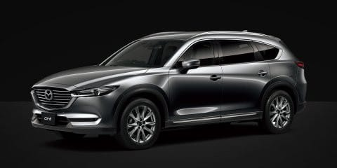

# プロジェクトX2…マツダ CX-8に乗ってみた

📅 投稿日時: 2018-06-07 02:27:12

🏷️ カテゴリ: [車試乗](c07dec5709d34bd74e1f6cb9c8291061b.md)

ということで．

[プロジェクトX2の候補に登った車たち](e1743cfebd5f8719852c262ab8bb588e4.md)を，

試乗していくわけですが…

まずはマツダで，CX-8とアテンザワゴンの試乗ですかね～，

…と，マツダディーラーに行ったところ．

アテンザは，6月に大型マイナーチェンジされ．

新型の配車予定は6月末．

旧型アテンザはエンジンも内外装も変わっちゃって参考に

ならないとのことで，旧型の試乗車もなく．

残念ながら試乗できませんでした…

この，新型アテンザ．

いろいろ情報が出回っているので，

ご存知の方も多いと思いますが．

旧型からの変更点は，フロントグリル＆バンパー変更，

リアコンビライト＆ガーニッシュのデザイン変更，

内装のデザイン変更，

2.5Lガソリンエンジンに気筒休止システム採用，

2.2LディーゼルエンジンはCX-8と同じ改良型に変更

というところで．

かなり大幅に変わるようです…

うーむ．

試乗できなかったのが残念…

でも，

同じエンジンのCX-8は試乗車があるようなので．

こいつに乗ってみるのだ！

（マツダHPより拝借）

試乗車は，2.2Lディーゼルの最高級グレード，

XD Lpackage．

実車を見ると…

でかい！

想像よりデカいよ…！

長さ4.9m，幅1.84m，高さ1.7m超え…

高さ以外は，アルファードとほぼ同等のデカさですね．

CX-5とは全く別物のデカさです．

そして，中を見てみると…

いや．

内装は結構高級感漂うじゃないですか．

2列目シートは十分な広さ！

外から見ると，さすが3列目は狭いかな…と

思ってたけど．見た目よりレッグスペースは広い！

…ただ．

3列目，ちょっと天井が低いかな～．

3列目をたためば，荷室は十分広いし．

さすがデカいだけあって，中の広さは

問題なし．

3列目も，大人の男性はきついかもしれないけど．

足元は結構広いから，座高が高くない人なら

長距離でも大丈夫じゃないかな～？

で．

運転席に乗り込んで．

走り出してみると…

まず．

動き出しからかなりのインパクトを受けます．

なんだこりゃ！？？

と，トルクすげーっ！！

1.9トン近い車重のはずなのに，軽々走る！

アクセルをちょっと踏むだけで．

エンジン回転もそれほど上がらず．

軽々と引っ張っていく！

ATだけど変速ショックもほぼ無し．

トルクで引っ張れるので，

アクセルを踏み込んでもシフトダウンせず．

さらにトルクコンバーターのロックアップを

外す必要もなく．

アクセルをぐっと踏み足しても，定常走行時の低回転の

まま，するすると車を引っ張っていきます…

いや，すごいパワー感＆高級感…

足回りも結構良くできていて．

乗り心地も，硬くはないけど

引き締まった感じがある，欧州車的味付け．

かなりの高級感を感じる足回り．

コーナーを攻めたらどうなるかは試せ

なかったけど．

レベル高そうだぞ…

ただ，かなりフロントのキャスター＆トレールが

大きいのか．

パワステに，それに打ち勝つための強いアシストが

入ってそうな感じで，街乗りの速度域では

ステアがちょいと軽めに感じるかな．

もう少し自然な重さがあってもいいな…

でも，上品なフィール．

オートクルーズも停止保持までやってくれるし，

60km以上からの動作だけど，レーン保持機能もあるし．

このあたりも最低限の条件はクリア．

その他，各所の操作感も安っぽくはないし．

内装のフィニッシュも結構いい感じ．

400万超える，お高い車だけど．

それだけの価値はあるなぁ…

ちょいとデカすぎるのが問題か．

あと，ディーゼルエンジンは．

燃料凍結防止のため，冬は毎回スキー場のそばで

寒冷地用軽油を給油しなくちゃならないし．

あと，パティキュレートフィルターに溜まった煤の

焼ききり（再生）のために，時々長時間走ってやらないと

いけないとか，オイルに気を付けてやらないと

いけないとか，細かな問題が気にかかるけど．

…でも，この化け物トルクのエンジンは魅力的なんだよな…

うーむ．

CX-8，かなりいい車でした…！

けど，400万越えはかなり予算オーバー（涙）

## 💬 コメント一覧

### 💬 コメント by (naoちゃんねる)
**タイトル**: CX‐8
**投稿日**: 2018-06-07 09:01:51

買っちゃいました…納車待ちです(小声)

FFのオデ君で志賀高原登ってくのが嫌になり、密かにプロジェクトXしてました。

このトルクで志賀高原登っていくのが楽しみです♪

でも…資金が底をつきました。スキー資金をまた貯めなくては(汗)

### 💬 コメント by (shun)
**タイトル**: X候補
**投稿日**: 2018-06-07 10:06:05

はじめまして。

山形でアウトバックに乗っています。

シーズン中常々、拝見しておりました。

いつも貴重な情報ありがとうございます。

お礼になるかわかりませんが、

去年プロジェクトXした時の感想を。

前車は5代目先代レガシィセダン（BMM)です。

3人＋荷物なら、レヴォーグだとギリギリかなと。

スキーは荷物多いですよね。板数多ければ尚更ｗ

現行アウトバックならゆったり乗れると思います。

またなにげに最後まで候補に残ったのが、現行レガシィセダンでした。

後席を6：4分割して倒せます。（中央だけでなく）

トランク容量は先代ツーリングワゴン（520）に匹敵してたかと思います。（現行セダン525　アウトバック559）

私は最後までセダンとアウトバックで悩みました。

うちは5人家族なのでルーフボックス必須。

セダンにそれはちょっと、

ということで、アウトバックになりました。

結果、大満足です。

シャシー等々ほぼ同じかなと思ってましたが、

それだけでは済まないレベルアップぶりです。

セールスみたいですが、

是非一度、試乗してみてください。ｗ

### 💬 コメント by (kiteholic)
**タイトル**: Unknown
**投稿日**: 2018-06-07 19:39:02

はじめまして。

いつも拝見させて頂いております。

私は志賀高原には行かず八方ばかりですので、お会いする事は難しいのかな？

さて、BRレガシィからの乗換えをご検討されているようですので、参考までに。

当方VM4レヴォーグとBS9アウトバックの2車に乗っておりますが、レヴォーグでのスキーは荷室が狭いです。私は家内と子供2人の4人家族ですが、レヴォーグではスキーの荷物を積み込むと後ろが見えなくなります。

しかしながら、アウトバックにおいては、お土産入れる用のクーラーボックスを更に追加してもその様な事も無くしっかりとバックミラーでの後方確認が出来ます。

尚、板はボックスに入れています。

また、乗り心地についてですが、高速をエコランするのであればレヴォーグは揺すられてお勧めしません。

ネットでは書けない様なスピードで走行する場合は非常に良いのですが…

ゆったりと走られるのであればアウトバックおすすめです。

色々と発覚しているスバルですが、逆に大幅値引きのチャンスかもしれませんね。

### 💬 コメント by (Skier_S)
**タイトル**: CX-8，いい車でした
**投稿日**: 2018-06-08 01:25:27

＞naoちゃんねるさま

えええええ～！！！

CX-8お買い上げですかっ！！！？？？

私は，見積もりが430万だったのでひっくり返りました（笑）．

RBオデッセイ，結構いいお値段で売れたのでしょうか…？

でも，CX-8．かなりいい車なので．

うらやましいです…

＞shunさま

初めまして～！

コメントありがとうございます．

いや，BSアウトバック，いい車なんです…

トランクも後ろ座席も広いし．

いい車だと分かってるんです…ホントに．

おそらく，BRMからの乗り換えで

同じクラスを狙うならBS9アウトバックなんですよね．

やっぱり普通は…

これで，D型でアイサイトがツーリングアシストに

なってくれれば最高だったんですけどね～．

＞kiteholicさま

初めまして～！

ご愛読ありがとうございます．

初コメントありがとうございます．

で．

VM4レヴォーグとBSアウトバックの2台もちですかっ！！！

すごい…

凄すぎます．

いや．レヴォーグ．

実はA型GT-Sを，スキー場でしばらく運転させて

もらったことがあるのですが．

確かにトランクの天地も狭いし．

リアシートもそんなに広くないし．

家族でスキーに行くには，やっぱりBS9が

常識的判断かな…

と思いました．

A型GT-Sは，足も硬くて家族から評判が悪いと

その車のオーナーが言ってました（笑）．

でも…

昔ジムカーナをちょっとかじっていたり，

山道を走るのも好きな私．

ここいらで，WRXは無理としても．

ちょっとスポーティーな車にも乗ってみたい，

という欲求もあり．

…自分の欲求と家族スキーとのバランス，悩ましいところです…

### 💬 コメント by (ほっぽ)
**タイトル**: Unknown
**投稿日**: 2018-06-08 06:53:48

Ｓさん

レヴォーグではやや狭い、しかし走りも楽しみたい、c程度の良い中古でもＯＫ、

となるとアイサイトは進化しませんが、

ＢＲレガシィの2.0DITアイサイトも候補になるかなと思いました。

希望を全部満たせないとなると、何を残して何を捨てるか？の選択ですね。

ＢＲレガシィ2.0DITアイサイトだと、室内は今と変わらない、

走りはグレードアップ、アイサイトは今まで通り（進化はしない）、

ガソリン代はこれまでより掛かる（ハイオク分は）

### 💬 コメント by (Skier_S)
**タイトル**: ほっぽさま
**投稿日**: 2018-06-09 01:43:57

うーーーーむ．

BRレガシィ，私が乗っているのがE型なので，一番新しくても

私の車と同じ年式になっちゃうことを考えると…

BRレガシィの乗り継ぎはさすがに厳しいか，

と思ってます．

でも．

BRレガシィの2.0DITも，

初めて乗った時はかなり衝撃でした．

お金がすごいあればDITが欲しいな～，

と思った，憧れの車でした…

### 💬 コメント by (ほっぽ)
**タイトル**: 駆け抜ける悦び
**投稿日**: 2018-06-09 09:35:47

Ｓさん

やはり同じモデルでエンジン違いはムリがありましたね。

私もＢＲレガシィのＤＩＴは試乗しましたが、

確かに刺激的で楽しい車でした。

大きさを感じさせない軽快感もありました。

### 💬 コメント by (Skier_S)
**タイトル**: ほっぽさま
**投稿日**: 2018-06-10 09:53:54

やはり，スバルはD型以降が安定して

いい感じですよね（笑）．

アウトバック・レヴォーグあたりが

安定してきてるのかと…

あと，お金がすごいあれば欧州車は

一度乗ってみたいと思っています．

BMWはいいみたいですね～．

BMWになってからのMINIもいいみたいですが．

あと，ポルシェも乗ってみたいけど…

激しく予算オーバーですので，一生

乗ることは無いかな（笑）

### 💬 コメント by (olaf2125)
**タイトル**: これもご参考
**投稿日**: 2018-06-10 15:49:40

コメントしつこくてスミマセン^^;

私のクルマ軽油ですが途中入れずに下りてから入れることの方が多いですね。

長野は冬場3号だと思いますが関東も関西でも秋には2号になるのであまり気にしてません。

先シーズン、マイナス17度で宿スタートしましたが特に何もありませんでした。

満タン出発できなかったときは松代SA下りのエネオスが24Hなので半分だけ入れたりします。軽油安いですよ〜(^^)

アテンザだと同じエンジンでCX8より200kg近く軽いですね。あのトルク満喫できますよ〜 (^^)

### 💬 コメント by (Skier_S)
**タイトル**: Olaf2125さま
**投稿日**: 2018-06-14 02:37:23

うぎゃーーー！

このコメント，気づいてませんでした．

回答遅くなってすみませんっ！！！

…しかし，マイナス17℃で2号軽油だったんですか？？

さすが3号入れてましたよね…

うちの友人は，3号を入れていたにもかかわらず．

-20度近くまで落ちた車山スキー場で，

朝にエンジン始動できず．

そのまま夕方まで待っても，昼間の

最高気温が-15度程度だったので，

全く融ける気配がなく．

結局牽引で山を下りた…

という悲しい過去を持っているので，

どうもディーゼルは怖くて（笑）．

もう，15年以上前の，プラドの話ですが…

今の車が良くなったのか，2号軽油が

昔より低い温度まで耐えるようになったのか…？？

とりあえず，燃料が凍る心配がなければ，

あのトルクは魅力です．

パティキュレートフィルタの再生は

特に問題になったりしませんか？

CX-5のオーナーが，オイルの希釈も

かなりあるようなことを言っていましたが…

