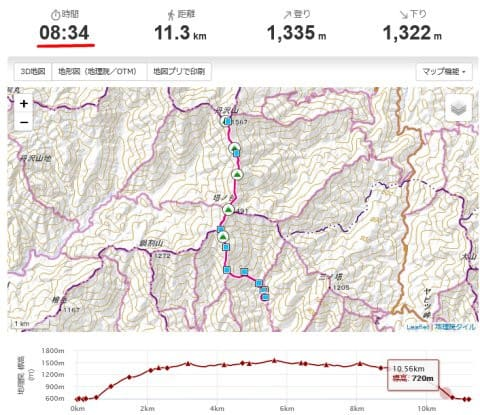
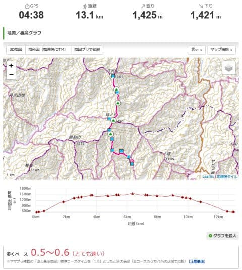
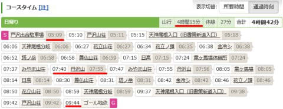
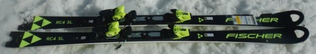
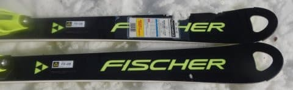
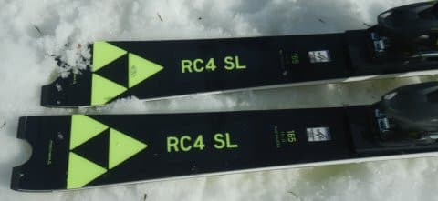
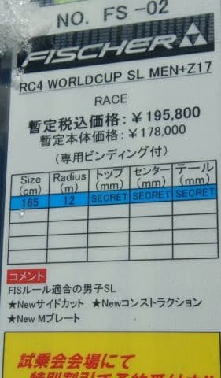
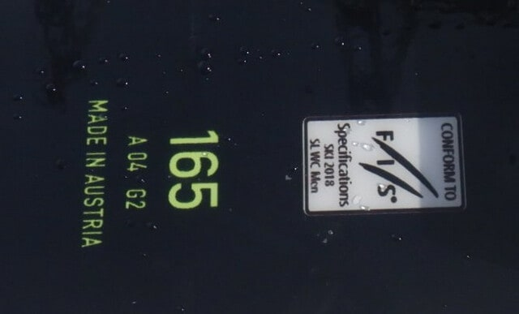
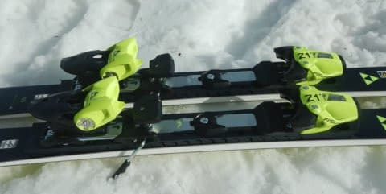

# 2023シーズンモデルのスキー板，試乗レポートその30…FISCHER WORLDCUP SL

📅 投稿日時: 2022-07-22 03:49:51

🏷️ カテゴリ: [スキー板試乗](c0bd8048615710cee890e403a36cc9a2b.md)

そういえば，[昨日の記事](e5ac1bba75a5c8a92fd0db6e27e641796.md)に書いた，

スキー場でのヤバいトレーニング（？）の結果，

バテても動き続けられるようになった説

の心拍数記録を残したのは，どこの山での

記録かというと…

7月上旬のくそ暑い中，丹沢山に登ってきた

時の記録でした～！

大倉スタートではなく，ちょっと距離が短めの

戸沢スタートでしたが．

ヤマレコの標準コースタイムが8時間34分のところ…

自分の記録を見てみると．

心拍数150キープを狙って歩いた結果，

山頂での休憩時間含め4時間38分で往復

できました～！

朝5時スタートで山頂で15分ほど休憩，

9:44には下山．

実質歩いている時間は4時間15分だったようなので，

だいたいコースタイムの半分ですね．

岩場や鎖場がある，手足を使って登らないと

いけないルートだと，ペースが上がらず

ここまで心拍を上げられないので，

木道と階段が続く，比較的緩やかな

丹沢山のこの記録が，自分の平均心拍の

最高記録なのかも…

しかし，丹沢は本格トレランやってる人も

いましたが，トレランする人はこれより

もっともっと早く往復してるはず…

トレランやってる人は，一体どのくらいの

心拍数で走ってるんだろうなぁ…？？

きっと．

私よりもずっと激しい，

「バテても動き続けるトレーニング」

で身体をいじめてるに違いない！←違うから．普通はバテないようにトレーニングするんだから

ってなことで．

本題へ．

本日も，2023シーズンモデルのスキー板の試乗レポート．

今回はフィッシャー編です．

では，どうぞ～！

○FISCHER WORLDCUP SL MEN 165cm

SL競技用

FISマークもついた，ガチの競技SL用板です．

そして，MADE IN AUSTRIAと書かれてます…

RC4 RCやRC4 SCはウクライナ製から

オーストリア製に変わりましたが，

ガチの競技用板は昔からオーストラリア製です．

ビンディングも解放値17の重い競技用

ビンディングがついてます．

プレートは，RC ProやSC Proと全く

同じのM/Oプレートがついてますね…

ちなみに，板のトップに開いている

穴は，RC4 RCやRC4 SCではプラスチックの

透明窓が嵌めてありますが，この板は

穴が開いたそのまんまです．

穴を埋めてません…

ってなことで．

ガチのSL板にちょっとビビりながら

滑ってみると…

やっぱり簡単にたわむ扱いやすい板では

なく，かなりガッツリどっしりした

板です．

しかし，角づけさえしっかりしてやれば，

中速域からそこそこまわって行きますし，

ターンのフォールラインに絡んだあたりで

板を押しずらして弧を深めることもできます．

でも．

やっぱり面白いのはスピードを

ギンギンに出して行ったとき．

思いっきりトップスピードを出すと，

板ががっつりグリップしてむちゃくちゃ

たわんでいき，強烈な遠心力を受けながら

ハイスピードで手や腰を雪面に擦るような

激深小回りができます！！

超ハイスピード激深小回りができる，

かなり危険な（？）ハイスピードカービング

小回りマシンです．

ガチガチエッジグリップの，強烈小回り

爆走板です！！

もう，この板を履いて低速で滑ろうとかは

全く思いません．

思う存分スピードを出して，これでもかという

深いターンをゲレンデに刻みまくれます．

ヤバいです．

キレキレです．

朝9時半という比較的早めの時間の試乗で，

ゲレンデも荒れきってなかったってのも

あるのかもしれませんが．

すでに春雪でゲレンデ表面はかなり緩んで

いる状態で，これほど激しいグリップ＆

カービングマシンだから…

硬い斜面で滑るといったいどれだけ

強烈なんだろう…！？？

とりあえず．

この板を履くと，平均滑走スピードと

滑っている時の弧の深さはヤバいことに

なりそうな板で，一瞬

「RC4 SCより面白いかも？」

と思いましたが．

この板で一日滑ると強烈な横Gに

耐え続けるのに疲れるだろうし．

…そして．

ビンディング込みで￥195,800って…

高すぎるので買えません（泣）

## 💬 コメント一覧

### 💬 コメント by (大阪のK)
**タイトル**: Unknown
**投稿日**: 2022-07-22 08:00:33

Sさん、オーストリアですよ。

### 💬 コメント by (Skier_S)
**タイトル**: Unknown
**投稿日**: 2022-07-22 10:21:09

>大阪のKさま

ほんとだ…ありがとうございます。、

直しておきました！

