# 土曜日はまた睡眠不足のまま志賀高原へ…そして笠岳に登ってきたよ！

📅 投稿日時: 2022-06-20 01:24:50

というわけで．

先週，月山での2022シーズン滑りおさめを

完了し，今週は，スキーシーズンが終わった

週末だったわけなんですが．

志賀高原への忠誠心が異常に高い私は，

今週も志賀高原へ行ってました～！！

今週も睡眠時間が短かったにも関わらず．

土曜の方が，日曜より天気が良さそう

だったので．

また，2時間半睡眠で家を出て…

やってきたのは，笠岳登山口！

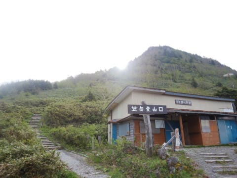

いや…笠岳って．

志賀高原のあちこちから見える，

熊の湯のそばにあるとんがった

目立つ山．

熊の湯スキー場から見るとすぐそばに

そそり立って見えるし…

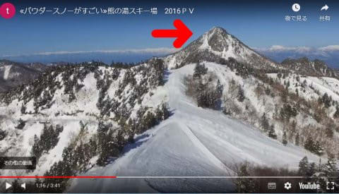

（[熊の湯スキー場ホームページ](https://www.kumanoyu.co.jp/lift/)より）

横手山からも，そのとんがった形が

特徴的に見えるし…

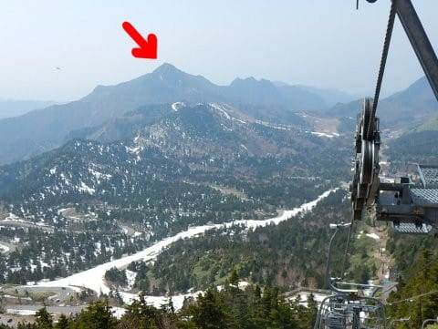

当然，焼額からも見えます！！

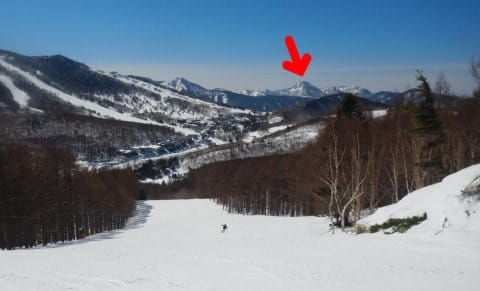

ってな感じで，この笠岳．

志賀高原のそこかしこから見えるので，

すごく気になっていたわけで．

かねてより，チャンスがあれば一度登ろう…

と，ここ数年間思ってたんだけど．

今日がその日だ！！

と，登り始めると…

いきなり階段ですね（涙）

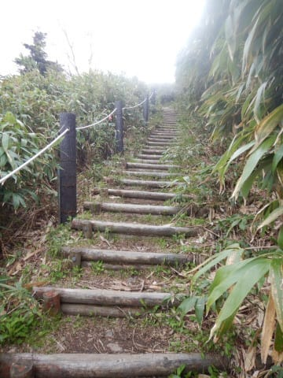

まぁ，かなりとんがった山だから，

急斜面だろうな，とは思ってたけど．

ひたすら急斜面の階段が続きます…

これ，山登りというより階段登りだよ（泣）

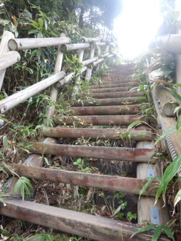

ほぼひたすら階段で，山頂付近にちょっとだけ

急な岩場もあったけど…

まぁ，垂らしてあるロープを使わなくても

登れる程度．

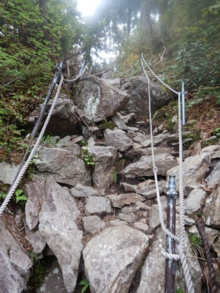

ってなことで．

駆け上がることわずか18分程度で，

登山口から山頂に着いちゃいました…！

…まぁ，標準コースタイム30分ちょいの

山なら，こんな程度かな．

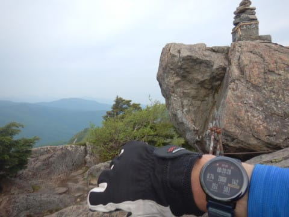

（計測スタートしてから靴紐締めて

リュック背負ってポール組み立てて…

とかやってたので，時計は測定開始

から20分28秒と言ってますが）

山頂にはちっちゃな祠がありました…

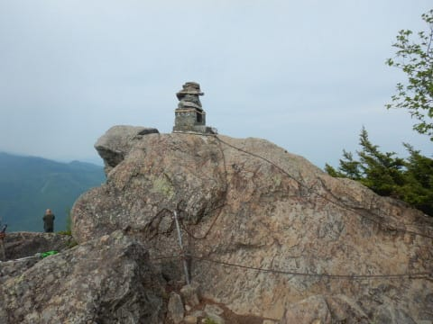

で．とんがった弧峰なので，360度パノラマが

楽しめるに違いない！！

と，すごい楽しみにしてやって来たわけ

ですが．

一応，横手山，旧前山，熊の湯方面が

見えるし．

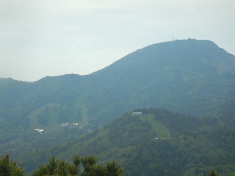

すごく分かりにくいけど，うっすら浅間山

方面も見えてます…

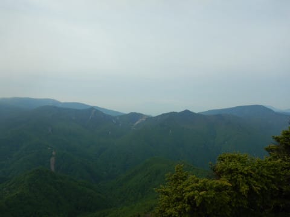

が．

周りに高い山が多く．特に目の前に

横手山があってそっち方向は見晴らしが

効かないし…

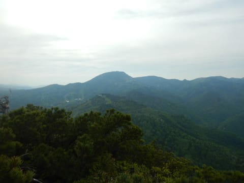

意外と山頂付近，半分くらい木で視界が

さえぎられてて．

予想ほど見晴らしは良くなかったのが

ちと残念…

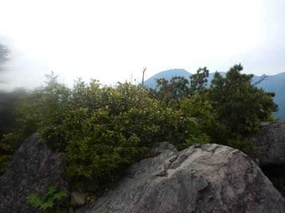

でも，かねてより登りたかった笠岳に

登頂できて，満足！！

あとは下山するのみ！！

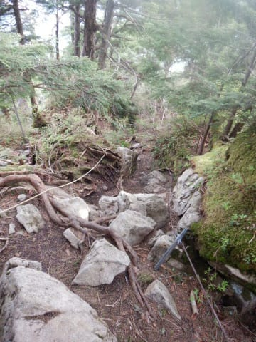

また，ひたすら階段を下り続け…

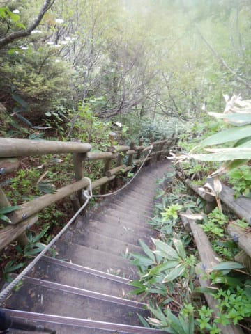

下りは10分で登山口まで駆け下り

ました…

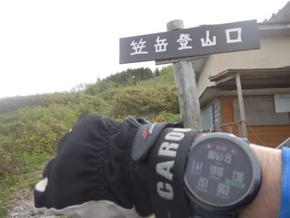

うむ．

標準コースタイムでも登りが35分，

下りが19分の，トータル54分のお手軽

コースですが．

登り20分，下り10分，山頂休憩含め

わずか40分で一往復しちゃいました…

これだと．

全く運動した気になりませんね

ということで．

まだ運動したりない私は，

さらに志賀高原内を移動して…

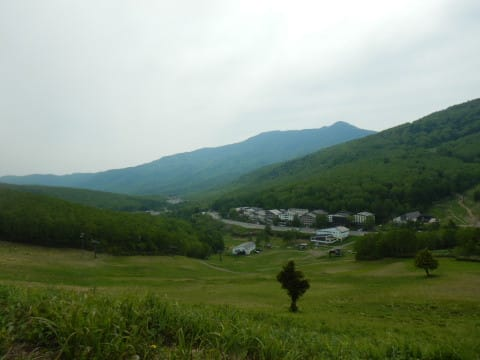

なぜか笹薮につっこんで…

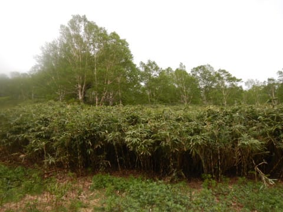

ネマガリタケの竹の子採りを

してきました～！！

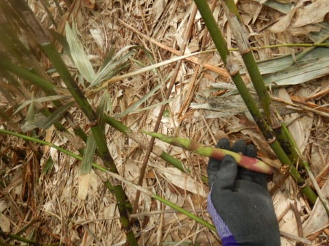

昨年，一昨年とコロナの影響で

中止されていた，志賀高原の竹の子狩り．

今年からまた復活して．

入山料2000円で竹の子狩りができる

ようになりました～！

ということで．

2時間半ほど竹藪をかき分けて，

山の中をさすらって竹の子を採り．

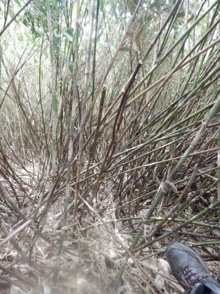

そして，夕食の準備に間に合うように，

竹の子を採り終わったら直ちに志賀高原を

後にして全力で自宅に戻るという，

かなり慌ただしい一日だったのでした…

ってなことで．

単に竹の子狩りだけに志賀高原に来ると，

往復交通費1万円がかかった，激烈に

お高い竹の子になってしまうので．

ついでに山も登ってきてやれ…！

と．

早朝3時に家を出て．

往復500km運転＆登山＆タケノコ狩り

という，ご無体スケジュールをこなしてきた

わけですが．

竹の子狩りをやった人なら分かる．

家に帰って来てからも，

さらに竹の子の皮むき作業2時間が

待っていたのでした…（涙）

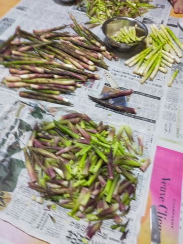

いやー．

タフな一日だったけど．

採りたての竹の子はすごくおいしかったし，

満足な週末でした～！

## 💬 コメント一覧

### 💬 コメント by (さち)
**タイトル**: Unknown
**投稿日**: 2022-06-20 12:34:42

えええー！！

日曜日ダイヤでしたけど藪の中にいたのにー！

ニアミスでしたねー

### 💬 コメント by (西舘)
**タイトル**: Unknown
**投稿日**: 2022-06-20 13:54:47

気になっていた笠岳の全貌が朗らかに！

階段大嫌いだから行かなくなりそうです。

タケノコはお嬢様が喜んだと思います、良かった良かった。

### 💬 コメント by (油漏＠膝関節)
**タイトル**: 梅雨の晴れ間の志賀高原
**投稿日**: 2022-06-20 18:56:28

お疲れ様でした。同じく土曜日に志賀高原の山中を彷徨っていました。

大沼池から赤石山、尾根伝いに岩菅山と二座を攻めました。のっきりからの下りは足の痙攣との戦いでした。スキー場から眺めていた岩菅山に久しぶりに登れて、うれしかったです。

宿では筍の御馳走が出ました。皮ごと茹でたものや、天ぷら、筍ご飯、筍汁とどれも美味しかったです。

結論　志賀高原は冬だけでは勿体ない。

### 💬 コメント by (Goku)
**タイトル**: Unknown
**投稿日**: 2022-06-20 22:51:27

お疲れさまでした。

タケノコだけでおなか一杯になれるのは採った人の特権です(^^♪

あれだけ採れれば交通費分は余裕で元が取れましたね(^_-)-☆

### 💬 コメント by (Skier_S)
**タイトル**: ＞ネマガリタケは美味い！！
**投稿日**: 2022-06-21 01:51:56

＞さちさま

あら~！

日曜に行ってらしたんですか…

惜しい．

竹の子，ちょうどいい感じで大漁でしたね！！

今年は良い竹の子が多かったです…

＞西舘さま

階段嫌いならあまりお勧めしませんが，30分もかからず山頂に着けるので

お手軽です．

竹の子は娘が大喜びでした…！

＞油漏＠膝関節さま

おっと．志賀高原でニアミスしてましたか…

でも，大沼から赤石経由で岩菅ですか！！

かなりのロングコースですね…！体力的にかなりきついコースかと．

下りはノッキリから岩菅登山口（一の瀬奥）に下りたんでしょうか．

岩菅山は，岩菅と裏岩菅の間の景色がいいので，私は裏岩菅が大好きです．

そして，山に登った後にこの時期の竹の子尽くしの料理と来れば…

最高の一日でしたね！

志賀高原は冬以外もいいですよね…！！

＞Gokuさま

帰宅して，焼き竹の子と竹の子の天ぷらだけでおなか一杯になりました．

超ゼイタクでした！！

ホントに，採った人の特権ですよね…

でも，採りに行ってない娘もおなか一杯食べてますけど（笑）．

交通費のモトは十分取れた感じです…！

### 💬 コメント by (musi)
**タイトル**: Unknown
**投稿日**: 2022-06-21 14:47:32

sさんいつも楽しく読ませていただいてます。　初めての非常事態宣言あたりから、久しぶりに書き込みます。

まだろくに滑れない高校生時代にバスツアーで泊まったのが今は無き笠岳スキー場でした。バブル期で学生には色々高くて、変な部屋に押し込まれ、大浴場のヌルイお風呂を覚えてます。しかもビビりの私は結局熊の湯スキー場へ滑り込まずに笠岳のリフトだけで終わりました。まさかスキー場が無くなり、疫病が蔓延して…….。来シーズンは手放しで楽しめると良いですね。

### 💬 コメント by (Skier_S)
**タイトル**: ＞musiさま
**投稿日**: 2022-06-22 00:15:26

お久しぶりです～！コメントありがとうございます．

笠岳スキー場，懐かしいですね～…

しかし，あそこだけで一日滑っていたとは…もったいない（笑）．

しかし，笠岳も前山も木戸池もスキー場が無くなり，志賀高原も寂しくなってきました…

これ以上さらにリフトやスキー場が減らないよう，来シーズンこそいっぱい

お客さんが戻ってきてほしいです…

