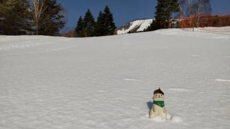
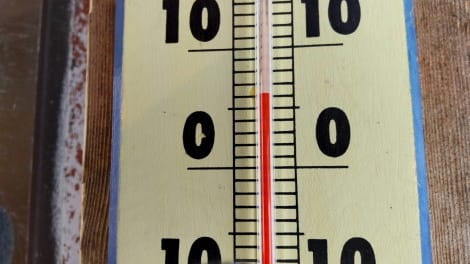
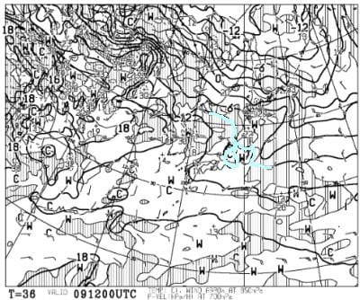
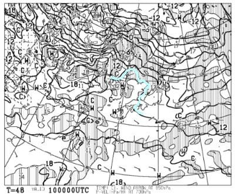

# この週末の志賀高原は晴天だけど…GWより気温は上がるよ（涙）．暑い時の格好していった方が正解

📅 投稿日時: 2022-04-09 00:28:22

えー．

今日の志賀高原は．

朝から見事に晴天！

…そして，朝から緩い雪(涙)

そしてやはり昼間はすごい気温が

上がったみたいで…

見事な春スキー状態だったようです…(泣)

はい．そして皆さん，覚悟してください．

この週末の志賀高原．

さらに気温が上がりますよ～！

9日土曜の850hpa図を見ると．

水色の+9℃線が志賀高原に近づいていて．

+9℃線が志賀に近づくって…

GWより気温が高いですね(涙)

さらに．10日の日曜は…

志賀高原に近づく水色の線は，

なんと．

+12℃線！！

いや…GWでも，ここまで高温になったのは

見たことがないレベルなんですけど！？？

5月末から6月並みの激烈高温ですよ！？？

これでいて，予想通り土日とも晴天に

なりそうなので…

高温＆強烈な日差しで，雪は朝からユルユル．

早朝営業でも，バーンは硬くないでしょう(涙)

そして，午前中にザブザブ雪になり．

昼には荒れ荒れバーンになっていくと

思います…

とりあえず．

雪があって滑れるだけシアワセ

だということで．

スキーに行ってる場合じゃない気がするけど．

今週末も滑りに行きます！

ホントにあと3時間後に出発できるのか…？？

## 💬 コメント一覧

### 💬 コメント by (レインボー74)
**タイトル**: Unknown
**投稿日**: 2022-04-09 12:09:32

土曜日の志賀高原情報

朝の上林+5℃　蓮池+8℃。暑い。

6時30分からのFTは、最初は硬かったけど、8時30分の一般スタートの頃には緩み始めていたとか。

それより何よりも、待っているだけでとにかく暑い。汗だくで気力はすっかり奪われて超早上がり。

帰路の蓮池は+15℃でしたよ。これってスキーの環境？

家でウエアや手袋などの装備を見直したのは、言うまでもありません。

### 💬 コメント by (ikkun)
**タイトル**: Unknown
**投稿日**: 2022-04-09 22:18:16

お疲れ様です……本当大変な暑さでしたね！私し恒例の野沢温泉スキー場の試乗会な今日でしたが……昨日３回目の接種 大丈夫だと思われてましたが……体が重い……そんな雪の中コブで跳びました(・・;)ヤバいですね！ちなみにストックリー blossomSLとフォルクルSL-DとフィッシャーDTX乗りました❗オガサカはでずっぱりでした

### 💬 コメント by (Skier_S)
**タイトル**: コメント回答遅れました…すみません
**投稿日**: 2022-04-11 01:00:43

＞レインボー74さま

土曜も暑かったですが，日曜はもっと暑かったですよ…

でも，雪はそんなに悪くなかったです！

＞ikkunさま

ワクチン接種後の試乗会，お疲れ様です．

でも，この高温ザブザブ雪で試乗しても良く分からないですよね…

この時期の試乗会でいい印象の板をトップシーズンの締まった雪で履くと，

「あれ？」と思うことも多数…

