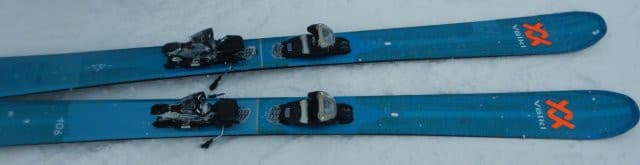
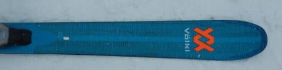
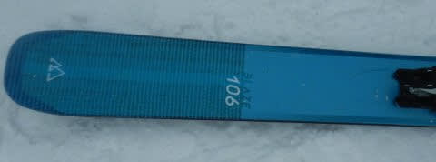
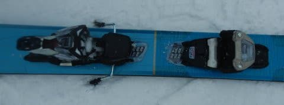

# 2023シーズンモデルのスキー板，試乗レポートその10…VOLKL BLAZE106

📅 投稿日時: 2022-06-08 02:00:27

…昨日は深夜…

というか，明け方に必死に記事を書いた

にも関わらず．

下書きのまま投稿する

という失態を犯し，

Blogを更新できなかった，Skier_Sです…(涙)

ってなことで．

渋峠の営業も終わってしまい．

特派員からのスキー場レポートも

届かなくなったわけですが…

でも，まだ終わっていない．

私のスキーシーズンは，まだ終わってません！

まだまだこのBlog，冬モードが続きますよ～！！

…でも．

大斜面が滑れない今シーズンの月山．

沢コース，いつまでもつんだろう…

とりあえず，月山で滑り収めするまで，

まだまだ冬のままの，季節感が無いこのBlog.

今日は，2023シーズンモデルのスキー板インプレッション．

今回はフォルクル編．

センター幅100mm越えの本格ファット板です．

では，どうぞ～！

○VOLKL BLAZE106

パウダー用ファット板

センター幅106mmと，結構太めのシェイプの

この板．

サイドカーブなどの数字が手元に残っておらず，

どのくらいのRかもわからないのですが．

見た感じ，ある程度のサイドカーブもあり，

キャンバーも入っているので，ある程度の

オンピステ性能もありそうなこの板ですが．

履いてみると…

うん．

完全パウダー用に狙いを絞っているのかな．

圧雪バーンで，エッジがグリップして

カービングで曲がっていくような板じゃないな…

圧雪バーンでのエッジグリップは弱め．

かなりズルズルと板がずれていく感じ．

板は軽いんですが，それもあってちょっと

圧雪バーンを飛ばすと安定感が足りず

キョロキョロしてしまうように感じます．

圧雪で滑る板じゃないですね．

この日は，ちょっと新雪も積もっていたので，

そっちを滑ってみると…

圧雪の上に10cm程度の新雪だと，

まだちょっと本領発揮できない感じ．

やはり，深めのディープパウダーで，

板に浮力を受けてまわって行く板なのかな…

とりあえず，圧雪バーンじゃイマイチその

本領を発揮できなかった感じのこの板．

カタログを見ても，新雪で滑ることを前提に

作った板っぽいので．

圧雪も新雪もどっちでも行ける

HEADのKOREとか，

FISCHERのRangerとかとは

ちょっと違う感じでした．

うーん．

深めのパウダーで試してみたいかな．
