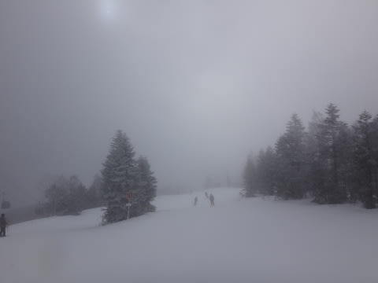
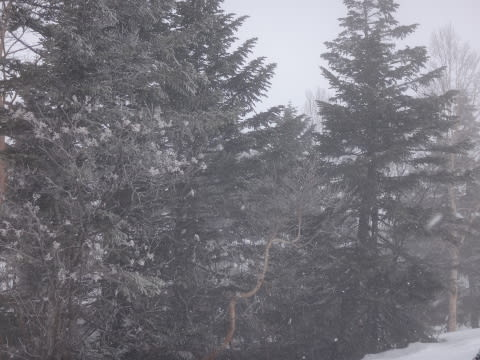

# 2月21日，日曜の志賀高原のゲレンデは…全山絶賛アイスバーン祭り開催中（泣）

📅 投稿日時: 2016-02-23 02:14:53

🏷️ カテゴリ: [2016スキー滑走日記](c70c67ed5248e9432b899dcd5747048bb.md)

ということで．

昨日速報した，日曜の志賀高原．

本日は，詳細レポートをば…

えー．

昨日レポートしましたが．

土曜深夜の雨は，途中で雪に変わるはずだったのですが…

なぜか．どうしたわけか．

気温が冷える前に降り止んでしまい．

その後，降り止んだ後，

遅れて冷え冷え踊りが効き始めるという，

時間差攻撃を食らってしまったため．

…なんだか．

ゲレンデも駐車場も，雨でぬれた状態がそのままカチカチに

凍り付いた，最悪の状況に…（涙）．

＃車の上，濡れてるんじゃないよ．このままガチガチに凍ってますよ

い，一体…これは何の報いだっ！？？？

なぜ，こんな目に…（泣）．

で．

山頂に出ると．

気温は-5度と，意味もなく冷えてます．

この冷えは，ゲレンデのアイスバーンを

確実に保証する冷えですね…（涙）．

朝イチは，雲の合間から日が射す天気で始まりました．

…ゲレンデはシマシマですが…

固そうです（涙）．

とりあえず，滑り始めてみますが…

まぁ，どうしようもないほどツルツルのアイスバーンじゃなく，

ざらざらした感じに固まった氷で．

シマシマがあるのも相まって，朝はまだなんとか

滑れるレベルかな…

…うむ．

仮に，だ．

仮に，今がゴールデンウィークだと考えたなら．

まぁ，しっかり締まった高速バーンとして，許そう．

…でも，今．

2月だよね…（涙）．

…で．

しばらくすると，表面に氷のコロコロさんが出てくるし（涙）．

そして，雲が出てきて…

雪がちらついてきましたよ…

さらに山頂はガスが出てきて，見にくくなってきたし…

そのうえ，9時半には．

ゲレンデの人も増え始め…

ゲレンデは全面硬いままで…（泣）

そのうえ，人が多いのに，前が見えないって…

一体，何？何の仕打ち…？？（涙）

さらに，オリンピックコースは…

え？左側の看板…．

なに？ブッシュ？？

滑っていくと…

ポールでバッテンが作ってありますよ…

見てみると…

あぁ．

草の頭が出てきちゃってます…（泣）．

…昨日の夜の雨で，やられちゃったのか…（涙）．

こんな状態のゲレンデなのに．

さらに追い打ち．

ゴンドラ5分待ち（泣）．

…残念．

なんだか，残念な感じだよ…（遠くを見る目で）

＃ゴンドラ待ちがあったのは，10時～11時の間．

＃1回のみ最大5分，あとは2-3分待ちくらい．

＃11時以降はほぼ待ちなし

ってことで．

「もしかしたら，他にもう少しましなゲレンデがあるのでは？」

という，甘い期待を抱いて，

一の瀬方面へやってきますが…

…当然，一の瀬も山頂付近はガスで，

そして，正面バーンは…

氷，ですね（涙）．

氷が削られた粉のような雪が，

うっすら乗っているような，アイスバーン．

パーフェクターは取りつき部分が

相変わらず土が出ていて…

コースの途中も雪が薄くなってきてるし…（涙）．

言うまでもなく，ここもアイスバーンです（泣）．

そして，タンネの森を覗いてみると…

ブッシュというより，木が隠れきってない部分もあるし…

ええ．そうですとも．

ここもアイスバーンですよ（泣）．

もう，アイスバーン．

全面アイスバーン．

どこへいてもアイスバーン．

…高天ヶ原や寺子屋にも移動しようかと思ったけど，

どこに行ってもアイスバーンだと思ったので，あきらめました．

…ダメです．

志賀高原，もれなく全山アイスバーン提供中．

全面絶賛アイスバーン祭り中です．

アイスバーンフェスティバル開催中です．

…ダメだ…（泣）．

午後3時近くになって，

「午後に向かって晴れていく」

という予想が当たり，日が射し始めてきましたが…

…そこに照らし出されたのは．

大勢の人が滑り，見事に磨かれたアイスバーンとなった

一の瀬正面バーン（涙）．

完全ツルツルのブルーアイスではなく，

ざらざらした感じの氷だったのが，

気休め程度の救いではあったものの…

気温がかなり低かったため，日が射しても全く緩む気配を見せない，

アイスバーン祭り大絶賛実施中の一の瀬を．

「なぜ？なぜ2月にアイスバーン？何の報い？？」

と，悲しみつつも．

やはりこの日も，日が傾くまで滑り続けた

Skier_Sだったのでした…

…しかし．

ホントに．

とても2月と思えない，

激しい雨が降り，ゴンドラが止まり，ブッシュがボコボコ

の週末が，2週連続で続くという，呪われた状況となり．

さらに今週は，全山アイスバーン祭りという

呪われた祭りまで開催されてしまうという…

あぁ．

積雪が．

フレッシュパウダーが，あと1mくらいほしいっ！！！

…これは．

来週．

朝から晩まで，娘と一緒にキッズパークでそり遊びをしないとダメか？←やらないから．絶対，できないから

## 💬 コメント一覧

### 💬 コメント by (はなげ親分)
**タイトル**: 全山アイスバーン祭り
**投稿日**: 2016-02-23 16:36:40

まさか2月にこのような祭りが開催されようとは……。

月曜日は快晴で、気温もプラスに振れましたが前日同様お祭り続行中でした。

そこで西館へ出かけたところ、ここだけしっとりとした熟女のような雪(？）でした。

あ～！少女のような雪が積もって欲しい～!!

### 💬 コメント by (苗場スキーヤー)
**タイトル**: 志賀高原を楽しみたいので教えてください。
**投稿日**: 2016-02-23 19:40:52

いつも楽しく拝見させていただいております。

教えてください。

宿泊は志賀高原プリンスです。

志賀高原を１日で楽しむには、焼額山リフト券で十分でしょうか？それとも共通リフト券のほうが良いですか？

苗場もアイスバーンでした。

物欲選手権楽しみにしています。

### 💬 コメント by (aqura)
**タイトル**: Unknown
**投稿日**: 2016-02-23 20:46:22

いやぁ～、アイスバーン祭り、楽しかったですねぇ(-。-;)

土曜日の夜のどしゃ降りでは、心の中もどしゃ降り状態。

でも、考えようによっては、ぐちゃぐちゃ、もさもさ雪よりは良かったかも…(^_^;)))

チケットですが、個人的には、共通券の方がいいかなぁ。気分てんかんに他のゲレンデにも行けますからね。日曜日も、焼額山限定チケットの友人を置いて、寺子屋まで遠征してました(^^ゞ

### 💬 コメント by (Skier_S)
**タイトル**: 志賀高原は，やっぱり共通券かな？？
**投稿日**: 2016-02-24 01:32:05

＞はなげ親分さま

やっぱり，月余もアイスターン祭りでしたか…

うーむ．

今は2月のはずなのですが…

ホントに少女のような雪が欲しいですよね！！！

＞苗場スキーヤーさま

ご愛読ありがとうございます～！

やっぱり，せっかく志賀まで来たんですもの．

共通券をおすすめしておきます…

志賀は，その広さを楽しんでほしいので，

ぜひ共通券で広いエリアを楽しんで下さい！

…でも，今シーズンは雪が少なすぎますが…（涙）．

＞aquraさま

…楽しかったですか（笑）．

私はちょっと…

やっぱり，志賀に初めて来た人は共通券ですよね．

私のようにはまっちゃった人は焼額だけでいいんですけど（笑）．

### 💬 コメント by (れお)
**タイトル**: ２月のアイスバーン祭り
**投稿日**: 2016-02-24 10:21:35

２月にアイスバーン祭りって、悲しすぎますね…。

滑ってて、昔行った野辺山とか、中央道のスキー場を思い出しました（泣）

ちょっと勇気出して、高天ヶ原上部のコブを滑ってみたんですが、ホント怖かったです…。

今週末も、日帰りで志賀に行けるかもって感しなので、天気予報楽しみにしてます～!!

しかし、都内も少しずつ暖かくなってる気が…。このままピークシーズン終わってしまったら悲しすぎです…。

### 💬 コメント by (Skier_S)
**タイトル**: れおさま
**投稿日**: 2016-02-24 23:22:28

もう，ホントに悲しすぎます…

とても2月の志賀高原とは思えません（涙）．

このままシーズンが終わったら，死んでも死にきれない感じです（泣）．

もう一度，ドサドサパウダー積もってほしいです…（懇願）．

