# 1月19日の志賀高原は…終日ぱふぱふデーっ！！

📅 投稿日時: 2014-01-21 02:22:27

って感じで．

日曜詳細ですが．

そうです．

来ました，きましたよ～っ．

待ちに待った，ぱふぱふデーですっ！

[水曜の天気予想](ed4e4614e73b5be71053db1e138754cde.md)で．

日曜…朝は冷えひえパウダーっ！！かなり寒いよっ！

　　　終日降りそう．時々強く降る．

　　　エンドレスパウダー供給デーになるかも．

って感じで．

日曜はパウダーねらい目かなっ！

…って．

書いたとおりの天気でした！

いやー．

4日前から正確にこの日の天気を当てるとは．なんとすばらしい！

さすが私の天気予想っ！←前日の予想を外しているという，自分に都合の悪いことは忘れている

で．

この日の朝…

うむ．昨晩からの積雪は，40cmほどかな？

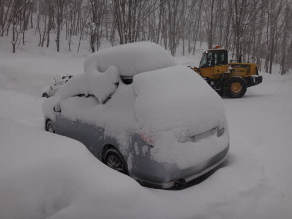

…見事に車が埋もれてるよ…

…ってことで．車を発掘してから焼額に向かうわけですが．

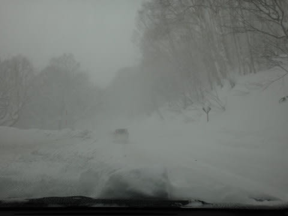

なんだか，途中の道もすごい雪で，前が見えないくらい

吹雪いてるんですが…

んで，山頂に上がると…

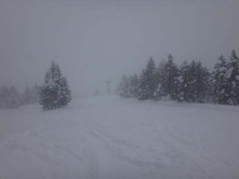

山頂温度計は，マイナス17度！

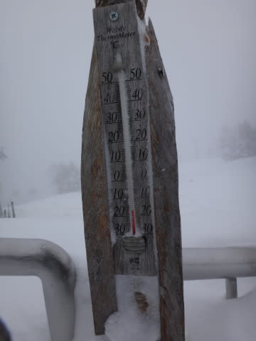

寒いよっ！

さらに，風も強めで，終日ゴンドラは減速運転…(涙)．

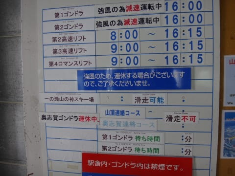

まぁ，奥志賀はゴンドラもリフトも止まってたみたいなんで，

動いてるだけましか…

とりあえず．

ゲレンデは全面新雪ですな．

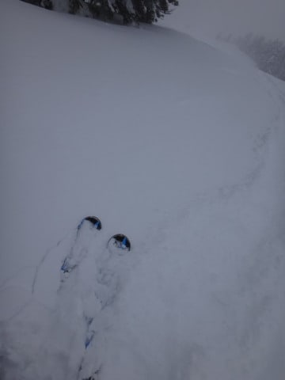

圧雪コースでも，10cmほど積もってますな．

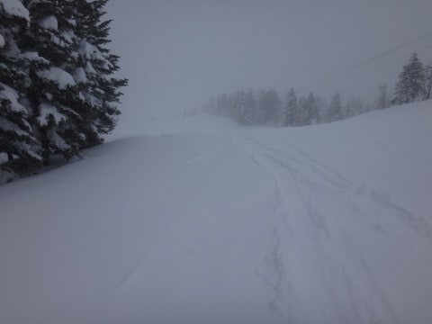

…ってことで，オリンピックコースへ向かうわけですが．

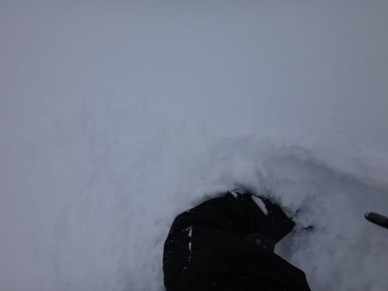

うおおぉぉぉっ！！！！．

膝パフっ！

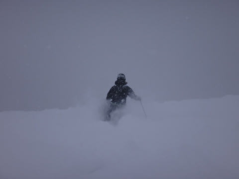

うおおおーっ！

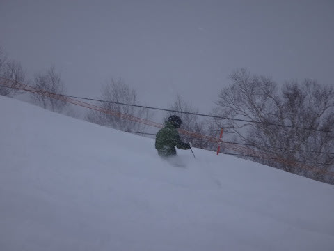

うほほほー！

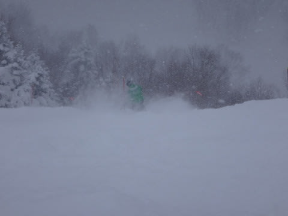

どははははーーーーっ！

し，幸せーーーっ！！

この日は圧雪コースでも，コース脇に行くと…

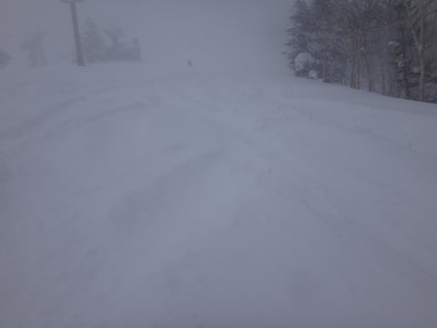

むはー．

パフパフだーっ！

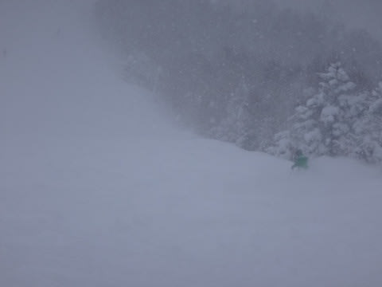

今日はどこに行ってもパフパフだーっ！！！

そして，この日は終日降り続け…

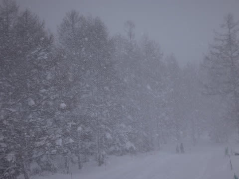

コースはいつまでもパフパフのまま．

そして，やはり今日も人がいない…

かなりの悪天候で，前が見えないし．

さらに，新雪が滑れない人にとっては，かなーり厳しい状態なので．

今日は滑るのをあきらめて帰った人も多いんだろうな～．

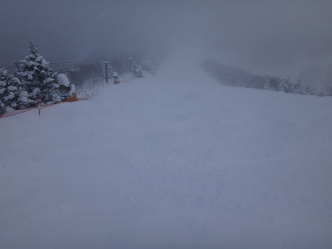

誰もいないんですけど…

人が少なく，雪が降り続けるおかげで，圧雪コースでも…

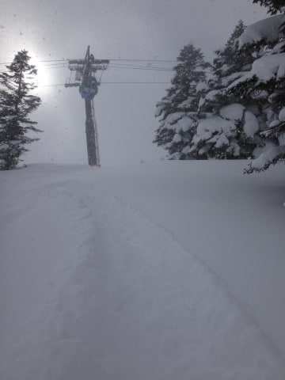

夕方まで，こんな感じで．

コース上を10cm以上のもふもふ雪が覆っている状況で．

私にとっては幸せだったけど．

新雪やモフモフ雪がだめな人には，地獄だったかも…

って感じで．

昨シーズンに引き続き，この週末から復活した．

日曜午後3時からのドリンクサービスで配られたココアを飲みつつ．

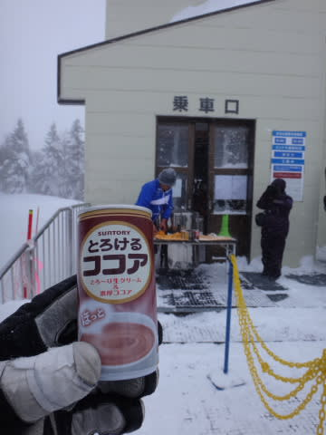

この日もやっぱりリフトストップまで滑り続けたのでした…

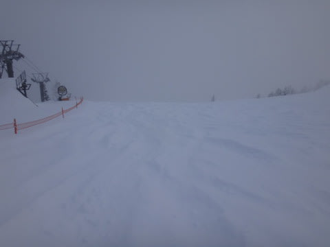

…そして．滑り終わってから，車に戻ると．

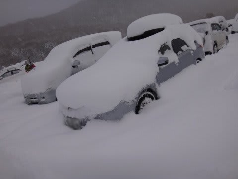

…

…また，発掘作業かorz…

## 💬 コメント一覧

### 💬 コメント by (いか)
**タイトル**: Unknown
**投稿日**: 2014-01-21 02:42:28

ぱふぱふうらやまですね！

週末に行けないのが残念でした。

マイホーム八方はファット人口がちょい多めなので、ぱふぱふはすぐに荒れ地になってしまいますが…。

水曜日から八方なのですが、明日火曜日に滑れたらぱふぱふだったのにーーーっと悔しく、笑

週末のお天気がやばめですね…orz

### 💬 コメント by (Skier_S)
**タイトル**: いかさま
**投稿日**: 2014-01-22 00:59:25

いやー．

今シーズン一番のぱふぱふでしたっ！

意外と今シーズン，深いパフパフに当たって

ないんですよね～．

水曜から八方ですか．

楽しんできてくださいねー．

