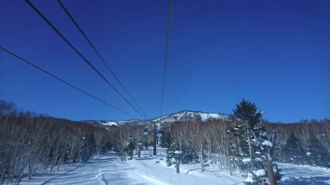

# え？かぐら・苗場・八海山スキー場臨時休業！？？そしてその他のスキー場も緊急事態宣言を受け営業縮小

📅 投稿日時: 2021-01-16 02:27:23

本日も，志賀高原の優秀な特派員から

レポート＆写真が送られてきてますよ～！

ってなことで．

特派員からのレポートによると．

本日の志賀高原は，朝からすっきり晴れ！

そして…

あさイチは，よだれじゅるじゅるモノの，

見事な締まり気味のシマシマバーン！！

これは…

…す，滑りたい…

朝のうちは放射冷却で，予想より低めの

-6℃まで下がったようですが…

雲一つないいい天気で，昼間は結構

気温が上がったようです．

一部，日差しが強いところは雪も

緩んだようですが．

概ねいい雪質をキープしてくれたようで…

そして，人が少ないのもあり，夕方まで

見事なフラットバーンをキープ！

…しかし，本当に人がいませんね…

日が傾くラストまで，いい感じの

バーンコンディションで滑れたようです…

あぁ…

いいなぁ…

…ということで．

新型コロナウイルスがあろうが何だろうが，

自然は変わらず．

雪山はいつも通り，そこにあるわけですが．

今日，スキー場のホームページを巡っていると…

うむ！？？？

（[八海山スキー場ホームページ](https://www.princehotels.co.jp/ski/hakkaisan/winter/)より）

え！？？

（[苗場スキー場ホームページ](https://www.princehotels.co.jp/ski/naeba/winter/)より）

えええええ！！？？？

（[かぐらスキー場ホームページ](https://www.princehotels.co.jp/ski/kagura/winter/)より）

かぐら，苗場，そして八海山スキー場が臨時休業！？？？

なんと…！！

どうやら，従業員に感染者が出たということで，

臨時休業になったようです…（涙）

（[かぐらスキー場Facebook](https://www.facebook.com/snowkagura/posts/3440030446124251)より）

がががーーーん．

なんということだ…

さらに，万座もホテルが臨時休業ですか…（涙）

こちらは感染者が出たわけではなく，単に緊急事態

宣言を受けての対処のようです．

（[万座スキー場ホームページ](https://www.princehotels.co.jp/file.jsp?id=334332)より）

そのほか，八方尾根も，緊急事態宣言による

来訪者の減少を受け，営業規模を縮小するよう

ですね…（涙）

（[白馬八方尾根スキー場ホームページ](https://www.happo-one.jp/news/18334/)より）

他にもいろいろ調べてみると，

やはり緊急事態宣言による来訪者現象を受け，

営業を縮小しているスキー場は数知れず…（涙）

あぁ…

なんということか…

このままつぶれてしまうスキー場が無いか心配だけど．

今は我慢の時期．

じっと耐えるしかないです．

耐えた先に，また明るい光が戻ってくることを

信じましょう…

## 💬 コメント一覧

### 💬 コメント by (しんちゃん)
**タイトル**: 楽しく拝見しています
**投稿日**: 2021-01-16 03:43:40

コロナ禍で耐えながら、現地特派員の画像満載のブログを見ながら、楽しみと癒しを得ています。

スキー場に行けなくても、車のメンテナンスや何かポチってやろうと考えていることやマイナス10℃以下でも楽しく滑る防寒対策など、楽しいネタを期待しています。

### 💬 コメント by (レインボー73)
**タイトル**: Unknown
**投稿日**: 2021-01-16 17:07:51

土曜日の志賀高原情報

土日は奥志賀ゴンドラが８時スタート。ダウンヒルもエキスパートも快適バーン。土曜日でも過疎化した志賀は、待ち時間が気にならないレベル。

今日のテーマはロードトゥ寺子屋。

さあ難関の奥志賀連絡路。レクチャーを受けたおかげで、今日は人生初のノンストップ達成！！　こんなことも今までしらなかったとは！　定年初心者だから、まあ仕方ないか。　

当然快適なヤケビを一通り楽しんだあと、ファミリー経由で寺子屋へ。それまで曇っていたのに重ーい雪が。降り始めはたいてい重いけど、今日は半端ない。

寺子屋レストランで、醤油ラーメン1000円、味噌ラーメン1050円、サンドウィッチ750円。go to eat 対応なので、実質２割近く安い。そして、美味しい。標高が高いのに値段も高くない。眺望も悪くない。

気分を良くして、再び寺子屋を滑ったものの、視界が悪くなって撤退。

ファミリーはすでに5cm以上積もっていたけど、まあ滑りやすかったかなあ。

ベタ雪なので、フード付きの三高に逃げたものの、徐々にストップ雪に。

ＧＳから奥志賀への帰路が疲れました。上手な隊員は『そんなの関係ない』とばかりかっ飛ばしましたが、私には無理。そろり新左衛門で、恐る恐る車に辿り着いたのでした。

それにしても、あんな悪条件でも終礼まで滑り続けるかたがたは、凄すぎです。

明日は重い新雪だから、太板でふわっと浮く快感をあじわいたいです。これから明日の作戦会議に入ります。

### 💬 コメント by (アリス)
**タイトル**: 臨時休業記事驚きました
**投稿日**: 2021-01-16 18:18:52

Skier_S様

お世話になっております。

1/15,16のゲレンデレポートはレインボー様のコメント通りですので、私からの投稿は遠慮させていただきます。

スマートウォッチの件で質問させてください。

Sさんより指導していただいた、PASEですが連日スキーのときは運動記録をして滑走後にLOADしてニヤニヤと楽しんでおりますが、その中で『合計落差』の値は信頼できる数値かどうか？です。

連日、志賀高原中央部を一往復移動しながら、要所では複数滑走しながら（ランチライム付き）で、35～38ラップで、15000ｍ前後の数値が表示されています。（この数値正しいのか？）

あっ、間違っても20000ｍにチャレンジしようなん大それた考えは持っていません・・・

### 💬 コメント by (Skier_S)
**タイトル**: 滑りたい…
**投稿日**: 2021-01-17 03:54:20

＞しんちゃんさま

スキーに行かないだけじゃなくて，外にも出てないので

そろそろネタ切れになりつつあります．

スキー場レポートが無いとつらい…

＞レインボーさま

奥志賀連絡，どんなレクチャーだったのか気になります．

そして，意外と日曜朝はそれほど深い雪にならなさそうです…

＞アリスさま

なぜか，Amazfit PACEは標高差が2倍に出るバグがあります．

大体その数値の半分が標高差です．

スマホの詳細画面，下の方に標高差グラフが出ると思いますが，

そこに出ている上りの標高差は大体正しいですが，

下り標高差はなぜか登り標高差の2倍くらいになってるのがお分かりかと…

