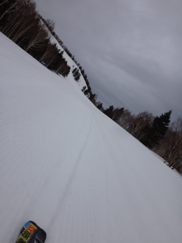
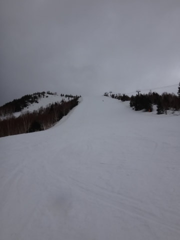

# 4月5日志賀高原詳細モード…パラパラと雨が降ったけど楽しめたよ

📅 投稿日時: 2015-04-07 01:22:50

🏷️ カテゴリ: [2015スキー滑走日記](c09ea645cfc085f86dfcd80f49599dd89.md)

っつーことで．

本日は．

昨日速報した日曜の志賀高原，詳細モードをば…．

えー．

ナイターが先週で終わったこの時期．

早朝から滑らないと，滑り足りないのだっ！

…と．

昨日に引き続き，今日も早起きして，6:30に

早朝営業のゲレンデにやってきたわけですが…．

…えっ？？

早朝営業開始時の山頂で，気温+8度ですかっ！！！

今日も…暖かすぎるんだけど…（涙）

とはいえ．

朝から雨が降るかも…という予想に反して．

早朝営業時には，雨は降ってなかったのが

ラッキー…っ！

朝イチは，一応シマシマバーンではあるけれども．

…でも…

気温8度なだけあって．

朝イチから，結構柔らかいんですけど…（ちょっと涙）．

そして，雪にもちょいと汚れが浮いてる感じ…（涙）．

とはいえ．

さすがに雨の予想の早朝営業は，人も少なく．

すんごいガラガラなんですけど？？？

…かなり柔らかめとはいえ．

荒れていない，きれいな圧雪バーンを

好きなラインで滑り放題！

うむ．

やっぱり早朝はきもちいですなっ！！

そして，8:30からの通常営業開始タイムには，

早朝営業の第2ゴンドラから，第1ゴンドラ側のコースへ移動して．

ふはははは．

また，誰も滑っていない，全くシュプールのついていない

ピカピカバーンを一番乗りだっ！！！！！

後ろに，自分のシュプールしかついてないよ～！

いや．

ホントに．

予想外に雨も降ってないし．

人も少ないし．

何本滑っても，シュプールがほとんど増えないし．

フラットな無人の斜面を飛ばしたい放題なんですけど？

これは…結構楽しいんですけどっ！？？

と，気持ちよく飛ばしていたのですが．

通常営業開始から1時間ほどたった，9時半ごろ…

…来ました．

来ましたよ．

…そう．

予想通りに．

…ぽつぽつと，雨が降ってきました（涙）．

雨は9時半から1時間半ほど降り続けて．

当然，雪は雨を吸って，水を吸った重めの雪に…（泣）．

まぁ．

せめてもの救いは．

ザーザー降りではなく．

パラパラ，と言った感じの雨で．

レインウェアを着てないとつらい感じだったけど．

ゴーグルがびしょ濡れになったり，グローブが

絞れるほどに水浸しになったりするほどでは

なかったことかな～．

（雨に降られてちょっと寂しげなテルテル坊主）

んで．

雨は11時半ごろに止んだけど…

雨が降って，ほとんどの人は帰っちゃったらしく．

ふむ．

ほう．

ははぁ．

…全く，人がいなくなっちゃいましたね…

お昼を過ぎても…

うむ．

やはり．

人がいない…

…あ，やっと人がいた…

（スキーに憑りつかれた人じゃない何かの可能性の方が高いけど）

…ってくらいの感じで．

超がらがらの焼額になっちゃいました．

んで．

ガラガラで人が滑らないので…

ゲレンデの表面が掘り返されず，汚れがうっすら浮いてきてます．

普通，人が滑るとこんな風にならないはずだけどっ！？？

これだけで，いかに人が少なかったかが分かろうというもの…

うむ．

午後はホントに，ゴンドラ1本滑っても，一人にも会わない

くらいなんですが…

雪は重くても，シュプールがほとんどついていない

斜面を気持ちよく滑れるので．

意外とこれは，楽しいかも…っ！？？

午後3時過ぎから，また雨が降ってきちゃったけど．

この雨も，30分ほどで止んで．

結局，ゴンドラ営業終了時間まで．

ほとんど無人と言っていい斜面を気持ちよく滑れて．

…いや，これ．

雨は降ったけど．

そのぶん，人が少なくて良かったのかも…？

などと，某氏がコメントに残してくれた通りの感想を

もってしまったSkie_Sなのでした…

そして．

悲しいことに．

本日で，わが愛する焼額第1ゴンドラ．

今シーズンの営業は終了…（激烈涙）

あぁ…

シーズンが終わっていく…．

でも．

お世話になりました～！

第1ゴンドラ！！

また来シーズン～っ！！！

そして，来週からは第2ゴンドラぐるぐるの予定
