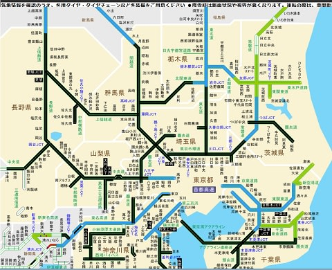

# なんだ～っ！！高速道路マヒ状態っ！明日志賀高原に行けるのか…！？

📅 投稿日時: 2014-02-15 00:23:48

えー．

なんだか．

首都圏の道路はすごいことになってますが…

…高速道路も全面通行止めですね（涙）．

うーむ．

明日，志賀高原に行けるのか？？？

とりあえず，これから寝て3時ごろに起きて…

高速が開通していたら出発だけど．

開通してなかったら，再開待ちかなぁ…

昼頃まで通れなかったらどうしよう…（泣）．

明日，私は無事志賀高原に立てるのかっ！？

乞うご期待っ！（何を？）

## 💬 コメント一覧

### 💬 コメント by (れお)
**タイトル**: 上林の上で足止めです～
**投稿日**: 2014-02-15 07:54:09

前泊して上林までは良かったのですが、すごい雪で道路に、山の雪が落ちてきてるようで、今、上林の上で足止めです。頑張って除雪中のようです。

まあ今日はしょうがないですね。

S さんも道中気を付けて下さい。

### 💬 コメント by (ゆうこ)
**タイトル**: 諦めました。
**投稿日**: 2014-02-15 09:23:02

長野新幹線、始発から動かなくて、いつ再開するかわからないし、再開しても着いたら午後遅くになりそうなので、もう諦めました。

今週は、家の掃除してます。

### 💬 コメント by (miya)
**タイトル**: Unknown
**投稿日**: 2014-02-15 11:05:24

久しぶりのコメです。。

私も日帰りで中央方面にいく予定で

3時に起きましたが、すべて通行止で

さすがに横浜から下道で行く元気がないので

諦めてオリンピックのスケート観てました。

朝起きたら日が出てて悔しいですね...

でもまだ通行止ですが...

### 💬 コメント by (いか)
**タイトル**: Unknown
**投稿日**: 2014-02-15 12:25:47

中央高速バスの運休で、始発の長野新幹線に切り替えましたが、先ほど終日運休が決まり今日は中止です…。雪は想像以上の強敵でした(T ^ T)

### 💬 コメント by (Skier_S)
**タイトル**: こらだめだ…
**投稿日**: 2014-02-15 22:53:46

＞れおさま

前泊したのは賢明な判断だったかと…

でも，山に登れなかったんですか．

無事，スキー場に着きましたか～？

私はもうあきらめました（涙）．

しかし，よりによって，なぜ週末に…って感じですね．

＞ゆうこさま

