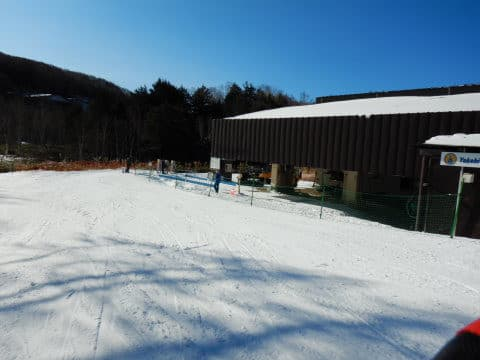
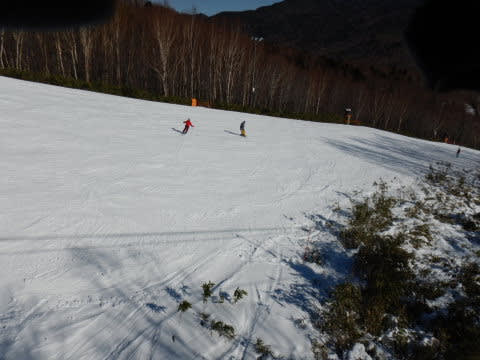
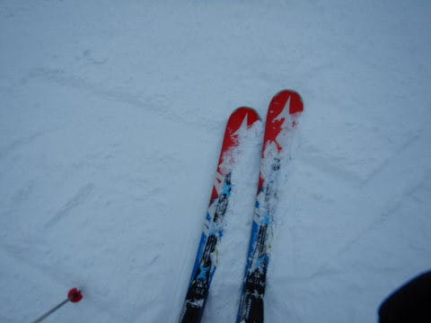

# 2019/12/14(土)の志賀高原，焼額山のゲレンデ状況…朝は晴れ，昼から曇りで夕方雪．リフトはそれほど混まず．

📅 投稿日時: 2019-12-15 02:53:40

ということで．

本日も志賀高原を滑ってきましたが．

いやーーー．

今日は積雪はなかったのですが．

朝方は，かなりのいい感じの

ゲレンデでした！

まず．

あさイチの志賀高原への登り路．

それ程の積雪はなさそう…とおもいながら．

スキー場に近づいてくると，そこそこの積雪路．

そんな積雪路を超えて，

焼額にやってきますが…

雲一つない，すっきり晴天っ！！

そして…

本日から動き出した第2高速に乗り．

今日から滑れるようになった，

唐松コースに繰り出しますが…

そうです．

シマシマっ！

あさイチの，見事な晴天シマシマ，

いただきま～す！！

うはーーーー！！

最高！！

今シーズン最高っ！

人工降雪特有の，ちょいと硬めの

バーンで，コース幅の半分しか人工降雪がなく，

幅いっぱい滑れないけど…

でも，先週まで滑れた緩斜面のサウスコースと

違って，今シーズン初の斜度のある中斜面バーン．

滑りごたえは十分！！

そして，リフトはガラガラっ！！

と，喜んで数本滑っていると…

やはり硬めの人工雪バーン．

バーンの表面が崩れ出し…

殺人コロコロバーンと化してきました（涙）

うーむ．

私にとっては今シーズン初の，

中斜面を高速リフトで滑れた

わけだけど．

全面コロコロは厳しい…（涙）

と，先週も滑った，低速ペアリフト側．

サウスコースに出てみると…

うむ．

こちらはコロコロがそれほど出てませんよ？？

結構フラットなバーンを，

気持ちよく滑れますよ！？？

ってなことで．

コース全面殺人コロコロに覆われてるけど．

高速リフトでペース良く飛ばせる

唐松コースか．

鈍足リフトで時間がかかるけど，

殺人コロコロがない，フラットバーンを

気持ちよく滑れるサウスコースか．

微妙な感じの選択肢となった午前中

でした…

ちなみに，第2高速リフトは一日中

待ちなしで．

第4ロマンスは最大一瞬この程度の

待ちがあったけど．

平均的には，ほぼ待ち0で．

どちらのリフトも基本的に待ちなく，

結構快適に滑れました…

が．

午前中は結構晴天だった本日．

昼間には，強めの日差しで

バーン表面が緩んでいき…

ありゃ？？？

予想とちょいと違い．

バーンはところどころ，

春の雪っぽい湿雪になり．

急斜面はだんだん荒れて

いきました…（ちょい涙）

で．

某都道府県連の指導員研修会も

行われ．

コース上の人口密度がちょいと高めの

タイミングもありましたが．

研修会は，コース端っこで行われていて，

コース幅も結構広めだった本日は，

それ程ひどい人口密度に感じることもなく．

ゲレンデ表面は荒れたものの，

晴天のゲレンデを昼過ぎまで

楽しんでいたのですが…

私の予想通り．

午後に向かって，雲がだんだん

増えていき…

そして．

さらに予想通り．

午後3時ごろには，

雲一つない晴天だった朝とは

うって変わって．

雪が降り始めて来ました！！

午後3時を過ぎるころには，

時折，強く雪が舞い…

そこそこ積もるほどになって

きましたよ！？？

雪は降ったりやんだりで，

それ程激烈に積もるほどではなかった

ですが．

昼間に緩んだ雪が，太陽が隠れるとともに

しっかり硬くなり始め．

ちょいと手ごわくなってきたバーン上に，

いい感じでうっすらと柔らかい雪が

乗ってくれて．

急斜面はやわらかい雪も削られて，

ちょいと荒れ荒れツルツルだったものの．

緩斜面では，今シーズン初の，

天然雪のやわらかめの雪を

堪能することができ．

いつも通り，リフト営業が終わる16時まで，

たっぷり滑りつづけたのでした…

深夜2時現在．

残念ながら，雪はほぼ止んでしまいましたが．

10㎝ほど天然雪が積もってくれたので．

明日の朝は，久々に人工雪の硬めの

バーンじゃない，やわらか圧雪バーンで

滑れそうかな！！

## 💬 コメント一覧

### 💬 コメント by (Northfox)
**タイトル**: 雪よ降れ！！
**投稿日**: 2019-12-15 10:12:37

昨日、白馬の五竜に行った仲間によりますと、午後からスキーを早めに切り上げる程の吹雪になったそうです。かなり積りそうだとのこと。

志賀高原にもお裾分けしてほしいものです。。。。

### 💬 コメント by (Skier_S)
**タイトル**: ＞Northfoxさま
**投稿日**: 2019-12-16 07:09:55

志賀高原は10cm程度の積雪でした（涙）

まだ全然積雪が足りない感じで．

コース上はほぼ100%人工降雪です．

早く天然雪を滑りたい…

