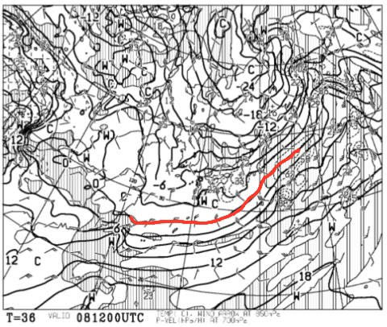
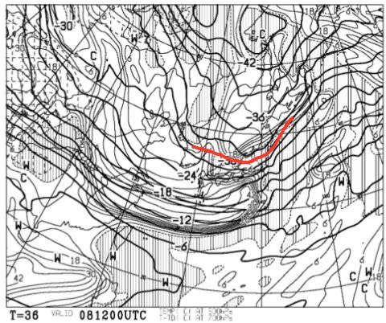
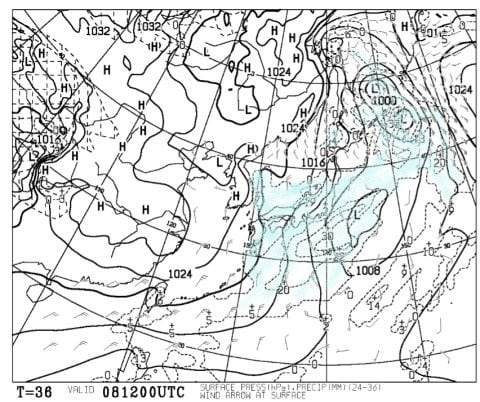
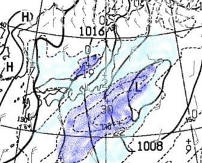
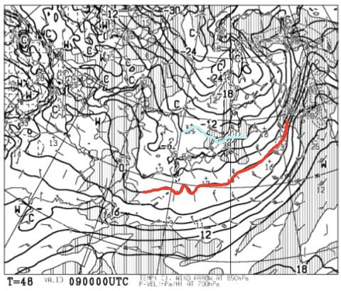
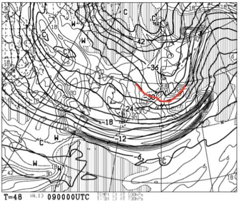
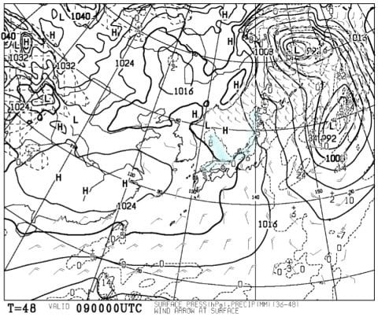
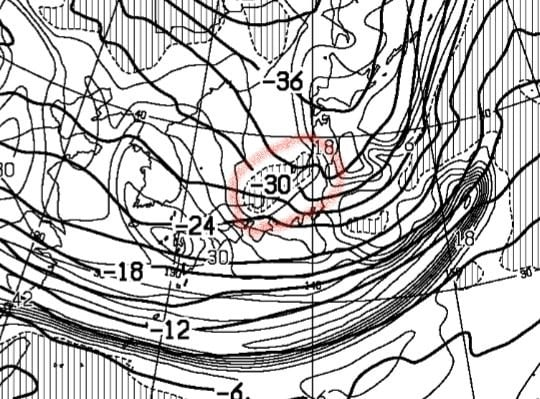
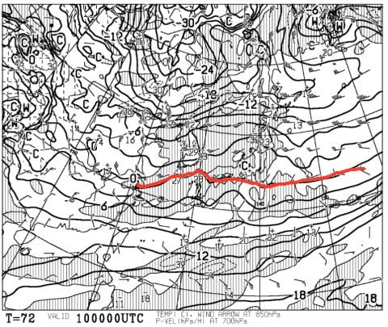
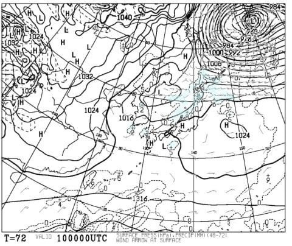

# 12月9，10日の週末の志賀高原スキー場の天気は？…うーむ．土日とも冷え冷え，天気が良くて．あんまり積もらなさそう…

📅 投稿日時: 2017-12-08 02:01:10

えー．

昨日は全く予期せぬ事態が生じてしまい．←いや，前にもやってるから，十分予期可能だったはずだから

掲載が一日遅れてしまいましたが．

…意外と，この天気予想を待っている人が

多いことを知った，今日この頃．

皆様，いかがおすごしでしょうか．

ってことで．

一日遅れですが．

今週末の，志賀高原の天気予想です！

まず．

前日の金曜日の850hpa予想図から見てみると…

をを！！

0℃線は日本のはるか南まで下がり．

志賀高原には－6℃線が掛かっているレベル！

これは，8日は終日冷え冷えですね～！

昼間でも十分人工雪が打てます．

で，金曜の500hpa気温図を見ると…

うむ．

そこそこの雪の目安，－30℃線が志賀高原に

かかってますよ！

金曜の地上天気図を見てみると…

水色に塗った降水域が，志賀高原にまでかかってます！

これは，ドサドサ雪が期待できるか…！？？？

…と，期待するところだけど．

この図を拡大して．

水色…降水量10mm以下≒積雪量10cm以下

青色…降水量10mm以上≒積雪量10cm以上

と，塗り分けると…

あう．

志賀高原は積雪10cm以下の領域（涙）

ということで．

8日金曜は．

志賀高原は雪になるものの．

せいぜい10cm以下の積雪になりそう（泣）．

で．

土曜日朝9時の850hpa気温は…

この日も0℃線は日本のはるか南．

そして，志賀高原には水色の－9℃線が掛かるという．

この冷え込みかたはトップシーズン並みですな！

これなら，土曜の朝の志賀高原は，－10℃以下の

冷え込みですよ！！！

そして，500hpa気温図を見ても…

この日も－30℃線が志賀に掛かってます！

…これは，土曜も雪が期待できそう…！！

ってことで．

ワクワクしながら土曜の地上天気図を見ると…

なんじゃこりゃ？

日本海側の西側のみ，雪雲の降水域が伸びてるけど．

福井県付近より東側では，

日本海にはほとんど雪雲がなく．

わずかに日本海側沿岸部に，細―く降水域が

被ってる程度．

…これだと．

志賀での積雪は望み薄…（泣）．

なぜ…

専門的になるので，あまり細かく説明しませんが．

さっきの500hpa気温図の拡大を見ると…

この，赤く囲った部分．

この網掛け．700hpa面での湿数が0以下の

領域を示していて．

…要するに，網掛けは「湿った空気」を

示していると思ってもらえればいいんですが．

ダメなのだ．

これがかかっているようだと．

ドサドサ雪が降らないのだ．

乾いた空気＝冷えた空気が，

大陸から日本にかけてよどみなく流れて

いるようでないと，ドサドサ雪にならないのだ．

途中で湿数0の湿った空気がいるというのは．

大陸からの冷えた空気がきれいに

流れていないということで．

ダメなのだ．

この網掛けがかかっていない山陰の方が，

地上天気図で見た時に，日本海から

長い雪雲が伸びているのがわかるかと．

（土曜の地上天気図を再掲）

この日，山陰の方が，志賀よりも

よっぽど雪が積もりそう…（涙）．

ってことで．

この湿数0の領域がちょうど日本海側にわだかまっているので．

土曜の朝の志賀高原も，せいぜいチラチラと

雪が舞う程度で，

積雪はせいぜい数cmでしょう（泣）．

で．

土曜は西から高気圧に覆われていくので．

昼ごろから晴れ間が広がってきそうですね．

そして．

10日の日曜，朝9時の850hpa気温図を見ると…

あー．

この日は，金・土に比べると0℃線が北上して．

－3℃線が志賀高原より北に行っちゃってるくらいなので．

土曜に比べると気温が上がりそう…

朝は-5℃程度だけど．

昼間は0度近くまで気温が上がるかな？？

で．

日曜の地上天気図は…

日本海沿岸部に，うっすら水色の降水域が

予想されてるけど…

南西の風だし，志賀高原に降水域の水色が

かかってないし．

志賀高原は晴れるでしょう．

ただ，低気圧が接近するので．

午後は雲が増えていきそう…

でも．

この日も積雪はなさそう…（残念）．

ってことで．

まとめると．

土曜：前日からの積雪は数cm．運が良ければ10cmくらい

　積もってるかも…

　朝の山頂は-10℃程度の，冷え冷え！

　朝イチのゲレンデは，うっすら積もった新雪が

　圧雪された，かなりいい感じのコンディション．

　朝のうちは雲が多いけど，昼に向かって晴れていく．

　昼間も気温が上がらず晴れて冷える理想的な天気．

　…だけど．

　今週の天然雪の積雪が少ないので，午後になると

　人工降雪のコースは，ゲレンデの固いところが

　ところどころ出てきたり．

　人工降雪が無いところは，ちょっとブッシュが顔を

　出し始めるかも…

日曜：朝は晴れ！気温は-5℃程度か…土曜より気温はかなり高め．

　朝のゲレンデは硬めの圧雪．

　人工雪バーンは，早々に固いところが出始めるかも…

　昼に向かって気温は上がり，0度前後まで上がる．

　昼ごろから雲が増え始める．

　…志賀は朝からリフトストップまで，

　降らないと思います．

　これすなわち．土日とも積雪がないので，

　ブッシュエリアが拡大する可能性が…（涙）．

　ただ，日本海側のスキー場は．

　朝から雲が多く，午後になったら降り出すかも…

　結構湿った雪で．標高が低いと雨っぽい感じ．

…って感じでしょうか．

まぁ，志賀高原は土曜昼前～日曜昼過ぎくらいまでは

晴れが続き．

気温もそこそこ冷えるので．

わるくなさそうですが…

冷えてるのに雪が積もらないという，

ちょっと残念な感じ…．

うーむ．

今のところ．

冷え冷え期間は来週も続きそうだけど．

次に雪が積もりそうなのは，11日朝から12日に

かけての2日間かな…
