# 1月31日，日曜日の志賀高原詳細…下地が硬い雪だけど，晴れてすいてていいコンディション！

📅 投稿日時: 2016-02-02 00:51:37

昨日速報した，この日曜日の志賀高原．

本日は詳細モードにて…

ってことで．

日曜の朝ですが．

金曜夜の段階で予想した，

「朝はうっすら積雪もあるかも．

10cmも積もることはなさそうな感じ」

って予想がぴったり当たって，

うっすら積雪がありましたが…

…

…でも．

積もったのは，わずかこんな感じ（泣）．

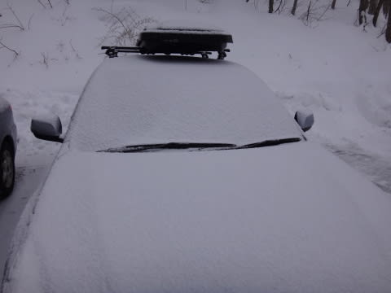

ほんの微々たるうっすら積雪（涙）．

…もう少し．

もう少し，積もってほしいところなんですけど…（懇願）．

そして．

焼額第1ゴンドラの山頂の気温は…

ふむ．

-9℃ですか．

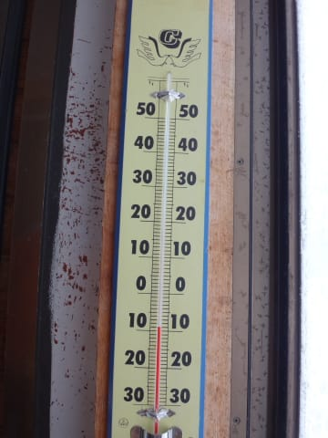

これも，木曜に．

この日の朝の気温を「-10℃」と予想してましたが，

だいたい当たりですな．

ってことで．

山頂のゲレンデに出てみると…

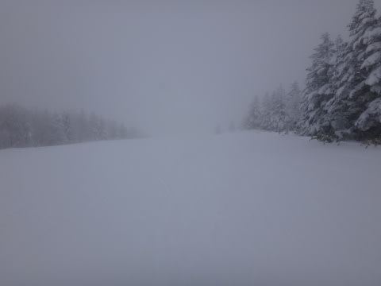

あうーーん．

ガスです（がっくし）．

パウダーがどっさり積もってる…ってなら，

天気が悪くても納得いくけど．

積雪の積み増しがほとんどないのに，天気だけ悪いとはっ！！！！

…ってことを嘆きつつ．

ガスで状況が見にくいバーンを

滑り出してみると…

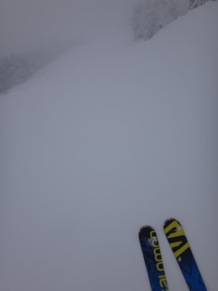

あれ！！？

これは…

しっかり冷えて締まった新雪の上に，2-3cmの新雪が乗って…

これは．

意外と．

チョーーーー気持ちいいんですけど！？？

このチョーーーーー気持ちいいバーン，

…これで太陽が射したら，最高なんですけど…！？？

…

…「晴れろ」

…「晴れろ～～～っ！！」（きわめて強い念を送ってみる）

…

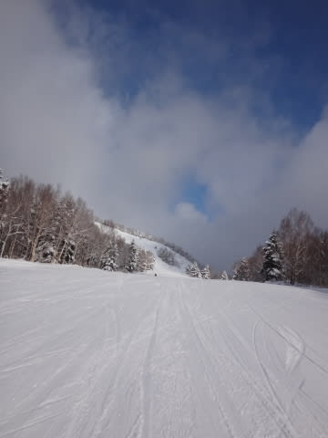

…なんとっ！太陽がっ！

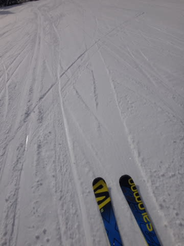

バーンに太陽の光がっ！

念が通じましたっ！！←違うから

素晴らしいよ，私の念力っ！！←絶対違うから

…ふははははははははは！

私の念力による日差しのおかげで．

最高の脳内麻薬系かっ飛びバーンだっ！！！

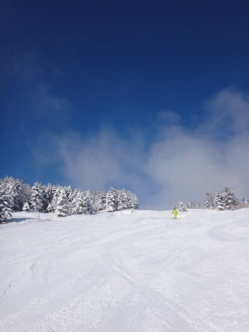

ふははは！最高っ！

気持ちいいよ…！

…と，数本滑ったところ…

あれれ？

なんだか，ゲレンデに氷のコロコロが…

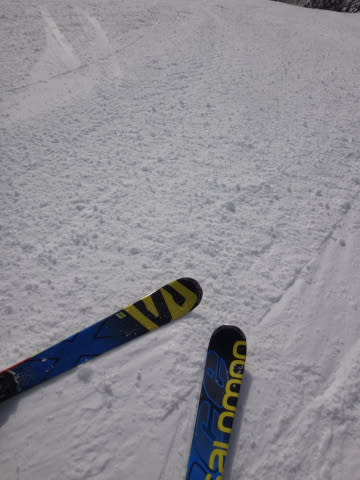

ううううーむ．…残念．

GSコース，朝10時ごろには，やわらか圧雪の表面が剥げて，

下地の固いコロコロが現れてきました…（涙）

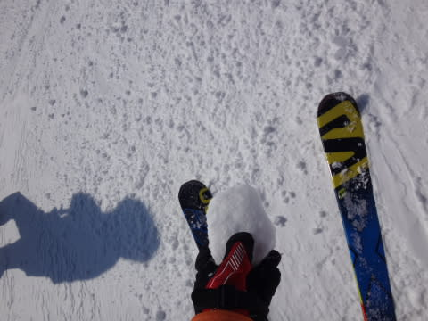

そして，ちょいと人も増えて来ました…

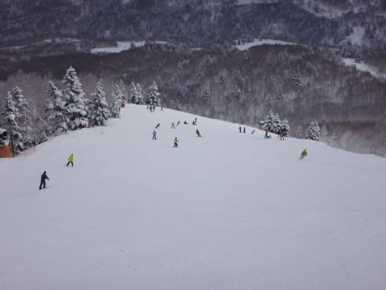

まぁ，人が出てきたって言っても，

決して激込みではなく．

さらにゴンドラ待ちもほとんど無く，

待っても搬器数個程度だったので，

全然許せるレベルですが．

で．

GSコースの快適タイムが終わったので．

オリンピックコースへ行ってみると…

こちらは人が少ないですな～！！！

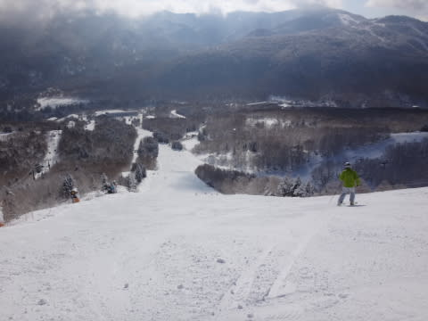

…でも．

アイスバーンほどツルツルではなかったけど．

ザラザラした感じに固まったバーンで．

さらにちょっと氷のコロコロさんもいたので．

ちょいと難しめのコンディションだったかな…

上に乗っている雪は，こんな感じでいい雪質なだけに…

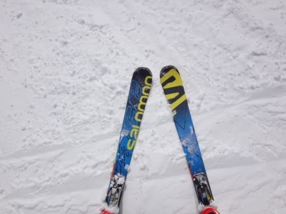

うーーーん．

金曜日に降った雨が，おしいっ！！

この雨がなければ，いいコンディションだっただろうに…（残念）．

ってことで．

昼は，ちょっとだけ奥志賀方面にも足を延ばしてみて．

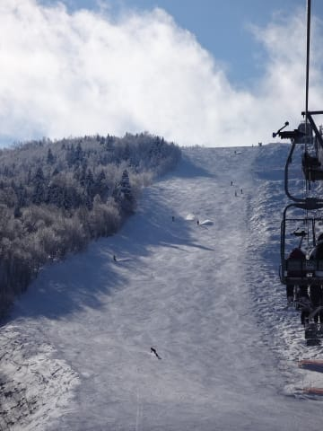

エキスパートコースが，午後にしては珍しく，

全面コブになっておらず，かなりフラットな

バーン状況でしたが…

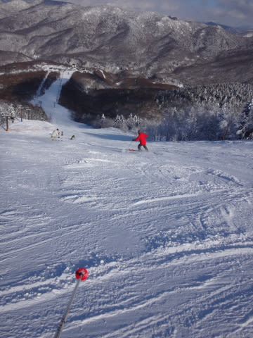

でも．

オリンピックコースと同じ，アイスバーンではないけど，

ちょいと固めなのが，惜しい！

てこずるほどのバーンではないけど，

気持ちよく大回りするには，ちょっと怖い感じ…

で．

この日の天気は，朝9時ごろから雲が切れ始め．

午前中は雲が多めの晴れだったものが…

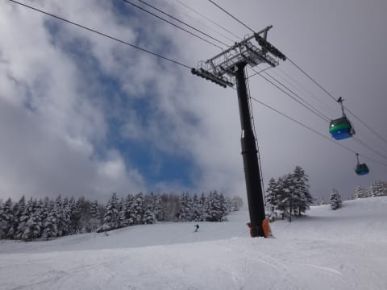

午後はもう，完全にすっきりはっきりしゃっきり晴れっ！！

だのに，ゲレンデの人が全体的に少なかったので…

夕方になっても，ゲレンデは意外とフラット！

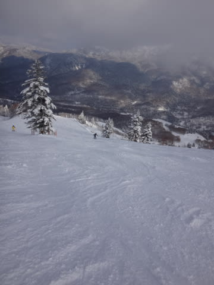

落ち込み部分とか，ちょっと凸凹して

固い下地が出てきたところがあったのが

惜しいなぁ…

金曜日の雨さえなければ…

と，残念に思いながらも．

午後はいつも通り，ゴーストタウン状態になった

貸し切りゲレンデをやりたい放題に滑りつつ…

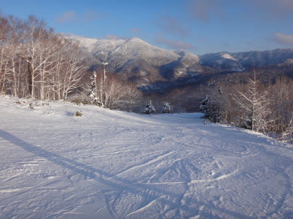

毎度定番の，日が暮れる営業終了タイムまで，

ひたすら滑り続けたのでした…

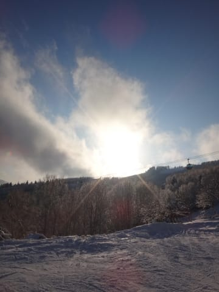

でも．

この土日．

人も少なく．

天気も良く．

気温も冷え冷えで，雪質も良く．

＃下地が固いのは残念だったけど…

当初の壊滅的な天気予想から比べれば，

すごーーーーーく恵まれた週末でしたっ！！！

これも．

数多くの読者の皆さんが．

冷え冷え踊りを踊ってくれたから

に違いありませんっ！！！！

…だもんで．

もし．

今後もまた，気温が上がりそうな予想になったら．

また，皆さんに踊りを踊ってもらえばいいんだ…！！

と，強く思った，Skier_Sなのでした…

＃しかし…冷え冷え踊りって，どんな踊りだ？

## 💬 コメント一覧

### 💬 コメント by (Goku)
**タイトル**: Unknown
**投稿日**: 2016-02-02 19:20:58

私の『ランニングマン晴れ晴れダンス』

効果てき面！でしたね（笑）

今日は早速降れ降れダンスを志賀を見ながらやっておきました（ほんとに？）

### 💬 コメント by (aqura)
**タイトル**: お久しぶりです(#^.^#)
**投稿日**: 2016-02-02 19:53:27

今シーズン、初めてスキーです。冷え冷えダンス踊り、ようやく土日に行けましたU+1F3B5

土曜日は下の方のゲレンデのガスに閉口しましたが…、日曜日は、バーンが固いものの、気持ち良く滑れましたU+2764

でも、まだブッシュが出ているところありますね、まだまだダンスが必要ですねU+1F605

### 💬 コメント by (Skier_S)
**タイトル**: 今度は降れ降れダンスを…
**投稿日**: 2016-02-02 23:28:37

＞Gokuさま

晴れ晴れダンス，効果てきめん過ぎましたね～（＾＾；

今度の降れ降れダンスの効果が

出るのを楽しみに待ってます（笑）．

＞aquraさま

をを！

お久しぶりです…

今週やっと初滑りですか！

先々週までは，雪がなかったですからね～．

これでも，この週末は，24日の大雪前に

比べればかなーーーーりまともになったんですが…

でも，確かに．

まだまだ踊り続けないといけない感じですね！

ってことで，今度は「降れ降れ踊り」を

お願いします～！

