# 3月6日，日曜の志賀高原コンディション詳細…激烈高温，すごい勢いで雪が解けたんですが…（泣）．

📅 投稿日時: 2016-03-08 03:27:24

なんてこった…

焼額山オリンピックコース．

本日から[雪不足のためクローズ](http://blog.princehotels.co.jp/yakebi/2016/03/07/)になったようです（涙）．

それどころか．

コースのいろんなところで[雪出ししないと，
ゲレンデが維持できない](https://www.facebook.com/yakebitaiyama/posts/948030495292297)状況になりつつあるようで…

…人工雪を付けてあるところはいいんですが．

人工雪がない，ゴンドラ山頂に近い部分はちょいとヤバい感じ…（泣）．

まだ，3月始まったばかりですよ！！？？？

去年は，[3月中旬でもこんな感じ](d20150317.md)だったんですよ？？

3月上旬で，コースが雪不足でクローズだとか，

志賀高原の歴史始まって以来の雪不足なのでは…（激涙）．

とりあえず．

悲しみにくれながら．

この日曜日の志賀高原，詳細レポートをば…

えー．

昨日速報したように．

すっきり晴天で始まった日曜日．

いつも通り，焼額山の駐車場へ行くと…

はぅ？？

なぬ？

第2ゴンドラ，強風で運休っ！！？？

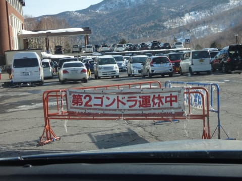

うーむ．

天気予想で，

　…南風が強いので，ゴンドラが減速運転になりそう．

　奥志賀ゴンドラとか，運休にならないことを祈るばかり…

とは書いたけど．

第2ゴンドラが減速運転どころではなく，運休してしまうとは…っ！！

…まぁ，風に強い第1ゴンドラは動くよね…

…

…

…

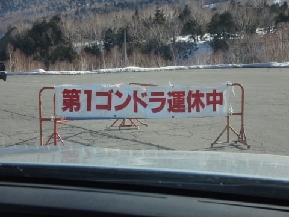

うがぁっ！！！

第1ゴンドラも運休だと…っ！！？？

…

…なんだ．

一体，何の報いだ…っ！！（泣）

誰だ～っ！！日ごろの行いが悪いのはっ！！←だから，自分でしょ

この日の朝は，奥志賀ゴンドラも，東館ゴンドラも，

朝は強風で運休．

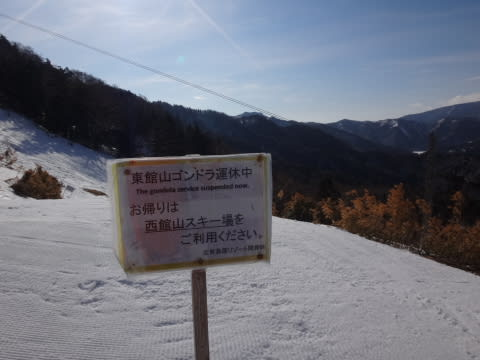

ってことで．

焼額をあきらめ，私としては珍しい

高天ヶ原スタートとなった本日．

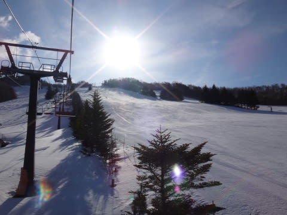

うーーーむ．

雪不足の昨今．

悲しいくらいのピカピカ晴天ですなぁ…．

晴天はいいから，雪を…（懇願）．

朝イチ高天は誰もいませんなぁ…

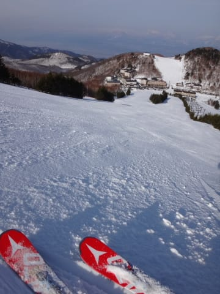

…そして．

放射冷却で冷え込んだゲレンデは．

ガチガチに固まってます．

ええ．ガチガチです．

滑ると金属音がする感じのガチガチです（涙）．

　朝のうちは晴れそう．もし，晴れれば放射冷却で，

　朝は固めの圧雪かな…．

って予想しましたが．

予想をはるかに上回る硬さだったよ…

高天ヶ原のモーグルバーンは…

いや．ここ．

朝イチは，滑ったら死ねるレベルの硬さです（涙）．

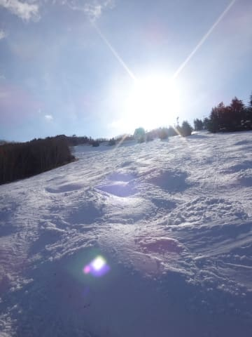

私には歯が立ちません…（泣）

そして．

3月上旬というのに，コブの底がもう抜けてるんですが…（涙）．

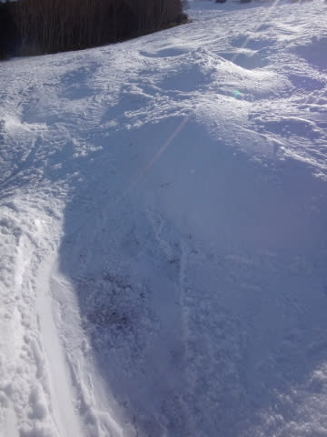

…なんてこった…

そして．

一の瀬へ移動すると．

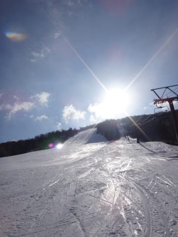

…あぁ．

なんだか，

昨日溶けた雪がそのままテロテロに凍ってる感じ…

一の瀬は朝日があたらないので，

シマシマバーンもガチガチアイスバーン状態．

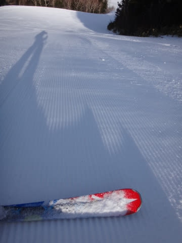

…まぁ，これはこれで．

固いのが好きな人はいいんですが．

普通の人にはかなり手ごわいバーン…

ここで．

「日が当たる焼額は，ちょうどいい硬さになってたりしないかな？？」

…と．

ゴンドラは強風で動いてないものの，リフトは動いている焼額．

やはり，わが生息地にちょっと顔を出しておかないと…

と，やってきました，焼額．

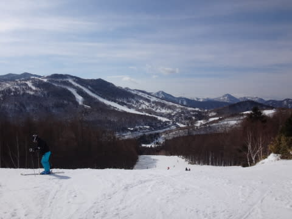

…でも．

あれれれれれれれれ？？？？

まだ，朝9時というのに．

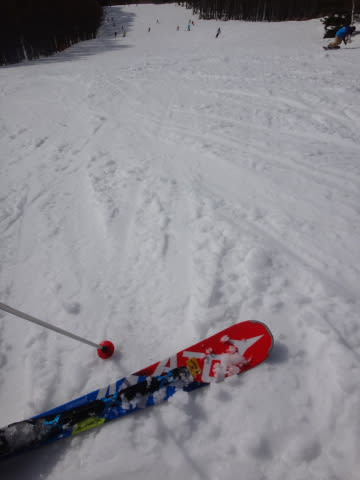

雪が，もうユルユルで，粘つく雪になっちゃって

るんですがっ！？？

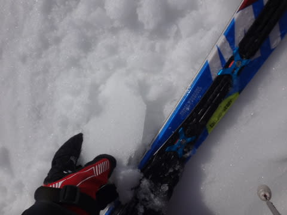

一の瀬はまだカチカチなのに，朝日を直接浴びる焼額は．

もう，朝イチから完全な春雪になってます…（涙）．

そして．

ゴンドラが動いてないので．

リフトに人が集中し．

コースも人が多いし，リフトには3分程度の待ちが…（泣）．

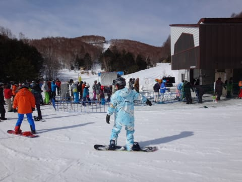

ダメだ…

やっぱり，一の瀬へ戻ろう…

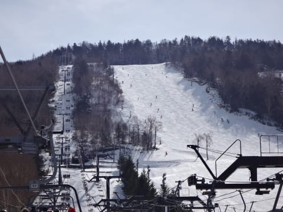

と，戻ってきた一の瀬．

朝10時近くまでは，朝固まった雪が緩み始めた感じで，

まだしっかりした雪で…

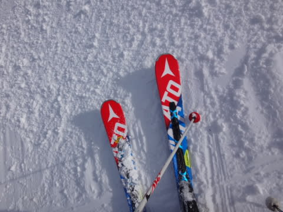

そこそこまともに滑れる感じで．

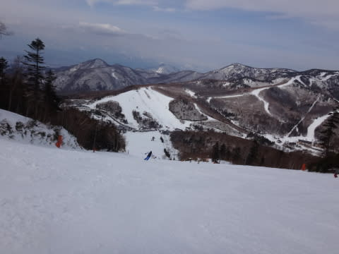

パーフェクターも，午前中は結構フラットだったんですが．

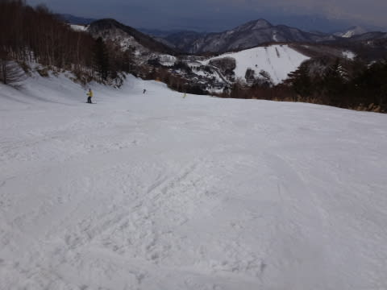

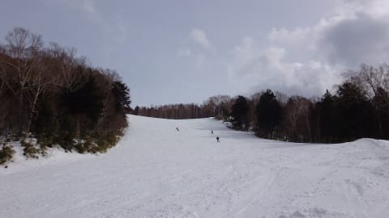

…でも．

昼間の気温はプラス10℃くらいまで上がってしまい（泣）．

昼近くには，もう一の瀬も完全にザブザブに溶けた感じで，

部分的に板に張り付くような，滑らない雪に

なっちゃいました…（涙）．

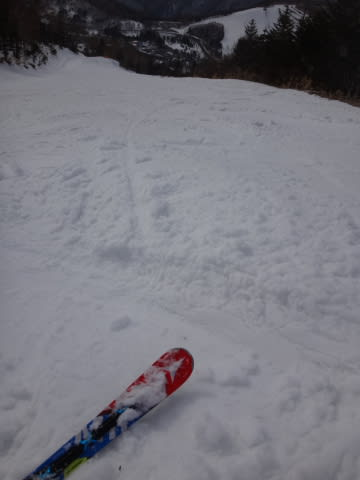

なぜ…

今，3月第1週ですよね…（泣）．

どうして，こんなひどい雪に…（悲）．

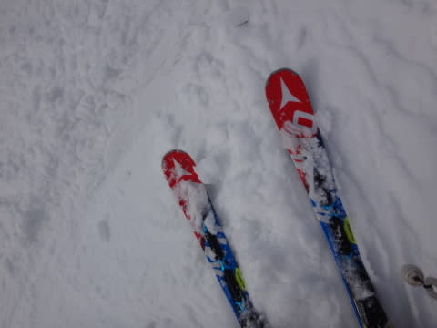

正面バーンは，ところどころ下地に固い部分があったり，

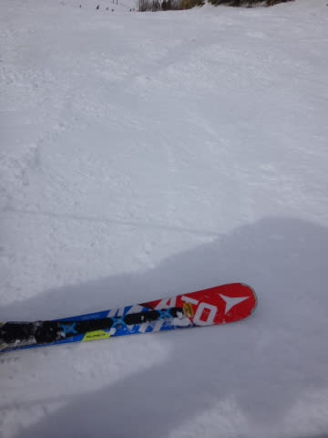

スタート部分も，ちょっとだけブッシュがあったりしましたけど．

パーフェクターの取りつき部分は．

もう通路1本分残して土が出ちゃった感じになってるし…

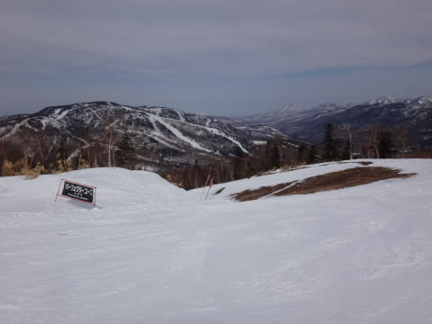

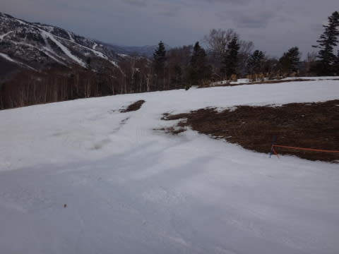

そして，全体的に雪が薄くなり…

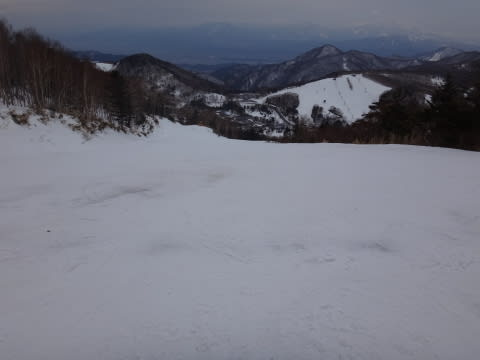

コース途中に，かなりブッシュが出てきて…

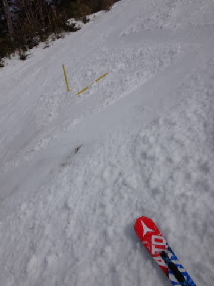

がーーーん．

夕方には土が出始めてきたよ…（涙）．

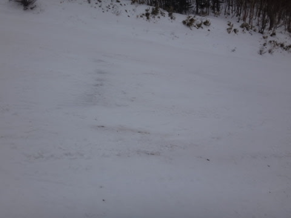

あああぁ…

だめだ．

ダメだよ…

昼すぎには，焼額と奥志賀のゴンドラが運転開始したけど…

強烈な日差し＆高温南風にやられたゲレンデは，

すごい張り付く雪で滑れたものじゃないレベル（涙）．

天気は午後からは雲が多くなり，強烈な日差しは隠れたものの…

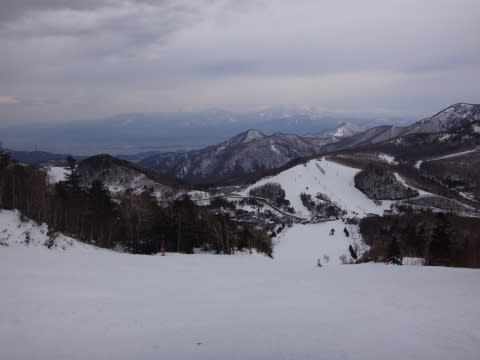

気温はすごく高く，雪はかなりザブザブの荒れた雪に

なってしまい…

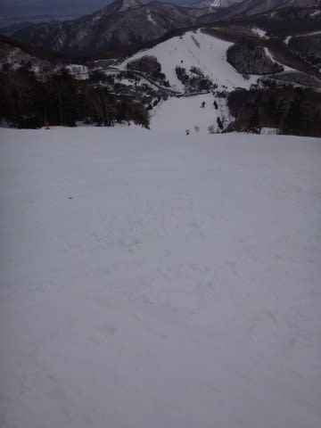

…人工雪がつけてある正面バーンは，

さすがに土が出てくるほどひどくはなかったけど．

どうして？？

どうして3月第1週に，ここまでひどい雪になってしまうの…？？？

と．

悲しみにくれながら．

いつも通り，リフトストップまで滑り続けたのでした…←それでもやっぱり最後まで滑るのね

しかし．

ホントに．

このままだと，ヤバいです．

一の瀬パーフェクターは来週はクローズに

なってもおかしくないレベルだし．

正面バーンも，4月までもたないかも…？？

と，強烈に心配になった，Skier_Sだったのでした…
