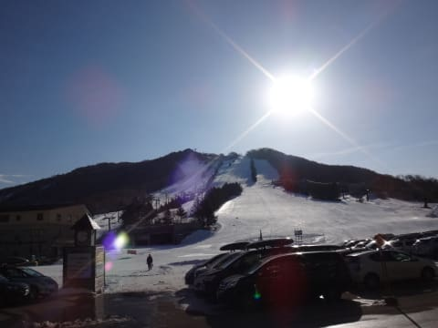
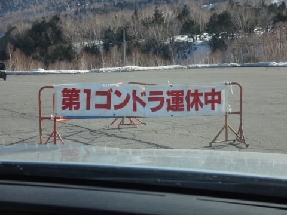
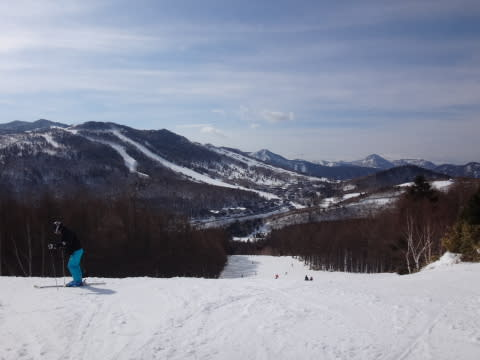
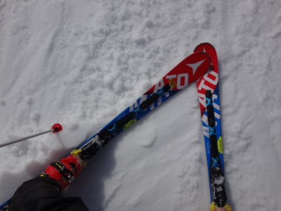
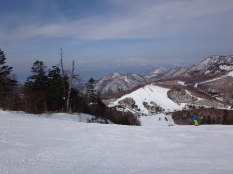
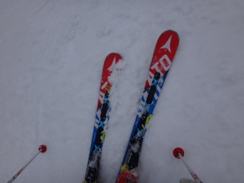
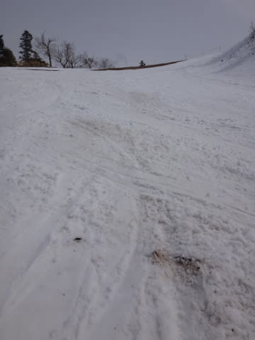

# 3月6日の志賀高原の状況，速報モード…午前は晴天，午後曇り．超高温のダメダメ雪の日（涙）．

📅 投稿日時: 2016-03-07 01:23:54

はい．

今日もいつも通り．

リフトストップまで帰るとこんな時間なので，

本日の志賀高原のゲレンデ状況，速報モードにて…

えー．

本日．

気持ちいい，すっきり晴天で始まった朝ですが…

え？？なにっ！！？？？

強風で，焼額も奥志賀も，全ゴンドラ運休だとっ！？？？？

なんだと～っ！！！

せっかくの晴天なのに，なんてこった…（泣）．

で．

生ぬるい南風が吹き付けて．

朝の気温は，すでに+8度と高く（激泣）

かなりの日差しと，この生ぬるい南風のために…

朝9時前から，焼額のゲレンデは…

粘つく重い雪です．

…朝イチから，これか…（超激泣）

ゴンドラも動かず，雪が悪い焼額を脱出し．

比較的いい雪だった一の瀬をグルグルしましたが…

しかし．

一の瀬も，午後の日が当たりだすと，

すごい重い雪になっていき…

なんてことだ…っ！！！

パーフェクターはそろそろ雪がヤバくなって

きてます…っ！！！

ま…まだ，3月はじめですよね…（超絶激涙）

ってことで．

今週も，例年比+10℃近く高い気温になり．

3月頭というのに，早くも4月中旬並みの

雪にやられた本日だったのでした…（泣）．

ああ…

もう一度…

もう一度，冷え冷え雪で滑りたい…（遠い目）

＃でも，もう冷え冷え踊りを踊る気力も残っていない…

## 💬 コメント一覧

### 💬 コメント by (aqura)
**タイトル**: (涙)(涙)
**投稿日**: 2016-03-07 14:38:17

日曜日、焼額山と思っていましたけど……、ゴンドラ運休との情報。一ノ瀬スタートで、寺子屋を滑っていました。段段、リフト待ちの列が長くなり、昼食も考え、移動したところ、大失敗！他のゲレンデは、もう、最悪期でしたね。

食事をしたあと、泣く泣く、ゲレンデを後にしました。もう一度、もう一度、良い状態で滑りたい…(^_^;)))

### 💬 コメント by (いか)
**タイトル**: Unknown
**投稿日**: 2016-03-07 22:31:57

志賀でも朝から春雪だったんですね…

私はこの週末は、諸事情で岩岳に2日間行っておりました。

16SXにしっかり乗ってみました。コンディションはザブザブ主体、朝イチはかなり硬い感じでした（硫安込み）。

やはり高速系のターンには安心感がありますね。

山回りでかかと荷重からフラットを通って足がどこまでも伸びていく感じは快感です（笑）

14SXの後継機として頑張ってもらいます(^^)

なお、昨日楽しく大回りをしていたところは、今日から雪不足閉鎖だそうで…

3連休までに閉鎖になるところが出てくると、大型スキー場は混みそうですね…

### 💬 コメント by (Skier_S)
**タイトル**: 今週末は冷えそう…
**投稿日**: 2016-03-08 00:31:42

＞aquraさま

私も朝イチでヤケビへ行きましたが…

ゴンドラ運休とのことで，

高天スタート，一の瀬→ヤケビ→一の瀬

という感じで．

ほとんどの時間を一の瀬で滑ってました…

しかし，もう雪はダメですね（泣）．

でも．今週末は冷えますよ～っ！！！

＃あんまり雪が降らなさそうなんだけど…

＞いかさま

あれ？

八方じゃなく，岩岳だったんですね…

でも，16SX，いいでしょ～．

かかと荷重から足がどこまでも伸びていく…

さすがSX乗りならではの表現．

まさにその通り！

…情報によると，17SXもそんなに大きく

変わらなさそうな感じですね～．

でも．

そろそろ志賀でもクローズするコースが出てきました（涙）．

今シーズンはダメだ…（泣）．

