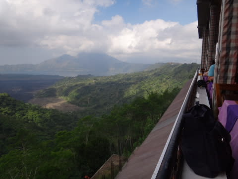

# 子連れコモドダイビングクルーズagain　その35　バリ観光，そして帰国

📅 投稿日時: 2011-10-11 01:07:26

ということで．

夜までの空き時間，チャーターした車に乗ってバリ観光と相成ったわけですが．

去年，[大体行きたいところはすでに行っちゃって](eb30ec8340377b89142854ff8c4d5ba9c.md)るので．

今回はどこに行こうか悩んだんですが．

旅行ガイドでお勧めな，バリ随一の景観地らしい「キンタマーニ高原」と

バリNo.2の規模を誇るらしい寺院「タマン・アユン」の2箇所をめぐることに．

空港から約2時間で，最初の目的地のキンタマーニ高原へ．

バトゥール湖を中心に、バトゥール山とアバン山が眺められる高台が，観光地化されてます．

まずは，バトゥール湖を見下ろすバリ一の景勝地に立つレストランで昼食…と．

完全に外国人観光客向けの，ビュッフェスタイルのレストラン．

テラス席が運良くあいていたので，絶景を眺めながら食事を楽しめます．

…でも，[去年のBebek bengil](e10446a7f9dbd5cd2bd2c0aac195cc0b4.md)の方が味わいがあっていいかな．

景色は悪くないんですけど，

「バリまで来ないと見れない！」

ってほどの景色でもない気がする…

食事の後．

いろいろ景観を楽しんで…

次は「タマン・アユン寺院」へ移動ですが．

うーむ．

ちと，「キンタマーニ高原」は遠すぎたか…空港へ戻る方向への移動なんですが．

移動時間が1時間ほどとかなりかかります．

ここは，バリで最も建物が美しい寺院と聞いていましたが．

なかなかキレイな作りですな．

堀を渡って…

花が咲いた芝生を歩いて進むと…

寺院の門につきます．

ここから中に入ると…

中には，なんだかメルとかいう塔がいっぱい建っています．

これは珍しい建築ではあるなぁ…

ヒンズー教の寺院ということで，仏教建築とはまた違った趣がある

空間です．

メルが建っているこの寺院の中心部．

観光客は周りからしか見れないんですが．

大体50mx100mくらいのスペースですか．

そんなに大きくないかな～．

ここをぐるっと一周すると，タマン・アユンの山場は終わりです．

あとはいろいろぶらぶら眺めつつ…

また入り口へ戻って…

タマン・アユン観光は終了．

今度は，スーパーへおみやげ物Getです．

えーっと．

同じことをしている人は多いと思うんですけど，

私はあんまりおみやげ物屋に寄らない主義で，

こういう現地のスーパーを覗くのが大好きです．

娘は，入り口の遊具にトラップされていましたが…

で．スーパーの中の製品．

なんか，日本製じゃないのに日本語の書いてあるパッケージの多いこと！

＃…でも，日本でも英語のパッケージの製品が多いから，

＃あまり他の国のことを言えないけど

で．お土産を買った後は．

空港へ戻ります．

空港でチェックインして，出国審査(一人当たり150,000ルピアを忘れずに！

赤ちゃんも同額(涙）．ルピアを使い切ると出国できませんよ～！）を通過したけど…

搭乗までは，まだまだ3時間近くあります．

バリの空港は，搭乗待合室がゲートごとに分かれているスタイルの空港で，

椅子がある搭乗待合室には，その飛行機の出発1時間前くらいまで入れません．

それまでは，出国審査を通過しても，待合室には入れず，免税店などが

並ぶスペースで過ごさねばいけないので…

だもんで，あんまりゆっくり座れる場所がないんです．

ここで，搭乗までの3時間を過ごすのは，つらい．

…そんなときの味方．

プレミアムラウンジ．

普通なら，ビジネスクラスを利用したときなどしか入れないラウンジですが．

バリの空港は，一人155000ルピア（一人1500円くらい．子供は無料）払うと入れます．

これで，シャワーもあるし，食べ物も食べ放題，飲み物もアルコール含めて飲み放題．

無線LANも使えて，ゆっくりソファーに座れます．

ちょいと高く感じるけど，なんてったって子供はタダ！夕食代が浮くことを考えると，

まぁリーズナブルかと．

子連れにはお勧めしておきます．

無料のビールやワインをたらふく飲んで（タダのものはいっぱい飲む貧乏人根性…）

食事もビュッフェスタイルで（種類は少ないけど）たらふく食べて，

シャワーも浴びたので，

十分モトはとった…

って感じで．

搭乗直前までくつろいで．

…娘はソファーで寝ちゃいましたね．

ラウンジに入ってないと，寝かす場所もなくて大変なところだった…

寝た娘を抱っこしたまま，深夜0時に，成田行きガルーダ直行便へ搭乗．

帰りは夜中なので，家族3人とも，ほとんど寝てすごしました

明け方，機内食が配られます…

食事が無駄になるのに耐えられない貧乏人の私は，

出されたものは食べる！

で．

娘も起きてチャイルドミールを食べて…

朝9時前に，成田到着．

長かったようで短かった，トータル7泊8日のコモド旅行．

こうして無事に，日本へ帰国したのでした…

＃レポートは長かったけど
