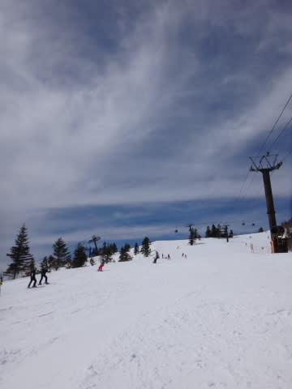

# 3月28日の志賀高原は…晴天，春の陽気だったけど…雪はそれほどひどくなかったかな

📅 投稿日時: 2015-03-28 22:02:40

🏷️ カテゴリ: [2015スキー滑走日記](c09ea645cfc085f86dfcd80f49599dd89.md)

という感じで．

今日の志賀高原は，春の妖気陽気が漂う一日でしたが．

…いや，雪は結構な春雪になったけど．

先週よりマシだったかな～．

とりあえず．朝．

山頂の天気は…

うす曇り，ですね～

そして，山頂の気温は…

…

なぬ？？？

朝イチで，もうプラス気温？？

…まぁ，私の想定どおりなんだけど…

実際にこの4月下旬並みの気温を目にすると，

ちょっと衝撃的…

朝一のゲレンデは，まーまーのシマシマバーンですね．

意外と，アイスバーンではなく．

やわらかい雪がしっかりとしまった感じのバーンなんだけど…

んだけど．

昨日気温が上がり，それが凍った氷のコロコロが，

ゲレンデ全面に…（涙）

氷のコロコロバーンで，ちょいと滑りにくいんですが（泣）

でも，朝のうちは，

天気はこの時期としてはベストといえる，うす曇りで．

9時半ごろには，氷のコロコロが解けて，滑りやすくなってきたけど．

雪は一気にどぼどぼになることなく．

10時を過ぎても，比較的しまり気味で，すべりいいゲレンデ状況！

こ，これは．

朝一からプラス気温だったけど．

天の恵みのうす曇りのおかげで．

結構いいゲレンデ状況じゃないか！！

…天気予想の雪質ははずしたけど（ぼそ）．

ってことで．

午前中は太陽が雲に隠れたり出たりの天気で，

暑いほどにはならず，快適な気温で．

んで，思ったより雪もよく，かなりいいコンディションかも？？

午前中はちょっと人が多いタイミングもあったけど…

まぁ，ゴンドラ待ちも最大この程度が1-2回あったくらいで，

許容範囲かな？？

…と，思っていたら．

午後からは，なんだかすっきり晴天になり．

…汗ばむほどになってきたんですが…

気温は…

…

…プラス9度ですか（涙）

おかげで，雪は，

結構緩んできちゃいました（残念）

で，標高が低いところでは．

はい．今シーズン初登場です．

板が張り付いてブレーキがかかる雪に…（涙）

ただ，雪はどぼどぼになってきたとはいえ．

先週の，強烈に水を吸ってスキーがもぐるほどのザラメに比べれば，

日に当たって重くなった粉雪が締まってきた状態になってきたので．

思ったほど斜面が荒れないよ！

先週に比べれば，ずーっとマシだよ！！

（でも，春の重い雪なのは間違いないケド…）

夕方になると，さすがにゲレンデはところどころ荒れて…

そして，日がかげると固まり始めてきたけど．

でも．

先週みたいな，強烈に水を吸っていたが沈み込むようなザラメに

比べれば，ずっと滑りよく．

予想以上に楽しめた，今日一日でした～！！

…

で．

はい．

そのとおり．

予想通り，ナイターにも行ってます．

ナイターは，一見シマシマに見えましたが…

ところどころ柔らか目のところもあるけど，

基本的にこのまま固まってます（涙）

そして．しばらく経つと，固まったのが掘り起こされて…

そうです．

恐怖の一面氷コロコロバーン化しました（涙）

す，滑りにくい…（泣）

でも．

悲しいことに．

ないても笑っても，飛んでも跳ねても転がっても．

今日がダイヤモンドナイターの通常営業の最終日なので．

しっかりリフトストップまで，滑ってきました…

ああ…シーズンが…シーズンが終わっていく…（悲）．

とりあえず．

明日は．

うーーん．

朝イチは日がさしそうですが．

すぐに雲が増えてきます…

そして．やっぱり，夕方に雨になるのかなぁ…

うーーん．降り始めは夕方遅くと期待したいところ．

私の日ごろの行いがいいから，

リフト営業中は降らないはずっ！

降ってもぽつ，ぽつ程度のはずっ！！

…外れたら，私の日ごろの行いのよさを打ち消すほどの

日ごろの行いが悪い人がいた，ということで…

＃「天気予想外れた」などと人の失敗を

＃あげつらう等の行為が，悪い行いの代表格ですので，

＃ご注意を

## 💬 コメント一覧

### 💬 コメント by (Goku)
**タイトル**: Unknown
**投稿日**: 2015-03-29 09:28:40

焼額山

祈りが通じたようで、思った以上に良さげですね～

私は珍しく戸隠の試乗会に行ってました。

戸隠もまーまーでした。

### 💬 コメント by (Skier_S)
**タイトル**: Gokuさま
**投稿日**: 2015-03-29 23:34:24

それほどザブザブにならず，

意外とよかったですよ～！

戸隠の試乗会，コンディション良かったみたいですね…

こちらも，2日間死ぬかと思うほど滑り倒して

来ました！

