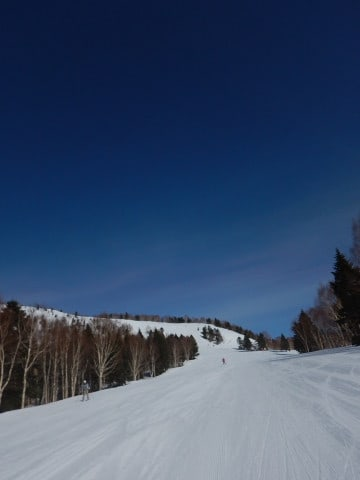

# 3月24日(土)の志賀高原は…おおむね晴れ，気温もそれほど上がらず，春スキーながら結構いい感じの一日だったよ

📅 投稿日時: 2018-03-25 01:46:23

🏷️ カテゴリ: [2018スキー滑走日記](c11b88dc181f34079ab41db74a3587646.md)

本日も志賀高原で滑ってましたが．

晴天のわりに気温がそれほど上がらず．

結構いい一日でしたよ～っ！！

えー．

まず．

志賀高原に上がってくる道路は．

…もう，ほとんど雪がありませんね…

トンネルの中がちょいと凍っていたのさえ

無ければ，夏タイヤでも十分来れそうなレベル．

で．

焼額の通常営業開始に間に合うようやってきましたが…

うむ．朝から晴天っ！

山頂の気温は予想ドンピシャ，

-5℃ですね…

朝はしっかり冷えたので，

バーンはしっかり固まった，かなり

スピードの出るバーン！

決してガチガチのアイスバーンではなく．

硬いのにエッジが利く，かなり快感の

バーン状況で…

そして，ぴかぴか晴天！！

いや，この時期の朝イチとしては，

限りなくいい感じの朝ですね！

春休みということもあり，

ゲレンデも結構人が多いかな～，

って思ったけど．

それほどひどい混雑にはならず．

ピークのゴンドラ待ちも，せいぜいこの程度で．

ゲートの外にまで人が出ることもなく．

晴天の中，午前中はそれほど気温も上がらず．

比較的締まった斜面を滑れましたね～．

3月下旬，午前11時過ぎの焼額で，

この程度の雪質なら．

まぁ恵まれてる方かな！

ただ．

昼近くには，日が当たる側の斜面はちょいと雪が緩みだし…

オリンピックコースなんかは，ちょっと重い

雪になって来たけど．

でも，水曜で今シーズンの営業が終了した，

第3高速沿いのイーストコース．

SGSコースから滑り込めば，1ゴンから滑って

いけるのですが．

このコース，滑る人が少ないからか，昼になっても

まだシマシマが残ってたり…

日が当たりにくい，北側のコースは

午後になってもしっかり締まったバーン

コンディション！

いや，この時期の晴れた午後に，

これだけ雪が締まっていればいいほうではないかな？？

午後はちょっと日差しが薄雲で

弱められたので，雪が解けにくくて

ちょうどいい感じだったのかも…

午後に2時過ぎなると，気温がぎりぎりプラスにまで

上がってしまって．

ちょいとゲレンデは荒れ気味に

なっちゃったけど．

でも，雪がドボドボになったり，

板に張り付く雪になったりすることはなく．

午後はゴンドラもせいぜいこの程度の混雑で．

ほぼ飛び乗り状態だったし．

まぁ，トップシーズンの最高の雪に

比べれば，春のザラメ雪っぽくなっちゃったけど．

でも，気温もそれほどひどく上がらず．

この時期としては，終日まともなコンディションだったかな～．

うむ．

楽しめた一日でした！！

…で．

本日は．

ダイヤモンドナイター，今シーズンの

最後の営業日です！！

いや，もう18:30のナイター営業開始時間は，

まだうっすら空が明るい感じで．

日が長くなったなぁ…

あぁ…もう春ですねぇ…

まだ全然営業できそうなのに，

これで今シーズンのナイターラストとは…

もったいない…（涙）

今シーズンラストとなる，圧雪かけたてシマシマの

ダイヤモンドナイター，

いただきます！

…バーンはちょいと硬めの，ガリガリした感じの

バーンでしたが．

しばらく滑ると，エッジがしっかり効くのに

板が走る硬めのバーンとなり．

硬めのバーンが好きな人にはたまらない

ナイターだったかな！

…って感じで．

ナイターラストまで，たっぷり楽しんだのでした…

…そして．

今日もナイター後に飲みに行ってしまい，

こんな時間…（ちょっと涙）

酔っぱらってるので，文章が多少おかしく

なってるかも…

うーむ．

明日，朝起きられるかなぁ…

（もうヘロヘロ）

明日は気温が上がって，今日ほど恵まれた

コンディションではなさそうですけど．

まぁ，一日晴れた，暑いくらいの春スキーの

日になりそうかな～．

しかし，やっぱり例年より雪が少ない感じに

なってきました（涙）

晴天はいいから，雪が降ってくれないかなぁ…

## 💬 コメント一覧

### 💬 コメント by (Hide)
**タイトル**: ありがとうございました
**投稿日**: 2018-03-25 07:50:15

S 様

土曜の朝に駐車場で突然お声をかけさせて頂きましたが、やっとご挨拶できた驚きのあまり名乗らずに大変失礼いしました。

身支度中のお忙しい時にもかかわらずステッカーまで頂いてしまいありがとうございました。

早速ヘルメットに貼ってしまいました（笑）

私は昼食の際に持病のギックリ腰が再発（症状は軽めですが）してしまい、泣く泣く15:00で引き上げざるを得ず、不完全燃焼で腰痛と闘いながら運転して帰りました。

今度はゲレンデでお会いできるよう願っておりますので、その節はよろしくお願いします。

### 💬 コメント by (さち)
**タイトル**: Unknown
**投稿日**: 2018-03-25 10:21:16

ナイター後にアレをくらってさすがに無事ではいられまい…と心配しましたが、

心配ご無用でしたね、さすが鉄人です！

ちなみに31日までteppaやってたり。

また来週ですね！

### 💬 コメント by (かず)
**タイトル**: Unknown
**投稿日**: 2018-03-25 12:25:14

昨日　今後のこと考えてお会いしてから寺小屋行ってみました　昨日は無風でしたがあそこの向かい風って予測可能ですか？　飲みってあそこですか？金曜は早々行きましたよ笑　最近トラピストBにはまってまして帰り下のFHで山伏1なんて買ってみました

### 💬 コメント by (いさ＆まさ)
**タイトル**: 土曜ありがとうございます
**投稿日**: 2018-03-25 21:19:11

ゴンドラ乗ったらあのS様が！お話させてもらってありがとうございました。スキーラインとこちらのブログを眺めながら、夫婦で勝手にいろいろ予想しておりましたが、またご挨拶させていただけたらと思います。

賜りました、ありがた～いお札をどこに貼るか悩み中です。板かストックかヘルメットか…デコにでも貼って滑りますか（笑）

### 💬 コメント by (げん)
**タイトル**: 本当にありがとうございました
**投稿日**: 2018-03-25 21:30:09

ラストの1ゴン降場でお声を掛けました京都からの親子連れです。お急ぎのところ写真にまで付き合って頂きありがとうございました。

今シーズンラストデーやったんで、息子と『なんとしてもSさん見つけるで！』と気合いを入れて滑ってました。

朝一の一の瀬ファミリーでは2人して『むははは、シマシマバーン最高！』と叫びながら滑りつつ、昼前からは本格的に『捜索』しながらヤケビ1ゴンをぐるぐるしてましたが見つからず。

午後からも奥志賀でスタンプラリーをコンプリートしておこみんの缶バッジもらってから『捜索』を再開するも見つからず。

息子からは『ほんまにSさん志賀高原にいてはんの？』と詰め寄られるも、『ブログに今日も来てはるって出てるやんけ！』と押し問答。

諦めモードで乗ったラストの1ゴンで、ふと3つ後ろの搬器に乗りこまはる人達の中に見覚えのある板と、昨年ダイヤモンドナイターを自分達と同じペースかそれ以上の速さでひたすらぐるぐる回ってはる人を見て子供達と『あれSさんなんちゃうか？』と話してた時に見たオレンジのウェアをチラッと見かけたんで、息子と待ち伏せしてました。ほんまにお会い出来てテンションMAXになってしまい、大変失礼致しました。

ただ、ステッカーが手持ち無しとのことで、その後息子からは『ステッカー欲しかったなぁ』とリフトでぶちぶち言われる始末。

『会えただけでもラッキーやったやろ!』とやりあってたらまさかの宿での再会並びにステッカーが頂けたことに息子は『奇跡や』の一言。今回は一緒に来てなかった娘や嫁から『凄いやん！』と賞賛されつつステッカーを渡すことができました。

20000mクラブ会員の凄さを理解してる息子は『今度は一緒に滑りたい』と妄言を口走っていましたので、来シーズンは是非ご一緒させて頂き、20000mクラブの恐ろしさを見せつけてやって下さい。

本当にありがとうございました(^^)

### 💬 コメント by (べー)
**タイトル**: Unknown
**投稿日**: 2018-03-25 21:49:53

今日も置き板にご挨拶してきました(笑)

９時半過ぎ位の１ゴンですが多分Goku様御一行と思われるお子様連れの後ろに並びましたが、お声かけできず残念…

あとＧＳコース上部で上下黒っぽいウェアの方にぶち抜かれました(汗)

多分20000mな方なんでしょうねぇ～

### 💬 コメント by (TAKA)
**タイトル**: ありがうございました！
**投稿日**: 2018-03-25 22:01:59

Sさん

土曜日の午後の１ゴンに乗っている時に、外のスキーを見るとゴールドステッカー付のスキー（！）、聞き耳をたてていると「20000mクラブ・・・」の会話！！　それで思わずお声掛けさせていただいた横浜の夫婦です。今思えば、お友達との会話を遮るような形にはなりましたこと失礼しました。それにもかかわらずいろいろ教えていただきましたし、手持ちのラスト2枚のお札をいただきありがとうございました。

実はその日の夕方、もしかしたらSさんが焼額終了後に一の瀬ファミリーに瞬間移動か！？と思い、またお話しできたらいいね～　と夫婦で一の瀬クワッドをぐるぐるまわしていました。Sさんを見つけることはできなかったのですが、思いのほかクワッドのラスリフをゲットしてしまいました（笑）

またお会いできること楽しみにしています。

### 💬 コメント by (しんちゃん)
**タイトル**: ダイヤモンドラストナイター
**投稿日**: 2018-03-25 23:03:30

今シーズンラストのダイヤモンドナイター。

いやぁ、シマシマ最高でした。

大人の、しかもＳさんのペースでナイターラストまで滑り切り、翌朝早朝営業から再びヤケビに来ていた小学生には脱帽です(^^;

### 💬 コメント by (しんちゃん)
**タイトル**: シマシマを堪能
**投稿日**: 2018-03-25 23:11:11

今日は早朝から参戦し、昨日のナイターから始まり、シマシマを堪能できました。

早朝から滑っているとおなかが減ってきたので集団早昼食にしました。念願のチウホテルのビーフシチューを頂けました(^o^)

昼食をとったら、ビーフシチューもシマシマも堪能できたので満足して帰路につきました。本日も無事にお家にたどり着いています。

天気のいい日のスキーはやっぱり楽しい!(^^)!

### 💬 コメント by (Skier_S)
**タイトル**: 最近，週末が天気よくてありがたい…
**投稿日**: 2018-03-25 23:45:45

＞Hideさま

コメントありがとうございます～！

焼額ではステッカー貼ってる人が

かなり多いので，見かけたら話しかけてみると

いろんな反応をもらえるかもです(笑)．

しかし，ぎっくり腰ですか！

スキーヤーとして，腰とひざは大事なので…

早く治して，ゲレンデ復活してください．

今度はゲレンデでお会いしましょう！

＞さちさま

いや…

昨日はあの後，ロビーでBlogを書きながら

1時間ほど落ちてました…

でも，朝は気づくと不思議なことに，

ちゃんとイチゴンの前に立ってました(笑)

来週までTeppaやってるんですね…

うーむ．魅力的…

来週はダイヤナイターがないので，

また参戦するかもしれません(^^

＞かずさま

残念ながら，寺子屋の向かい風は

正確に予測はできませんが…

西風が強くなるかはある程度読めます．

ちなみに飲みはあそこです．

其の十とか結構気に入りました．

＞いさ＆まささま

土曜はご一緒させていただき，ありがとうございました．

あのコンディションを，太板でかっ飛ばすのに

驚きました…

いや，私も毎年奥志賀で20000m超える方が

どんな方か，ずっと気になっていたんです．

土曜はゴールドステッカーの手持ちがなくて，

シルバーしかお渡しできずすみませんでした．

今度はゴールドお渡しします！

また焼額でお会いしましょう～！！

＞げんさま

シーズンラストにお会いできて，良かったです…

まさか私と会ってあれほど喜んでくださる方が

いるとは，こちらの方が恐縮してしまいました．

しかし，宿での再開は確かに奇跡でしたね(笑)．

そうですか．昨年のダイヤナイターでも

すれ違っていたのですね…

次は来シーズンになるようですが，焼額ゴンドラの

朝イチに並べば，20000mゴールド＆シルバー会員の

皆さんが揃ってます．

声をかけていただければ，一緒に滑れますよ．

ぜひ来シーズンは，集団暴走（？）にご参加ください！！

＞べーさま

今回もいらしてたのですね…

9時半過ぎで子連れの皆さんと乗っていた

Gokuさんを見かけたとなると．

私ともかなりニアミスしている気がします…

上下黒でかっ飛ばしている人に抜かれましたか！？？

大体誰か想像つきますが…

おそらく，シルバー会員の某氏かと．

今度見かけたら，声をかけてみてください(笑)

＞TAKAさま

いや，こちらこそお声がけありがとうございました～！

お話しできて楽しかったです．

一緒に滑っている仲間とは，いつでも話ができますから(笑)．

あの日は焼額が16:30まで営業で，ラストリフトに乗ると

16:45ごろ車にたどり着く感じなので，

さすがに瞬間移動は間に合いません…（涙）．

でも，クワッドラストゲットされましたか．

そのころには，あのゲレンデには20000m

ゴールドな方が多数揃っていたはずです(笑)．

また志賀にお越しの際は，ぜひ一緒に

滑りましょう！

＞しんちゃんさま

いや…

ホントにあの子は驚愕に値します．

今日もナイターに行ったようです…

ナイター→翌日早朝からナイターまで

というのは，私も絶対無理です．

すごい…

ナイター楽しめましたか？＞Y君

