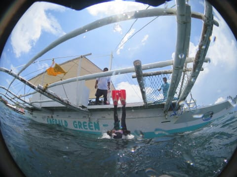

# 2019年8月，4度目のモアルボアル・小6の娘Cカード取得1周年！その5…ダイビング2本目は，いつものイワシポイント！

📅 投稿日時: 2020-07-29 00:46:44

えー．

このBlog．

昨日は車ネタだったわけですが．

ここしばらく，ダイビングネタと

車ネタばかりで．

「どこが徒然スキーヤー日記だ？？」

と．

いつもながら多くの方に思われてしまう

であろう時期になってきた，今日この頃．

皆様いかがお過ごしでしょうか（時候の挨拶）

…いいんです．

スキーヤー（単なるレジャースキーヤーだけど）が

書いている日記だから，

内容が車ネタだろうが，

ダイビングネタだろうが，

飛行機ネタだろうが

イヤホンの使用レポートだろうが，

文学作品だろうが

謎の暗号だろうが，

宇宙人に対するメッセージだろうが，

なにが書かれていても，

「スキーヤー日記」

なんです！！←毎度の開き直り

ってなことで，今日も，

徒然スキーヤー日記定番のダイビング日記へ，Go!

ーーーー

というわけで．

モアルボアルの1本目が終わった後は…

ボートはショップに向かって

戻り始めます．

午前中は，ショップに戻らず2本

潜るのですが…

2本目に潜る場所は，ショップ目の前の

ポイント．

…そうです．

モアルボアルの目玉，イワシポイントです！

昨年は，このイワシポイントの1本目で

[ジンベエザメに遭遇](e1870442964e5e766af156b160fd89602.md)という，素晴らしい

体験をすることができましたが…

エントリー前，

「ジンベエ出るかな…」

という目で海を見る娘．

さて．

この1本でも，ジンベエさん，出てくれるかな？？

…出てくれるよね？？←そんないつも出ないから

ってなことで．

2本目は，ショップ前のイワシポイントに…

バックロールでエントリー！

エントリー後，

深度を落としていくと．

すでに向こう側に影が見えますね…

ってなことで．

エントリー直後から，

モアルボアル名物，イワシの群れに

遭遇です！

ボートの真下に，大量に群れてますね…！

このイワシの群れ，数100mの長さに

渡って続いているのですが…

ちょっと沖の方の，密度が

高そうなところに向かってみますか…

と，沖に向かって泳いでいくと…

をを！このイワシの群れの密度を，

見よ…っ！

そして，イワシの群れを通して

差し込む光…

ダイバーと比較すると，群れのサイズの

巨大さが，わずかに感じられますが…

これが数100mの長さに渡って続く，

この凄さと言ったら…！

そして．

イワシだけじゃなく…

イワシの群れの下に，アジの群れの

カタマリも！

この，下側がアジの群れなのですが…

これもまたすごい迫力！

イワシに比べ個体が大きいので，

アジの群れはまた見応えがあります…！

そして，アジの群れを見送ったら，

今度はまたドロップオフの方に

戻ってきますが…

こちらも，頭の上は一面の

イワシに覆われてます…

向こう側が暗く見えるのは，

全部イワシの影です！

ってなことで．

雲のようなイワシの群れに近づきながら…

そろそろダイビングも終盤．

エグジットの時間です…

娘も，久々のイワシの群れを

満喫したようで．

浅瀬のボートの下に戻ってきて…

そして，エグジット！

…って，ボートのラダーのあるあたり，

もう足が着くくらいの浅瀬でした…

ってなことで．

2週間前に潜ってきた，

座間味の癒しダイビングと，

モアルボアルのイワシダイビング．

…わずか1文字の違いですが．

かたやのんびり，

かたや迫力満点と，

いい感じの両極端のダイビングでした…

うむ．でも．

ジンベエは出なかったな…残念．←そんな何度も出るモノじゃないですから
