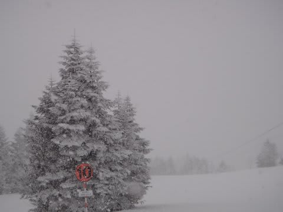
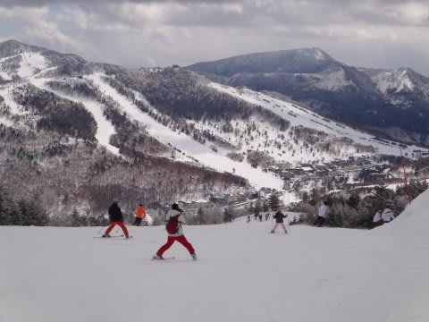
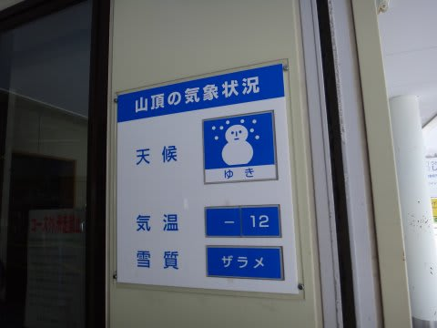
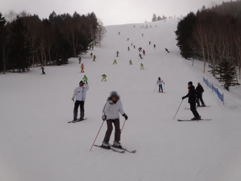

# この週末の志賀と今後の営業は…

📅 投稿日時: 2012-03-27 01:50:32

🏷️ カテゴリ: [2012スキー滑走日記](cca3a0e9524e0203150f790b1fc3c71ad.md)

今日もたっぷり雪が積もっているようですね．

志賀高原は．

まぁ，昨日までの週末も，しっかり雪が降った志賀高原の3月ですが．

今のところは，全く雪の心配がいらないですね～

とりあえず．今でもまだまだ全面可能で，土が出てくる心配は

全く無い感じです．

まぁ，日曜は…

こんな感じで気温も朝はマイナス12度．

3月と思えない低い気温で…

こんなに雪質は良かったんですが

（このすぐ下はアイスバーンなんだけど)

来週くらいまで，春休みで人が多いんですかね～．

この週末もちょいと人は多め．

でも，リフト待ちはほとんどなく，焼額第1ゴンドラもほぼ待たずに乗れる

状況でした．

あー．第2ゴンドラはちょっと混んだのかな．

しかし．

こんなに雪がいっぱいある志賀高原ですが．

今週末の4月1日で．

・焼額第1ゴンドラ

・西舘山

・ブナ平，ジャイアント

・蓮池，丸池

は営業終了です．

うーーん．

雪があるのに，もったいない…

もう，シーズンも終盤ですね…
