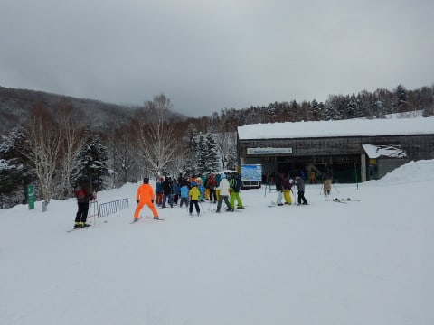
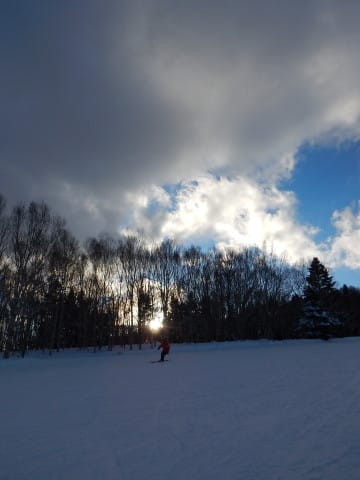

# 2月11日，3連休中日の志賀高原は…曇り時々晴れ時々雪．雪はまぁまぁだったけど，激混みの一日

📅 投稿日時: 2018-02-11 23:18:03

えー．

どうやら，3月10日からの[焼額の春の早朝営業が
第1ゴンドラで営業](http://www.princehotels.co.jp/page.jsp?id=219064)に正式決定したらしい今日この頃．

…昨シーズンまでは第2ゴンドラでやっていた，春の早朝営業でしたが．

今シーズンから第1ゴンドラで営業になるとは…！

このまま，GWまでの春営業も第1ゴンドラが動いてくれると

嬉しいんですけどね～…

って，ちょっとうれしいニュースのあとに，

本題．

昨日，3連休初日は仕事のため滑れず（涙）

本日，3連休中日に，やっと志賀高原に来れました～！！！

まず．

志賀高原の登り坂ですが．

昨日の夜，スキー場ぎりぎりの標高まで

雨だったので．

最初は全く雪がなく…

スキー場に近づいてから，ようやく雪道に

なって来たのを見て…

いやーー．

やばかった．

もう少し気温が高かったら，スキー場まで雨だったよ…

ぎりぎり雪になって良かった…

これもひとえに．

ふははははっは！

私が踊った冷え冷え踊りの効果だぁっ！！！

……

（そこら中から大量に飛んでくる石）

…

…ご，ごめんなさい！！

皆さんが踊った冷え冷え踊りの効果です！！

（石に当たって血まみれになりながら）

…って感じでやってきた，

いつもの焼額．

朝イチオープン待ちの列は…

うげげ．

結構すごい…

これは，今日は混みそう…（戦慄）

朝イチゴンドラでやってきた

山頂の気温は-6℃と．

それほど冷え込んでませんが，

昨日よりは低いかな．

そして天気は…

曇り空ですね．

朝の積雪はそれほどなく．

昨晩，せいぜい5～10cm積もった程度だったのかな？

だもんで…

朝はぴかぴか圧雪！

重めの雪がしっかり圧雪された，

エッジできれいに彫り込める，

快楽がっつり傾きバーン！

そして，じきに日も射しはじめ…

晴天シマシマっ！！

ふはははっははっはは！

シマシママニアにはたまらん

シマシマっぷり！

最高っ！

大原の圧雪シマシマ，最高！！←ピステンの圧雪でも最高だと思うけど…

ただ．

人が少なかったのは，朝の1時間だけ．

朝9時半には…

うぎゃーーーー！

第1ゴンドラに，早くも列が…

そして，コース上の人口密度もガンガン上がり始め．

で．

10時を過ぎると…

なんだーーー！

これはっ！！（泣）

これでも輸送力が高い第1ゴンドラ，

10分も待たずに済みますが…

さすがに3連休中日．

かなりの混雑です…（涙）

もう，コース上もどこに行っても

かなりの人口密度だし．

普段は混まない第3高速や…

第2高速も，ゲートの外まで列が

続いてるよ…（泣）．

いやーー．

せめて3連休，このくらい人がいないと

スキー場の経営がヤバくなるから，

まぁ混雑もいいんじゃないかな…

と，必死に自分をごまかしつつ

滑ることしばらく．

昼休みタイムになると，

1ゴンはガラガラに！

昼休みタイムは，人も少なく．

天気も良くて結構いいよ…

でも．

昼休みタイムが終わって．

午後になるとまた人が出てきて．

1ゴンにもまたちょっと列がつき始めました…

いつもならそれほど混まない午後も．

今日はさすがに人が多いです…（ちょい涙）

でも，人が多すぎて滑りにくい，って程の

混雑じゃなかったですよ～．

天気は，昼頃からは時折雪雲が飛んできて，

雪がぱらつくこともありましたね～．

でも，焼額はガスが出ることはなく．

午後も日が差したり曇ったり．

雪質は，ちょっとぼそぼそした感じの，

湿った雪が冷えて固まった雪でしたが．

昼間も気温はマイナスをキープしたので．

結構いい感じ…！

でも．

さすがに人が多かったので．

夕方になるとちょいと荒れてきて．

ところどころ，わずかに硬く感じる下地が

出てきたのが，ちと残念…

うーーむ．

もう一降りほしいところですな…（懇願）

ってな感じで．

ちょいと人は多めだったものの．

天気は比較的穏やかで．

この日もしっかり，リフト営業終了の16:30まで

たっぷり滑ったのでした…

で．

…

…はいはいはい．

おわかりですよね．

まだ終わりませんよ．

そうです．

夜は，お約束のナイターです！！

今日はサンバレーナイター！

いやーーー．

シマシマだよ！

今日はこぶ斜面側も，半分圧雪されますね…

いや，いい感じのシマシマだよっ！！

と，喜んで飛び込んだものの．

…

あららら？？

なんだか．

湿った雪が固まって，それが崩れた

コロコロバーンなんですけど…（涙）

ちょっと滑りにくいんですけど…（ちょっと泣）

足場がコロコロ崩れていくような，

ちと難しいコンディションでしたが．

でも，数本滑るとやはり楽しくなってしまい．←あなたは雪ならなんでも楽しいんでしょ

やっぱりリフトストップまで滑り続けた，

Skier_Sなのでした…

うーむ．

しかし．

1月以降，雪が少ない…

下地の硬いのも出てきてるし．

そろそろもう一降りほしいなぁ…

## 💬 コメント一覧

### 💬 コメント by (michi)
**タイトル**: お世話になりました
**投稿日**: 2018-02-12 10:36:52

昨日はちびっこ含め大人数でしたね。

お世話になりました。

子供達も友達が増えて一緒に滑ると楽しいようでした。

昼前の一ゴンの混雑にはビックリしました。

でもまさか三高まで歩いて登るとは思いませんでした（笑）

結局、終礼にも参加し、ラスリフまで滑りきって楽しい一日でした。

また宜しくお願いします(^^)

### 💬 コメント by (Skier_S)
**タイトル**: michiさま
**投稿日**: 2018-02-13 04:55:33

土曜はお世話になりました～！！

予想外の大人数でしたね．

今回は子供たちの集団爆走に付き合って，

なかなか楽しかったです…

うちの娘もすごい満足してました．

ご一緒ありがとうございました！

お土産までいただき，ありがとうございました．

また娘と一緒の時は，よろしくお願いします！

