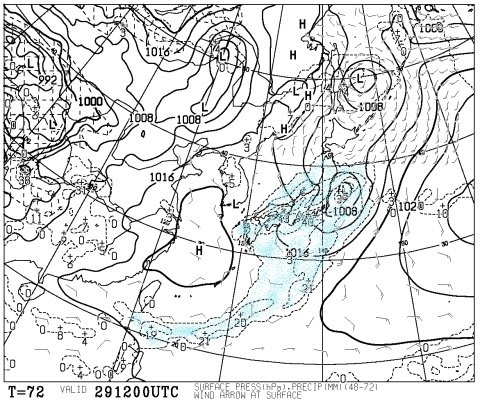
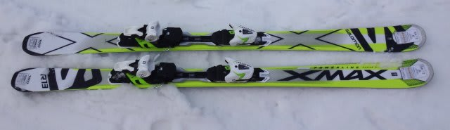
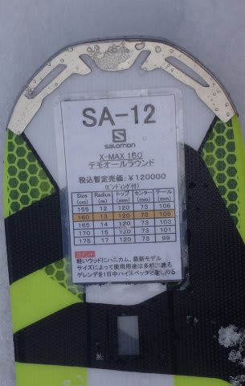
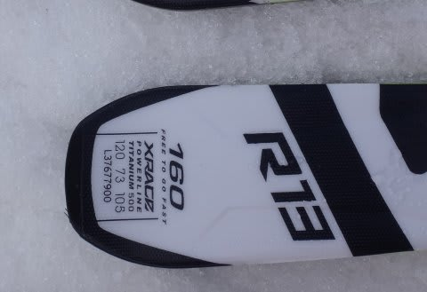

# お待たせ！2016シーズンモデル，スキー試乗レポート第6回…SALOMON編その2

📅 投稿日時: 2015-03-27 01:20:40

えー．

昨日．

「木曜までは，冷えていいコンディション…」

って感じで書いたと思いますが．

ええ．

書きましたが．

…木曜日の志賀高原．

[このレポート](http://red.ap.teacup.com/applet/gokurakuskier/20150326/archive)を読むと．

ホントに最高だったようですね．

…明日から暖かくなり．

今週末は，また春のザブザブ雪になるというのに．

これはホントに目の毒なレポートですね．

[このレポート](http://red.ap.teacup.com/applet/gokurakuskier/20150326/archive)を読むと．

ドボドボ春雪になるのが分かり切っている今週末に，

スキーに行くのが，虚しくなってきますね…（でも行くけど）

なぜ，木曜までいいコンディションで．

週末に悪くなるかな～（涙）．

しかし．

この週末．

さらに悪いニュースが…

予想が難しい南岸低気圧がやってくるこの日曜．

…南岸低気圧の位置が，昨日の予想から微妙に北にずれて…

あ，あうぅ？？

な，何てことだ…

どうしたことだっ！

水色で塗った，降水が予想される領域が志賀高原にかかっているではないかっ…！！！

これは…気温的に，降れば，確実に，雨．

…ってことで．日曜の午後は，

…何か，天からスキー場には降ってきてはいけないものが落ちてくる可能性が…

木曜は…木曜までは，最高だったらしいのに．

…なぜ，週末に限って…（強烈に激烈な涙）．

…という感じの，悲しいニュースに涙をこぼしてしまう今日この頃．

皆様いかがお過ごしでしょうか．

…って，長い時候の挨拶のあとは．

みなさんお待ちかね，2016シーズンモデルのスキー板

試乗インプレッション．

今度はサロモン編の2回目です．

今回は時間がないので，1機種のみ．

では，どうぞ～！

○SALOMON X-MAX 160cm

基礎オールラウンド．

去年の24hours MAXとX-kart MAXをミックスしたようなモデルみたいですが…

とりあえず．持った感じも，履いた感じも，軽い！

すごい軽い板です．

でも，160cmってのもあり，この軽さと相まって

ホントのトップスピードを出すと，ちょっと

キョロキョロするところも…

でも，逆に言えば，それだけ動かしやすい板です．

軽いので，どのようにでも振り回せます．

だもんで，どんな斜面でも怖さは無いです．

あまりガッツリグリップではないですが，

グリップさせると，しっかりエッジに乗って走らせることも可能．

その場合はテールグリップがメインで，トップが浮かび上がって

いく感じでクルクル回っていきます．

テールだけがグリップして，板のトップグリップが弱い感じ．

…今年までの，X-Kartの性格に近いかも…

何にしろ，軽くてクルクル回るので．

あまり体力を使わず，そこそこお手軽にどんな斜面でも

楽に滑れる板を探している人には，向いているかも…

…でも．

今回試乗した板が160cmって，ちょっと板が短すぎました．

もう少し長い170cmとか履いてみると，もう少し高速安定性とか

が増して，たぶん評価はもう少し変わるんじゃないかと思います…．

あくまで，160cmの短すぎる板での評価，ということで．

## 💬 コメント一覧

### 💬 コメント by (れお)
**タイトル**: 羨ましすぎる…
**投稿日**: 2015-03-27 11:08:32

このGoku様のレポート羨ましすぎますね…。

ホントに、週末を避けて雪が降ってますね…。

私も、Sさんの無念さわかります!! 泣

### 💬 コメント by (Goku)
**タイトル**: Unknown
**投稿日**: 2015-03-27 20:14:57

噂のGokuです（笑）

週末の天気がイマイチなのがわかっていたので、最高の日を狙って休みました。（いったいシーズン何日休む気だ）

昨日もし仕事していたら、発狂したのはゲレンデを目の前に行けない私だったかと・・・

それにしても、土日以降もずっと高温が続くのが気がかりで仕方ありません。

### 💬 コメント by (Skier_S)
**タイトル**: 今週末はダメなのだ…
**投稿日**: 2015-03-27 22:37:58

＞れおさま

ですよね～．

うらやましすぎますよね～…

なぜ週末を避けて…（涙）

＞Gokuさま

ホントにドンピシャ大当たりの日に行きましたね～！

いいなぁ～！！！！！！！

私は土日とドボドボの雪を滑ってきます．

そして．

日曜午後は雨に降られながら…（泣）．

