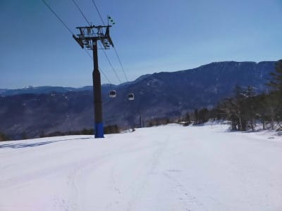

# 2021/4/21(水)，22(木)の志賀高原スキー場特派員情報！…晴天・高温の2日．雪はストップ雪っぽい…

📅 投稿日時: 2021-04-23 04:26:54

🏷️ カテゴリ: [日記](cc4b5682fb7b8b144980957a978653fb0.md)

えー．最近．

週1ペースで死んでいる，Skier_Sです．

…ってか．

そろそろ毎日更新が厳しくなって

いるのかも…？？

昨日は最後のWeb会議＠深夜が終わった

直後，そのまま机に突っ伏して

寝てしまい．

その後，知らぬ間に布団に潜り込んで

いたようで．

気づいたら布団の中で朝を迎えて

ました…(涙)

実に久しぶりに7時間以上寝た気がする

…でも，仕事を終えずに寝てしまったせいで，

今日は準備不足で何度もピンチを迎え

たけど．

やっぱり人間夜は寝ないとダメだな

だけども．

今日も一体何時に寝れるのか不明な状態なのは

気のせいか…

ってなことで．

ありがたいことに昨日も今日も，志賀高原

特派員から写真を送ってもらっているので．

今日も志賀高原特派員レポートです！

焼額は先週，今週は水・木とお休みなので．

特派員の皆さんは，奥志賀高原からの

レポートを送ってくれました…

えー．

まずは4月21日(水)の志賀高原ですが．

朝から見事に晴天！

朝から，山頂でも気温は+2℃と

結構高めで．

あさイチは見事なシマシマながらも，

朝からかなり緩めの雪だったようです（残念）

高温＆晴天で，朝のうちから雪は

結構ザブザブ雪になっちゃったみたい

ですが．

でも，人が少ないので，ゲレンデは

そんなに荒れなかったようですね…

ってか，今日も写真に人が写ってない，

ガラガラ状態ですね．

そして幸いなことに，この日は雪は

貼りつき雪にならず，そこそこ

板が滑ったみたいですね…

ただ，奥志賀はゴンドラ側ダウンヒル，

3壁より下の，ゴンドラ前の最後の部分．

結構雪が減って，一部は廊下になりつつ

あります（涙）

ゴンドラ乗り場前も，雪が減ってますね(泣）

第2高速ペア沿い，エキスパートコースも，

急斜面が終わる部分で土が出始めたよう

です(ちょい涙）

うーん．

GWまで雪がもってほしい…

と思っていたところ．

4月23日の特派員写真を見ると…

ええええ！

25日(日)で奥志賀ゴンドラのダウンヒルコース，

第6リフト・パークの営業終了！？？？

…ゴンドラは連絡用に動くようですが．

26日以降は，奥志賀で滑れるのは

第2，3，4ペア沿いのコースのみ．

奥志賀のゴンドラ側は滑って

降りられなくなるようです…

まぁ，22日でこの状況なら，

もってあと3日ということなのか…

ってなことで．

22日の木曜の志賀高原も，見事な

晴天だったようですが．

雪，減りましたね…(泣）

で．

この日も朝から気温はプラス気温(涙）

あさイチはシマシマだったようですが．

(久しぶりのおこみん特派員からの写真！）

でも，朝から気温が高かったので，

気持ちよかったのは朝の2本まで．

3本目あたりから，雪は滑りが

悪くなっていき…

昼前には，全面で板の滑りが

激悪になり．

妖怪板掴みが今シーズン最高レベルで

大量発生していたようです．

ただ，昼ごろになっても，

日差しは強かったものの気温は+4℃

くらいまでしか上がらなかったようで．

3月末から4月上旬にかけての，

一気に雪が解けた時期に比べれば，

激烈に雪が解けてるような感じでは

無かったようです…

だもんで．

営業休止したダイヤモンドも，

まだ滑れそうな感じで雪が残ってますし．

今日は営業していない高天ヶ原．

中央バーンもモーグルバーンも，

まだコースには穴が開いてない

ようですね…

とりあえず．

まだ何とか雪がもっている志賀高原ですが．

なんだか．

23(金)，24(土)は天気がよさそうで，

気温が上がりそう

です．

24日(土)の850hpa図では，

赤い0℃線ははるか北，

志賀は水色の+6℃線に囲まれている

くらいで．

昼間は+10℃近くまで上がるかな…(涙)

でも．

25日の850hpa図を見ると…

ををを！

久しぶりに，志賀高原より南に，

赤い0℃線が下がるよ！

これは…25日の日曜は，朝は晴れて，

午前中は0℃を超えそうだけど．

午後に向かって気温がひくくなって…

午後は雪がぱらつくかも…？？？

どちらにしろ．

土日とも，雨が降る心配はなく．

基本的に晴れそう！

土曜は気温が上がり，貼りつき雪になるかな．

でも，日曜は午後に雲が増えて冷えて行き．

午後遅く，リフト営業終了前後くらいに

雪がぱらつくかも…

とりあえず，今週末は．

先週の，

土曜は終日雨．

日曜は午後吹雪＆荒れ荒れのまま凍ったバーン

という，

「これ，何の修行？」

って聞きたくなる週末に比べれば．

かなりまともな週末だと思います…！

## 💬 コメント一覧

### 💬 コメント by (うえいと)
**タイトル**: Unknown
**投稿日**: 2021-04-23 08:56:50

足前の違いか21の奥志賀は私には10時すぎると（ダウンヒル5本）緩み雪に足が取られやすく一番下の通路でストップ気味になりました。

そこで渋は休みながら固めの横手へ転戦。

そちらで少し楽しんで来ましたよ。

### 💬 コメント by (ikkun)
**タイトル**: Unknown
**投稿日**: 2021-04-23 12:48:44

ありゃま(・・;) それだけ温かく雨が沢山だった証しですね(・・;)今朝は霜がちいと降りました？

 実は本日志賀高原に??と思いましたが……固定な奴を払わないとヤバいので……(泣)      

掴まれる雪ならばやはり早い時間に 行かねば？……行ける人は行かないと❗なんて……

### 💬 コメント by (Skier_S)
**タイトル**: 土曜は高温，日曜は冷えるよ！
**投稿日**: 2021-04-24 01:39:02

＞うえいとさま

あ，21日も奥志賀は，結構貼りつき雪だったんですね…

でも，横手は大丈夫だったんですね！

…この時期はやっぱり横手・熊の湯が正解かも…

＞ikkunさま

今日の志賀高原の奥志賀方面は，朝早くから滑らない雪だったようなので…

行くなら横手山．

あ，日曜25日なら冷えるので妖怪板掴みは出ないと思いますよ~！

