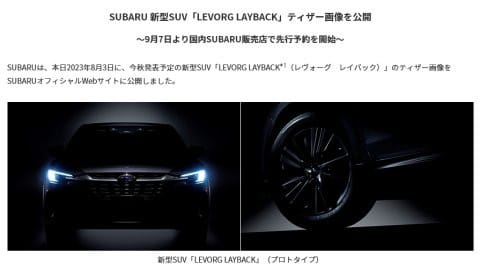
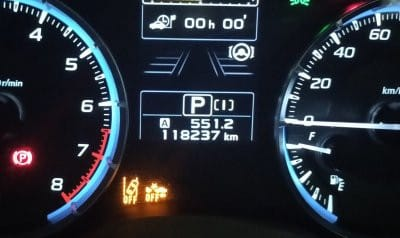

# VMG LEVORG君，5年目の車検！

📅 投稿日時: 2023-08-09 04:08:27

えー．

スバルのホームページを見たのですが．

LEVORGのD型リリース時に追加されるという

噂だったSUVモデル．

ついに，「LEVORG LAYBACK」という正式名称と

ともに，ティーザー画像が公開されましたね…！

（[SUBARUニュースリリース](https://www.subaru.co.jp/news/2023_08_03_151403/)より）

どうやら，LEVORGのグレード追加というより，

新しい車種という位置づけになるらしい，

この車．

車高が高い車はいやだけど，雪道や登山口

までの山道などを走ることが多く，

ロードクリアランスが欲しい私にとっては

ねらい目の車なんだけど…

なんだか，装備がいっぱいついた，

かなり高い車になりそうな予感．

装備はいっぱいいらないから，安い

グレードがあるといいなぁ…

ってなことで．

車といえば．我が家の我がLEVORG君．

先日，早くも2度目の車検を迎えました～！！

…[あの日々](ecdca7ac058e50b9e3a2a3ae04e18b623.md)から5年…

もうそんなになっちゃったのか…

で．

5年間での走行距離，11万8000km．

これは…私としては極めて少ない！！

コロナだったり娘の受験だったり仕事が忙し

かったりして，出かける量が少なかった年が

たまたま続いちゃったという理由ですが．

前のBR LEGACYも，その前の車も．

5年で16万kmくらい走っていたので…

5年間での走行距離が4万km以上少ない

ですね…

これまでの車に比べて，走行距離が

年1万km近く少ないってことで．

走行距離がこのくらいなら，まだまだ

走ってもらわないと…！と，

我が車にしては珍しく，5年目車検を

突破させることにしました…．

（[その際の代車がプレオプラス](eae5bad67f63ce3aa169a74f2756d60e1.md)だったのはすでに書いた通り）

で．

車検のためにディーラーさんへ行った

わけですが．

いつもの担当の方が異動になり，

私の担当が変わったらしく…

これ，いつもの営みを繰り返さなくちゃ

ならなくなったな…？？

と思ったら，案の定．

ディーラーさん「車検見積もりしました～！

　こちらになります！」

私「ふむ」

ディ「まずはブレーキフルード交換と，

　オイル交換を…」

私「お願いします」

ディ「そして冷却水の交換…」

私「クーラントはマニュアル上22万km

　無交換で行けるはず．交換しなくて

　いいです」

ディ「そうですか．

　では，下回りスチーム洗浄…」

私「こまめに洗ってさび止めしてるので

　いらないです」

ディ「…あ，えーと…次は…

　マフラーの防錆塗装…」

私「今のステンマフラー，外から錆びて

　穴が開くことはあんまりないので，

　いらないですね…．そもそも錆びないように

　気を使ってますし…」

　（外から錆びるより，むしろ触媒からの

　水がマフラー内に溜まって錆びるほうが

　多いんじゃないかな…）

ディ「あとはエンジンの内部洗浄…」

私「もしかすると，吸気系から入れる洗浄剤

　ですかね…」

ディ「そうです！エンジン内部がきれいになって…」

私「ディーラーさんでやってもらいたいと

　思わないのでいいです」

　（必要になったら自分でやるわ…）

ディ「そうですか…

　あとはエアクリーナー交換…」

私「10万kmでエアクリーナー換えて

　まだ2万kmですから…5万km毎交換推奨なので，

　換えなくていいです」

ディ「エアコンフィルタ交換とエアコン

　エバポレータ洗浄…」

私「洗浄はいらないです．エアコンフィルタは

　自分で適当な時に替えるので，

　交換部品だけください」

ディ「…そうですか…

　基本的な見積もりはこれだけになります…

　だとすると，エンジンオイル，ブレーキフルード

　交換とエアコンフィルタ部品だけですね…」

私（やっぱり肝心なものが抜けるのか…）

　「あのー．前回交換から4万km走ったので，

　フロント・リアのデフオイルは交換してほしいん

　ですけど…

　4.5万kmで交換推奨のはずなので」

ディ「あ，デフオイルですね！」

私「あと，リニアトロニックのオイルも替えて

　もらえるとありがたいです…」

ディ「あ，ATフルードですね…承知しました．

　まだ，他に替えてほしいものありますか？」

私「プラグは10万kmで替えたばっかりだし，

　燃料フィルタは6万km走行時にリコールで

　燃料ポンプ交換時にAssy交換だったはずだから．

　あとは替えなくちゃならないものはないです」

という感じで．

換えてほしくないものを勧めてもらえるのに，

換えてほしいものが抜けているという，

いつものパターンを繰り返し．

さらに車検終了後…

ディ「各種点検結果OKです！！

　…ただ…」

私「ただ？」

ディ「12万km走って，フロントブレーキパッドが

　まだ8mm以上残ってるんですが…

　どこかで交換しましたか？？」

という，ここでもいつものやり取りの繰り返しが…

早い人では2～3万kmで使い切っちゃうことも

あるらしいブレーキパッド．

高速走行の割合が多いうえ，エコラン気味で

ブレーキをあまり踏まない私の運転では，

ブレーキパッドがそんなに減らないのだ．

12万km程度では，まだ新車のパッドが

半分以上残るのが私の常なのだ…

私「いえ．新車のパッドのままです」

ディ「10万km越えて，新車のパッドが

　まだこれだけ残ってるんですか…！！？？

　どういう運転しているんですか…！！」

ってな感じでいつも通り驚かれるという，

もう，形式美といえるやり取りを行った後，

無事，車検終了となったのでした…

ってなことで．

我がVMG LEVORG君．

まだ走行距離12万kmで，

全く不具合はないし．

これまでの積算燃費はリッター13.3km/Lと，

燃費がいいとは言えないものの，

まぁ，ルーフボックスをつけっぱなしの

300psの4WD 2Lターボ車と考えれば，

まぁ許せる範囲だし．

うん．

大丈夫．

もうしばらく乗れる．

LAYBACKなんて買わないぞ～！！

…と．

これもまた，いつも聞いたことがあるような

誓いを口にして，LEVORG君の6年目に

突入したのでした…

## 💬 コメント一覧

### 💬 コメント by (m&t m)
**タイトル**: Unknown
**投稿日**: 2023-08-09 06:43:10

我が家のエクストレイルも今年９月に7年目車検です

現在14万kmちょっと

自分も今までの車歴でブレーキパッドを交換した事は無いです

まだまだ走りましょう♪

レイバック気になりますが・・

### 💬 コメント by (副院長)
**タイトル**: Unknown
**投稿日**: 2023-08-09 08:55:09

S様、「ふにゃふにゃ　なんて買わないぞ～」はもう、物欲に負けている感じがしますが。追い打ちをかけると、そろそろ冬タイヤの交換時期でもあるのでは、いかがでしょうか？私は極楽ハイパワーセダンお気に入りですので、まだまだ、乗り続けます。

### 💬 コメント by (いか)
**タイトル**: Unknown
**投稿日**: 2023-08-09 09:32:12

私の青れぼ選手は5年半16.5万キロと順調に熟成中です。7月も元気に北陸3往復でした。3回目車検までの間の延長保証期間内に壊れるものは壊れきってほしいところです(すでに小物2回修理適用しました)。

ロングドライブ中心だとブレーキパッド減りませんね、私も14.5万キロ時点でフロントが8mm以上残っていました笑 ただし、リアがアイサイトに頼っているせいか4mm台になっていて、車乗り換えギリギリにパッドだけ交換するのも微妙な気分になりそうなので、替えてしまいました。最近はワインディングでブレーキも楽しんでいるので、ちょっと減るのが早くなりそう…

### 💬 コメント by (スシネコ)
**タイトル**: Unknown
**投稿日**: 2023-08-09 14:07:34

「12万km走って，フロントブレーキパッドが

　まだ8mm以上残ってるんですが…」

いつものこのパターン、何度読んでも毎回ここで笑ってます。

### 💬 コメント by (Skier_S)
**タイトル**: LEVORG君にはもうしばらくがんばってもらわないと
**投稿日**: 2023-08-10 02:16:33

＞m&t mさま

あのエクストレイル，もう7年目なんですね！

14万kmならまだまだいけますね…

しかし，14万kmブレーキパッド交換してないんですか…スキーに来る人は長距離メインで走るので，

ブレーキパッドが長持ちする人が多そうですね（笑）．

＞副院長さま

タイヤはまだあと1シーズンは余裕で持ちます！大丈夫です…

しかし，スキーにセダンは合わないような気がするのは私だけでしょうか…？

＞いかさま

16.5万km！走ってますね～…！！

小物はどこを修理したんでしょうか？うちの車も壊れるかもしれないので気になるところ…

しかし，14万kmで新車の時のブレーキパッドが8mm以上残ってたら，驚かれますよね．やっぱり（笑）

＞スシネコさま

もう，ここは様式美かと思うほど繰り返されます．

みんな一様に驚きます．

もう，楽しいくらいみんな同じ反応です…

### 💬 コメント by (いか)
**タイトル**: Unknown
**投稿日**: 2023-08-10 17:48:30

私の修理した箇所は、エアコンのオイル滲みと左右ミラーの開閉機能(これはスバルの持病)、あと思い出したのが、ブレーキマスターバックの交換(これも持病)でした。まだ保証が1年半あるので、何箇所か行きそうです笑

### 💬 コメント by (Skier_S)
**タイトル**: ＞いかさま
**投稿日**: 2023-08-11 15:05:36

え！ブレーキマスターバックの交換！？？

それ，かなり致命的な不具合ですね…

一体どこが壊れるんでしょうか？

ブレーキサーボ効かなくなったりしたら怖い話ですが…

