# 2018/12/24(月)の志賀高原スキー場の状況，速報モード…朝の積雪は予想より少ない10cm（涙）．ゲレンデ状況は多少改善したけど…

📅 投稿日時: 2018-12-25 01:02:30

🏷️ カテゴリ: [2019スキー滑走日記](c3e4496fc0fb7f9c17ff21214a35b1ace.md)

ってなことで．

本日もリフトストップまで滑って

きましたよ～．

そして，帰宅もいつも通り遅かった

ですよ～！

ってなわけで．

本日の志賀高原の状況．

日曜深夜恒例，速報モードにて，お送りします…

えー．

まず，朝．

膝パフ程度の積雪を期待して，

宿の前に出てみたところ…

…思ったより積もってないよ…（涙）

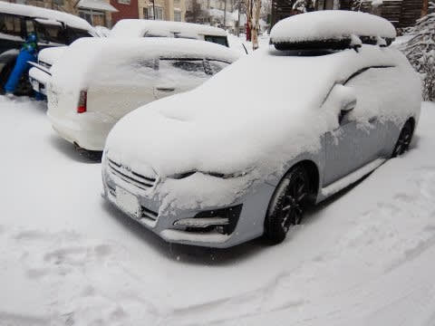

積雪，わずか10cmってところか…

いや．

積もらないよりはいい．

積もらないのに比べれば，

文句なくいいんだけど．

金曜夜の最終予想で

　23日夜から朝までに，結構新雪が積もってそうな予感…

　20cm，ブーツパフくらいは行ってくれそう！

と書いたように，少なくとも20cmの

積雪を期待していたのだ．

それが，まさか10cmとは…

でも．

そのわずか10cmの積雪でも．

ゲレンデに雪が増えてくれるのは，

今のゲレンデ状況にとっては大きくて．

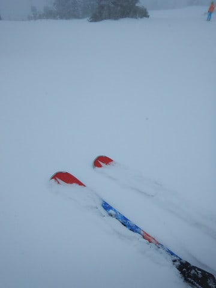

例えば，奥志賀のエキスパート下の

緩斜面，第1ゲレンデ．

昨日はこんな感じだったのが…

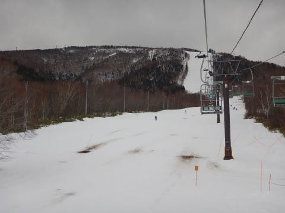

今日はこんな感じで．

土は完全に雪に隠れました～！

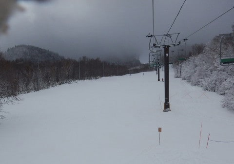

焼額の第1ゴンドラ乗り場付近も．

昨日はこんな感じで，かなり土が

出ていたのが…

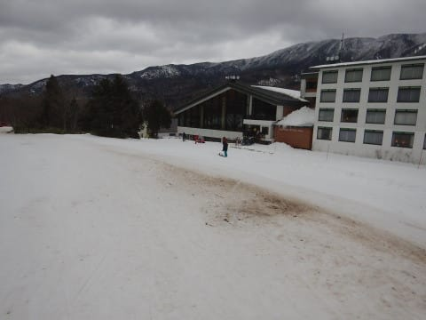

今日はこんな感じで，きれいに真っ白に

なりました！

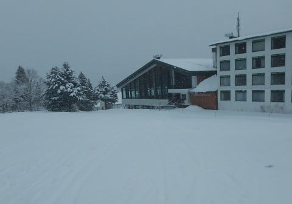

ただ．

急斜面は，スキーヤーに削られてブッシュや

浮石が出てきているところがまだ残っているので．

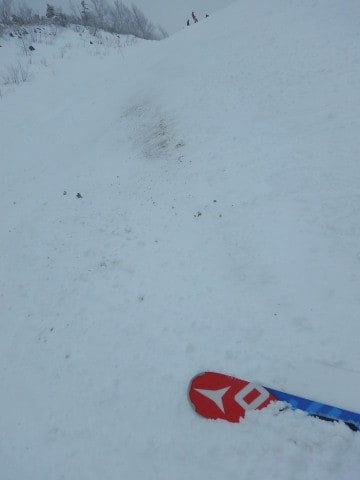

うーむ．

もう一降り．

いや，もう二降りほしいところ…

で．

今日の天気は，曇り時々雪で．

時折雪が激しく降り…

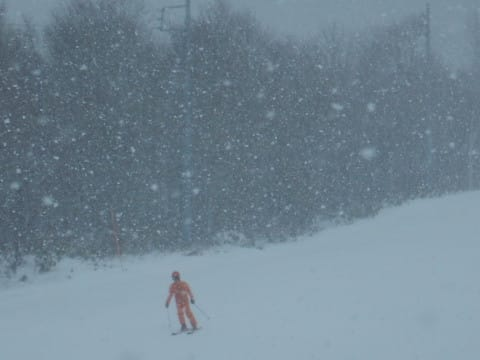

気温も，昼間でマイナス7℃程度と．

かなり冷え冷えで．

雪質は柔らかい上質な雪！

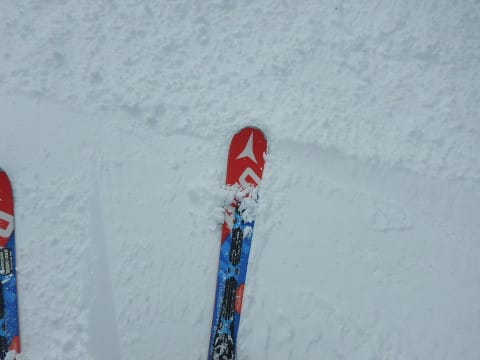

ただ，急斜面はところどころ固いのが

顔を出していて，ちょいと難しいところも

ありましたが．

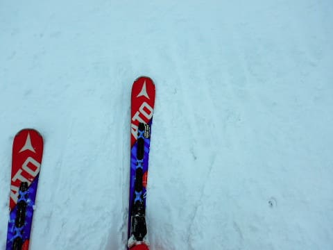

でも，昨日よりは楽しめたかな！

コースは，午前中はちょっと混むタイミングも

あったけど．

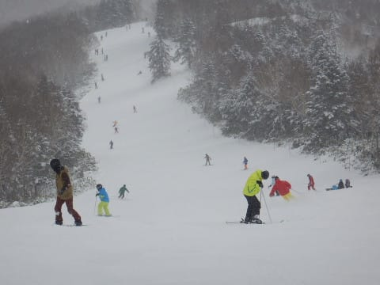

焼額と奥志賀では，ゴンドラ・リフト待ちは

ほとんどなく．

さらに，午後はかなり空いてきたので．

まぁ，その点は良かったかな～．

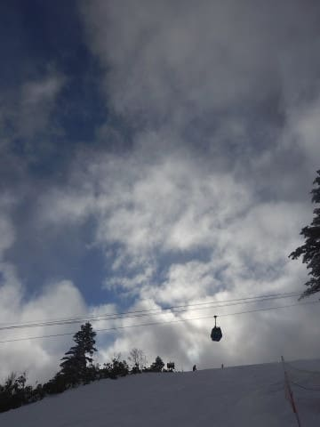

ってなことで．

明日，詳細レポートやります！

## 💬 コメント一覧

### 💬 コメント by (musi)
**タイトル**: 渋滞
**投稿日**: 2018-12-25 07:32:20

弾丸出張からのスキーお疲れ様です。呪いの解けてるSさんは今回も発見出来ませんでした。

三連休を滑ると昨日はかなりありがたいコンディションに感じました。各所で必死に雪出しされてて、昨日は人工降雪もウナリまくってて頼もしかったです。あともう一息ですよね。

ジャイアントに泊まっていたので、東館のゴンドラで下山しないと、奥志賀方面から帰れなかったのですが、オープンしてない寺子屋を歩いたり、ボコボコの焼額山と奥志賀連絡部を歩いたりと、今回は筋肉鍛えられました。

降雪量が少ないからスキー客少ないのかな〜なんて考えながら運転してたのですが、高速道の渋滞

がなく、快適に帰れませんでしたか？

アナログなD5に乗っているので、渋滞が嫌いなもので、それだけは、今回満点でした。

### 💬 コメント by (Skier_S)
**タイトル**: musiさま
**投稿日**: 2018-12-27 03:03:52

コメント回答おそくなってすみません．

…今回も発見できなかったようで，残念です．

とりあえず，3連休の最終日はなんとかちょっと

マシなコンディションで滑れました．

帰りは，確かに渋滞が無くてすごい快適でしたよ～！

